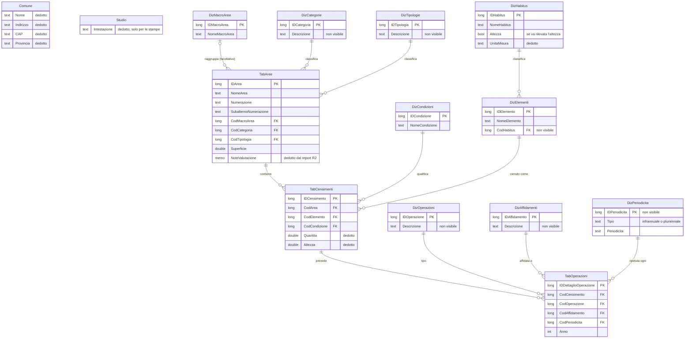

# 01 — Analisi della specifica esistente

> **Stato**: completato · **Passo**: 1 di 5 · Metodologia in [README.md](README.md)

- **Obiettivo**: capire cosa riusare della specifica del software Access 97 per il censimento del verde pubblico e dove non basta rispetto ai tre pilastri di GreenManager.
- **Input**: [Specifiche Software Censimento Verde.pdf](../resources/Specifiche%20Software%20Censimento%20Verde.pdf), del 2011.
- **Output atteso**: l'inventario strutturato del documento, il modello dati ricostruito e la valutazione *mantenere / adattare / scartare* di ogni elemento.

## 1. Sintesi del documento

Il documento è una relazione di 5 pagine, datata 23/11/2011. Descrive un software sviluppato nel 2000 in Access 97 per gestire il censimento del verde pubblico di un comune.

| Aspetto | Contenuto |
|---|---|
| Scopo | Archiviare ed elaborare il censimento del verde pubblico di un comune. |
| Chi lo usa | Uno studio che esegue i censimenti per conto dei comuni. Al comune viene consegnato solo il cartaceo. |
| Organizzazione dei dati | Un database Access per ogni comune. Il database di un nuovo comune si crea copiando i dizionari da uno esistente (funzione aggiunta nel 2001). |
| Utenti | Amministratore, utente operativo, utente in sola lettura che può stampare i report. |
| Piattaforma | Windows (da XP a 7) con il runtime di Access 97. Uso anche client/server. |
| Requisiti non funzionali | Nessun problema di affidabilità. Maschere semplici, con i dizionari in un'unica form a schede. Nessuna richiesta su efficienza e portabilità. |

**Come leggere il software.** Cinque caratteristiche orientano tutta l'analisi:

1. **È uno strumento di rilievo e di consulenza, non di gestione.** Lo studio censisce e *suggerisce* operazioni al comune. Non registra cosa è stato fatto.
2. **Il censimento è aggregato.** Un record di censimento indica uno o più elementi dello stesso tipo in un'area, misurati nell'unità prevista dall'habitus (es. "12 *Acer campestre* nell'area 5"). Il singolo individuo non ha identità.
3. **Non c'è geografia.** Né le aree né gli elementi hanno coordinate o geometrie. L'unico dato spaziale è la superficie dell'area, inserita a mano.
4. **Lo stato non ha storia.** La condizione è un attributo del censimento: un nuovo rilievo sovrascrive il precedente. Non ci sono date né foto.
5. **Il tempo è l'anno.** Le operazioni hanno solo un anno e una periodicità descrittiva.

**Limiti della fonte.**
- Il testo elenca tabelle e dizionari ma non i loro campi. I campi si ricavano dallo schema relazionale a p. 4, che è una schermata di Access con finestre ridotte o a scorrimento: diversi campi non si leggono (vedi §2 e §3).
- La frase sui dati richiesti dal censimento è troncata nel PDF ("I dati richiesti sono l'area di appartenenza, l'habitus").
- I dizionari hanno pochi esempi di valori, alcuni nessuno.
- Il database originale non è disponibile, quindi le deduzioni non si possono verificare (domanda 1).

## 2. Entità e dizionari

Fonti: testo di p. 1–2 e schema di p. 4. Nella colonna dei campi:
- i campi in *corsivo* non si vedono nello schema e sono dedotti dal testo o dalle relazioni;
- "…" indica che la finestra Access ha una barra di scorrimento, quindi esistono altri campi non leggibili.

### 2.1 Tabelle operative

| Sigla | Tabella | Contenuto | Campi |
|---|---|---|---|
| Co | Comune (non nello schema) | Anagrafica del comune: indirizzo, CAP, provincia ecc. Ha un solo record, perché il database è per comune (dedotto). | *indirizzo*, *CAP*, *provincia*, … |
| St | Studio (non nello schema) | Dati dello studio che esegue i censimenti, usati solo per intestare le stampe. | non indicati |
| Ar | `TabAree` | Il comune è suddiviso in aree. Ogni area ha dati che la identificano e la classificano. | `IDArea` (PK), `NomeArea`, `Numerazione`, `SubalternoNumerazione`, `CodMacroArea`, `CodCategoria`, `CodTipologia`, `Superficie`, … *note di valutazione* (dedotto dal report R2) |
| Ce | `TabCensimenti` | Registrazione di uno o più elementi dello stesso tipo in un'area, con la loro condizione. | `IDCensimento` (PK), `CodArea`, `CodElemento`, `CodCondizione`, … *quantità* e *altezza* (dedotti dal dizionario habitus) |
| Op | `TabOperazioni` | Operazioni da eseguire, associate a un censimento (n per censimento). | `IDDettaglioOperazione` (PK), `CodCensimento`, `CodOperazione`, `CodAffidamento`, `CodPeriodicità`, `Anno` |

### 2.2 Dizionari

I dizionari si compilano per primi e si copiano nel database di ogni nuovo comune. La colonna "Collegato a" riporta la sigla indicata nel testo.

| Dizionario | Tabella | Collegato a | Contenuto ed esempi dal testo | Campi visibili |
|---|---|---|---|---|
| Affidamenti | `DizAffidamenti` | Op | A chi è affidata la gestione del verde (es. tecnici comunali, terzi). | `IDAffidamento`, … |
| Categorie | `DizCategorie` | Ar | Categoria dell'area (es. area incolta, agricola, boschiva). | `IDCategoria`, … |
| Condizioni | `DizCondizioni` | Ce | Condizione dell'elemento o dell'insieme di elementi censiti. Nessun esempio. | `IDCondizione`, `NomeCondizione` |
| Elementi | `DizElementi` | Ce | Tutto ciò che si può censire, ciascuno con il suo habitus (es. *Acer campestre* → Alberi – Angiosperme). Comprende anche gli arredi. | `IDElemento`, `NomeElemento`, … *CodHabitus* (dalla relazione) |
| Habitus | `DizHabitus` | Elementi | Classi di elementi: alberi, arbusti, tappezzanti, arredi urbani. Per ciascuna si indica l'unità di misura e se va inserita l'altezza. | `IDHabitus`, `NomeHabitus`, `Altezza`, … *unità di misura* (dal testo) |
| Macroaree | `DizMacroAree` | Ar | Raggruppamento delle aree, usato solo da alcuni comuni. | `IDMacroArea`, `NomeMacroArea` |
| Tipo operazioni | `DizOperazioni` | Op | Operazioni che si possono suggerire a chi gestisce il verde (es. estirpazione, spollonatura). | `IDOperazione`, … |
| Periodicità | `DizPeriodicità` | Op | Periodicità delle operazioni suggerite, divise in infrannuali e pluriennali. | `Tipo`, `Periodicità`, … (la chiave non si vede) |
| Tipologie | `DizTipologie` | Ar | Tipologie di area. Nessun esempio. | `IDTipologia`, … |

### 2.3 Relazioni

Tutte le relazioni dello schema sono uno-a-molti, con integrità referenziale (Access mostra i simboli 1 e ∞ solo in questo caso):
- un'area ha molti censimenti; un censimento ha molte operazioni;
- l'area rimanda a macroarea, categoria e tipologia;
- il censimento rimanda a elemento e condizione;
- l'elemento rimanda all'habitus;
- l'operazione rimanda a tipo di operazione, affidamento e periodicità.

Comune e Studio non compaiono nello schema. Sono tabelle di un solo record che valgono per tutto il database (dedotto).

### 2.4 Osservazioni sulla struttura

- **L'habitus si ricava dall'elemento.** Il testo dice che il censimento richiede l'habitus, ma nello schema l'habitus è un attributo dell'elemento. È la soluzione corretta: l'habitus dipende dall'elemento, non dal censimento.
- **L'affidamento è per operazione.** Il testo lo descrive come "a chi è affidata la gestione del verde del comune", ma lo schema lo collega alla singola operazione.
- **La macroarea è un dato territoriale trattato come dizionario.** Viene copiata da un comune all'altro insieme agli altri dizionari, anche se le macroaree di un comune non valgono per un altro.
- **Categoria e tipologia si sovrappongono.** Sono due classificazioni dell'area senza una distinzione chiara, e per la tipologia non ci sono esempi.
- **Vegetali e arredi stanno nello stesso elenco.** Specie botaniche e arredi urbani sono voci dello stesso dizionario, distinte solo dall'habitus.

## 3. Modello dati ricostruito

Il diagramma è dedotto dallo schema di p. 4.
- Nomi di tabelle e campi come in Access, senza accenti (Mermaid non li accetta negli identificatori).
- I tipi sono dedotti.
- Nei commenti: *non visibile* indica un campo che deve esistere ma non si legge nello schema; *dedotto* indica un campo ricavato dal testo.

Lo schema non indica le cardinalità minime. Il diagramma assume che i riferimenti siano obbligatori, tranne la macroarea, che il testo dà come facoltativa.

## 4. Funzioni e report

Gli identificativi servono a riferirsi a questi elementi nei passi successivi.

### 4.1 Maschere

| ID | Maschera | Uso |
|---|---|---|
| M1 | Pannello dei comandi iniziale | Navigazione |
| M2 | Una maschera per ciascun dizionario | Gestione del singolo dizionario |
| M3 | Pannello di tutti i dizionari, a schede | Gestione dei dizionari in un'unica form |
| M4 | Maschera delle aree | Gestione delle aree |
| M5 | Maschera dei censimenti, con sottomaschera delle operazioni | Gestione di censimenti e operazioni, ricerca per area |
| M6 | Maschera dei dati del comune | Anagrafica del comune |
| M7 | Maschera dei dati dello studio | Intestazione delle stampe |
| M8 | Pannello delle stampe | Scelta dei report e dei filtri |

### 4.2 Funzioni

| ID | Funzione | Descrizione | Maschere |
|---|---|---|---|
| F1 | Gestione dei dati | Inserimento, modifica, eliminazione e ricerca di dati e dizionari, secondo l'utente. | M2–M7 |
| F2 | Database per un nuovo comune | Si sceglie un database esistente e se ne copiano solo i dizionari. Il nuovo comune parte così con gli stessi tipi di operazione, habitus, periodicità ecc. | — |
| F3 | Ricerca dei censimenti per area | Filtro dei censimenti di un'area. | M5 |
| F4 | Stampa dei report | Report con filtri. | M8 |

### 4.3 Report

Il contenuto è dedotto dal titolo: il documento non descrive i report.

| ID | Report | Contenuto |
|---|---|---|
| R1 | Elenco aree | Anagrafica delle aree |
| R2 | Elenco aree con note di valutazione | Aree con le valutazioni testuali |
| R3 | Elenco aree per categoria | Aree raggruppate per categoria |
| R4 | Elenco aree per tipologia | Aree raggruppate per tipologia |
| R5 | Elenco censimenti con suddivisione per aree | Per ogni area, gli elementi censiti |
| R6 | Elenco censimenti con dislocazione della specie | Per ogni specie, le aree in cui si trova |
| R7 | Elenco operazioni con suddivisione per aree | Per ogni area, le operazioni previste |
| R8 | Elenco operazioni con dislocazione della specie | Per ogni specie, le operazioni previste e dove |

I report sono di due tipi, inventario (R1–R6) e operazioni (R7–R8), letti per area o per specie. Non ci sono riepiloghi (totali, statistiche) né report per periodo.

### 4.4 Ruoli utente

| ID | Ruolo | Attività |
|---|---|---|
| U1 | Amministratore | Gestisce il software |
| U2 | Utente | Usa il software e inserisce i dati |
| U3 | Utente in sola lettura | Consulta i dati e stampa i report |

Secondo il documento, il database per comune nasceva proprio da U3: dare a ogni comune l'accesso in sola lettura ai propri dati. Questo accesso non è mai stato realizzato e al comune si consegna il cartaceo.

## 5. Valutazione

Esiti possibili:
- **mantenere**: il concetto passa nel nuovo modello sostanzialmente com'è;
- **adattare**: il bisogno resta, ma cambiano struttura o significato;
- **scartare**: non passa nel nuovo modello, eventualmente sostituito da altro.

Le sigle D-xxx rimandano al [registro delle decisioni](decisioni.md); quelle prese in questo passo sono riassunte in §7.

### 5.1 Entità operative

| Elemento | Esito | Motivazione | Nel nuovo modello · da desktop a web |
|---|---|---|---|
| Comune (Co) | **adattare** | Serve sapere a chi appartengono aree ed elementi. Però GreenManager serve anche privati e consorzi, e una ditta lavora per più committenti. | Diventa il committente o proprietario del verde (domanda 4). Non più un database per comune ma un unico sistema; la separazione tra organizzazioni è multi-tenancy, fuori perimetro. |
| Studio (St) | **scartare** | Serve solo a intestare le stampe. | È configurazione dell'organizzazione che usa il sistema, non un'entità di dominio. |
| Aree (Ar) | **adattare** | Il raggruppamento in aree resta (D-002). Numerazione e subalterno sono codici utili in campo e nei documenti. | L'area acquista una geometria (poligono) e la superficie si calcola dalla geometria. Le note di valutazione diventano osservazioni datate (domanda 9). |
| Censimenti (Ce) | **adattare** | Il record aggregato non permette né la mappa né lo storico del singolo elemento. | Sostituito dall'elemento georeferenziato (D-002). Resta da decidere se ammettere elementi di gruppo con quantità (domanda 3). La condizione esce dal record e diventa un'osservazione (D-007). |
| Operazioni (Op) | **adattare** | Sono raccomandazioni con un anno: manca il registro dell'eseguito. | Diventano interventi con ciclo pianificato → eseguito, date, esecutore e bersaglio, cioè uno o più elementi o un'area (D-008). |

### 5.2 Dizionari

In Access i dizionari si copiano in ogni nuovo database comunale. Nel nuovo modello diventano cataloghi gestiti nell'applicazione (D-005).

| Dizionario | Esito | Motivazione | Nel nuovo modello |
|---|---|---|---|
| Affidamenti | **adattare** | Mescola due concetti: la modalità di gestione (in economia, in appalto) e chi esegue. | Catalogo delle modalità di affidamento. L'esecutore concreto diventa un dato dell'intervento (domanda 5). |
| Categorie | **adattare** | Gli esempi (incolta, agricola, boschiva) sono categorie di uso del suolo, poco adatte al verde urbano. Si sovrappone alle tipologie. | Classificazione dell'area da riallineare a uno standard (domanda 6). |
| Condizioni | **adattare** | Un valore unico e senza data non descrive lo stato nel tempo. | Valore di un'osservazione datata (D-007). I criteri di valutazione (fitosanitaria, stabilità, VTA) si definiscono dopo il benchmark. |
| Elementi | **adattare** | Mette insieme specie botaniche e arredi in un elenco piatto. | Catalogo delle specie (nome scientifico, nome comune, genere, famiglia, cultivar) separato dalla classe di elemento (D-006). Gli arredi diventano elementi non vegetali. |
| Habitus | **adattare** | È il concetto più utile del modello: già oggi decide unità di misura e dati da rilevare. | Classe di elemento, che determina anche il tipo di geometria (punto, linea, poligono) e gli attributi da rilevare (D-006). |
| Macroaree | **adattare** | È un dato territoriale del singolo comune, non un catalogo da copiare tra comuni. | Raggruppamento facoltativo di aree, come dato operativo. Forse una gerarchia di aree a più livelli (domanda 7). |
| Tipo operazioni | **mantenere** | Un catalogo dei tipi di intervento è indispensabile. | Catalogo dei tipi di intervento (`InterventionType`), eventualmente con le classi di elemento a cui si applica. |
| Periodicità | **adattare** | È un'etichetta descrittiva (infrannuale, pluriennale) e non permette di calcolare le scadenze. | Regola di ricorrenza strutturata (frequenza, periodo dell'anno) che genera interventi pianificati (domanda 8). |
| Tipologie | **adattare** | Non ha esempi e il confine con le categorie è incerto. | Da unificare con le categorie o da distinguerne chiaramente (domanda 6). |

### 5.3 Funzioni e maschere

| Elemento | Esito | Motivazione | Nel nuovo modello · da desktop a web |
|---|---|---|---|
| F1 Gestione dei dati | **mantenere** | Funzione di base. | Gestione via web, anche in campo da smartphone e tablet, con posizione GPS e foto (D-004). |
| F2 Database per un nuovo comune | **scartare** | Il database per comune serviva all'accesso in sola lettura dei comuni, mai realizzato. Il documento stesso nota che un database unico avrebbe dato dizionari univoci. | Un unico sistema con cataloghi precaricati e modificabili (D-005). Resta il bisogno di non reinserire i cataloghi per ogni nuovo committente. |
| F3 Ricerca per area | **mantenere** | L'area resta il filtro principale. | Si aggiungono filtri per specie, stato e interventi, e la ricerca sulla mappa (per vicinanza o dentro un'area disegnata). |
| F4 Stampa dei report | **adattare** | La stampa era l'unico modo di consegnare i dati. | Report consultabili online, ed export in PDF, foglio di calcolo e formati GIS. |
| M1, M3 Pannello comandi, dizionari a schede | **scartare** | Sono scelte di interfaccia desktop; il design della UI è fuori perimetro. | Resta il bisogno di gestire i cataloghi in un unico punto. |

Le altre maschere (M2, M4–M8) sono coperte da F1–F4.

### 5.4 Report

| Report | Esito | Motivazione | Nel nuovo modello |
|---|---|---|---|
| R1 Elenco aree | **mantenere** | Resta l'anagrafica di base. | Elenco filtrabile ed esportabile. |
| R2 Aree con note di valutazione | **adattare** | Le note sono testo libero non datato. | Aree con l'ultima osservazione e lo storico. |
| R3, R4 Aree per categoria e per tipologia | **adattare** | Sono lo stesso report con un raggruppamento diverso. | Un unico elenco aree con raggruppamento a scelta. |
| R5 Censimenti per area | **adattare** | L'inventario per area resta utile, ma cambia l'unità di censimento. | Inventario degli elementi per area, con totali per specie e classe di elemento, e mappa. |
| R6 Censimenti per specie | **adattare** | Come R5. | Inventario per specie, con distribuzione per area e mappa. |
| R7 Operazioni per area | **adattare** | Mostra solo le operazioni previste. | Registro degli interventi per area, filtrabile per periodo e stato (pianificati, eseguiti). |
| R8 Operazioni per specie | **adattare** | Come R7. | Registro degli interventi per specie. |

Gli otto report si riducono a due viste parametriche: l'inventario e il registro degli interventi, raggruppabili per area, categoria, tipologia e specie. Mancano i riepiloghi (consistenza del patrimonio, interventi per periodo) e i report richiesti dalla normativa (es. bilancio arboreo, L. 10/2013), da verificare allo Step 2.

### 5.5 Utenti e requisiti non funzionali

| Elemento | Esito | Nota |
|---|---|---|
| U1–U3 Ruoli | fuori perimetro | Ruoli e permessi non si specificano. Si registra il bisogno: il committente deve poter consultare i propri dati, almeno in sola lettura. |
| Access 97 su Windows, client/server | **scartare** | Lo stack è vincolato (Django, React). |
| Un database per comune | **scartare** | Sostituito da un unico sistema (D-005). |
| Dizionari rapidi da compilare | **mantenere** | Resta un requisito: i cataloghi devono essere semplici da gestire. |

### 5.6 Sintesi

| Gruppo | Mantenere | Adattare | Scartare |
|---|---|---|---|
| Entità operative (5) | 0 | 4 | 1 |
| Dizionari (9) | 1 | 8 | 0 |
| Funzioni e maschere (5) | 2 | 1 | 2 |
| Report (7 righe, 8 report) | 1 | 6 | 0 |

Quasi tutto va adattato. Il software Access resta valido come vocabolario di dominio e come base dei cataloghi, ma la sua struttura non regge i tre pilastri: manca la geografia, manca il tempo, e l'unità di censimento è aggregata.

## 6. Lacune rispetto ai tre pilastri

### 6.1 Censimento georeferenziato

| ID | Lacuna | Cosa serve | Dove si approfondisce |
|---|---|---|---|
| L1 | Nessuna geometria: né le aree né gli elementi hanno una posizione. | Geometria per elemento e per area (D-002), mappa, posizione da GPS in campo. | Step 3–4 |
| L2 | Il singolo elemento non ha identità: il censimento è aggregato. | Identificativo stabile (UUID, D-004) e codice leggibile, eventualmente legato a una targhetta sull'albero. | Step 4 |
| L3 | Mancano i dati dendrometrici e descrittivi: c'è al più l'altezza. | Circonferenza o diametro del fusto, altezza, diametro della chioma, classe di età, data di impianto. | Step 2 (normativa e prodotti), Step 4 |
| L4 | La specie è solo un nome in un elenco piatto. | Catalogo delle specie strutturato (D-006). | Step 4 |
| L5 | Non c'è ciclo di vita: un albero abbattuto si cancella o resta com'è. | Stato dell'elemento (presente, abbattuto, sostituito) con le date, senza perdere lo storico. | Step 3–4 |
| L6 | Mancano contesto e vincoli: albero monumentale, tutela, interferenze con strade e reti. | Attributi di contesto, da definire dopo il benchmark. | Step 2 |
| L7 | Non si sa quando e da chi è stato fatto il censimento. | Data e autore del rilievo. | Step 4 |

### 6.2 Registro delle azioni

| ID | Lacuna | Cosa serve | Dove si approfondisce |
|---|---|---|---|
| L8 | Le operazioni sono raccomandazioni ("da eseguire", "suggerite"): non si registra cosa è stato fatto. | Ciclo pianificato → eseguito, o annullato (D-008). | Step 3 |
| L9 | Il tempo è solo l'anno. | Data pianificata o scadenza, data di esecuzione. | Step 4 |
| L10 | La periodicità non genera scadenze. | Regola di ricorrenza che produce interventi pianificati. | Step 3 |
| L11 | L'operazione riguarda un solo censimento. | Interventi su più elementi o su un'area intera (es. sfalcio di un parco). | Step 3–4 |
| L12 | Mancano esecutore, quantità, tempi, costi e materiali. | Da definire in base a cosa serve a ditte ed enti. | Step 2–3 |
| L13 | Azioni e stato non sono collegati: un abbattimento non cambia l'elemento, un'ispezione non motiva un intervento. | Legame tra l'osservazione che motiva l'intervento, l'intervento e il suo effetto sull'elemento. | Step 3 |

### 6.3 Registro dello stato

| ID | Lacuna | Cosa serve | Dove si approfondisce |
|---|---|---|---|
| L14 | La condizione è un valore unico, sovrascritto e senza data. | Osservazioni datate con storico; lo stato corrente è l'ultima osservazione (D-007). | Step 4 |
| L15 | Nessuna foto né allegato. | Foto scattate in campo e legate all'osservazione. | Step 3–4 |
| L16 | Nessuna valutazione strutturata: stato fitosanitario, stabilità, VTA, classe di propensione al cedimento, priorità. | Schema di valutazione, da definire con benchmark e normativa. | Step 2 |
| L17 | Non si sa chi ha osservato. | Autore dell'osservazione. | Step 4 |
| L18 | Lo stato di un'area è solo una nota testuale. | Osservazioni anche sulle aree (domanda 9). | Step 3 |

### 6.4 Passaggio da desktop a web

| ID | Lacuna | Cosa serve | Dove si approfondisce |
|---|---|---|---|
| L19 | Un database per comune, dati consegnati su carta. | Un unico sistema; il committente consulta i dati online e li esporta. | Step 3 |
| L20 | Uso solo da ufficio. | Uso in campo da smartphone e tablet, con GPS e fotocamera (D-004). | Step 3 |
| L21 | Nessun import o export, nessun formato GIS. | Import ed export in formati tabellari e GIS; eventuale import dei database Access (domanda 2). | Step 3 |

## 7. Esito del passo

Le decisioni e i termini seguenti sono registrati in [decisioni.md](decisioni.md) e nel [glossario](glossario.md).

### 7.1 Decisioni

| ID | Decisione | Motivazione | Stato |
|---|---|---|---|
| D-005 | Nessun database per committente e nessuna copia dei dizionari: i cataloghi sono gestiti nell'applicazione, precaricati e modificabili. | La copia dei dizionari compensava il database per comune, nato per un accesso in sola lettura che il web risolve in altro modo. Un sistema unico dà cataloghi coerenti. | confermata; l'ambito dei cataloghi resta aperto (domanda 10) |
| D-006 | Le specie (tassonomia botanica) sono un catalogo separato dalla classe di elemento (ex habitus). La classe determina tipo di geometria, unità di misura e attributi da rilevare. | Il dizionario elementi mescola specie e arredi. L'habitus fa già da classe e si collega in modo naturale alle geometrie di D-002. | ipotesi, da confermare allo Step 4 |
| D-007 | La condizione non è un attributo dell'elemento ma il valore di un'osservazione datata, con autore e foto. Lo stato corrente è l'ultima osservazione. | È il terzo pilastro; in Access lo stato si sovrascrive. | ipotesi, da confermare allo Step 4 |
| D-008 | L'operazione Access diventa un intervento con ciclo pianificato → eseguito, date, esecutore e bersaglio (uno o più elementi, o un'area). La periodicità diventa una regola che genera interventi pianificati. | È il secondo pilastro; in Access le operazioni sono solo raccomandazioni annuali. | ipotesi, da confermare allo Step 3 |

D-002 resta un'ipotesi da confermare allo Step 3. L'analisi conferma i limiti del censimento aggregato, ma la domanda 3 (elementi di gruppo) può precisarla.

### 7.2 Glossario

- **Termini Access aggiunti**: Comune, Studio, Operazione (istanza di un tipo di operazione), Numerazione e subalterno, Unità di misura.
- **Termini nuovi introdotti da questo passo**: Committente (nome nel modello da definire allo Step 3), Specie (`Species`), Classe di elemento (`ElementClass`), Osservazione (`Observation`), Intervento (`Intervention`).
- **Voci riviste**: Habitus ed Elemento (dizionario), alla luce di D-006; Censimento, per precisare che in Access è aggregato.

## Domande aperte

La domanda 1 è chiusa. Le domande 2–11 sono rinviate al passo indicato, nel cui documento sono riportate.

1. **Database originale.** È disponibile un file `.mdb` del software? Permetterebbe di leggere i campi nascosti nello schema (es. quantità e altezza nei censimenti, unità di misura negli habitus) e i valori reali dei dizionari, da usare come base dei cataloghi. → **chiusa**: il file non è disponibile. I campi segnati come dedotti in §2 e §3 restano non verificabili, e i cataloghi iniziali andranno costruiti da altre fonti (Step 2).
2. **Import dei dati esistenti.** Bisogna importare censimenti dai database Access? Se sì, servono regole per trasformare un censimento aggregato e senza posizione in elementi georeferenziati (es. elementi senza geometria, da posizionare poi in campo). → rinviata allo Step 3
3. **Elementi di gruppo.** Oltre all'individuo singolo, il modello deve ammettere elementi di gruppo con una quantità (es. una macchia di arbusti, un gruppo di alberi non rilevati uno per uno)? Incide su D-002. → rinviata allo Step 3
4. **Committente.** Le aree appartengono a un committente (comune, condominio, azienda) distinto da chi gestisce il verde? Come si rappresenta nel dominio senza entrare nella multi-tenancy? → rinviata allo Step 3
5. **Affidamento.** Serve la modalità di gestione (in economia, in appalto, volontariato), l'esecutore concreto (ditta, squadra, operatore) o entrambi? → rinviata allo Step 3
6. **Classificazione delle aree.** Categoria e tipologia vanno tenute distinte o unificate? Conviene adottare una classificazione standard del verde urbano, ad esempio le tipologie usate dall'ISTAT? → rinviata allo Step 2
7. **Gerarchia delle aree.** Basta una macroarea facoltativa o serve una gerarchia a più livelli (es. quartiere → parco → settore)? → rinviata allo Step 3
8. **Periodicità.** Quanto deve essere strutturata la regola di ricorrenza (frequenza, periodo dell'anno)? Gli interventi ricorrenti si generano in automatico o su conferma? → rinviata allo Step 3
9. **Stato delle aree.** Il registro dello stato vale anche per le aree (es. le note di valutazione) o solo per gli elementi? → rinviata allo Step 3
10. **Ambito dei cataloghi.** I cataloghi (specie, tipi di intervento…) sono unici per tutto il sistema o personalizzabili da ogni organizzazione? Tocca la multi-tenancy, ma decide come si gestiscono i cataloghi. → rinviata allo Step 3
11. **Report Access.** I report vanno riprodotti con lo stesso impianto, perché i comuni ci sono abituati, o basta coprirne il contenuto? → rinviata allo Step 3
