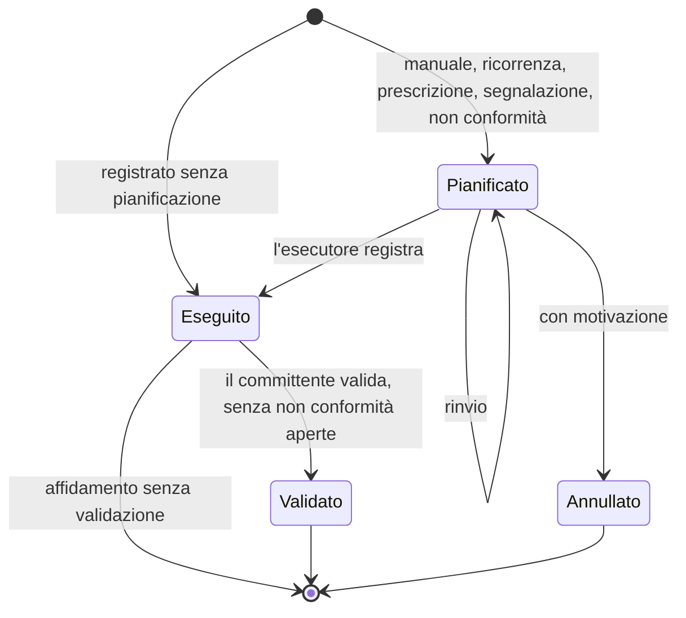
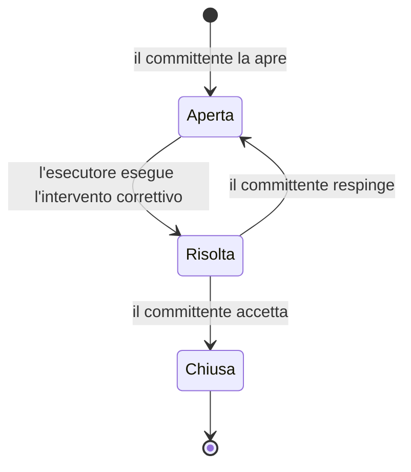

# 03 — Feature del prodotto

> **Stato**: completato · **Passo**: 3 di 5 · Metodologia in [README.md](README.md)

- **Obiettivo**: definire le feature di GreenManager, con priorità e flussi principali.
- **Input**: [01-analisi-spec-esistente.md](01-analisi-spec-esistente.md), [02-benchmark.md](02-benchmark.md), [decisioni.md](decisioni.md).
- **Output atteso**: gli attori di dominio, il posizionamento del prodotto, il catalogo delle feature per modulo (MVP / v2 / futuro) e gli scenari d'uso principali.
- **Ordine di lavoro**: prima gli attori e il posizionamento, perché il posizionamento decide più di metà delle feature incerte della matrice (§4.6 di [02-benchmark.md](02-benchmark.md)). Poi il catalogo e gli scenari.

## 1. Attori di dominio

Gli attori sono i ruoli che esistono nella gestione del verde, con o senza GreenManager.
- Un soggetto può avere più ruoli. Un comune che lavora con le proprie squadre è committente, gestore ed esecutore; una ditta è gestore ed esecutore per i suoi clienti.
- Quali attori usano il sistema, e per fare cosa, dipende dal posizionamento (§2).
- Ruoli e permessi sono fuori perimetro. Qui si descrive cosa fa ogni attore nel dominio, non cosa può fare nell'applicazione.

### 1.1 Gli attori

| ID | Attore | Chi è | Cosa fa | Riferimenti |
|---|---|---|---|---|
| A1 | Committente | Il soggetto a cui appartiene il verde, o che lo ha in carico: comune, consorzio, ente parco, condominio, azienda, privato. È custode degli alberi e risponde dei danni che causano (art. 2051 c.c.). | Affida la gestione e i lavori. Riceve i rapporti e consulta il proprio patrimonio. Se è un comune, ha gli obblighi di legge: catasto degli alberi, bilancio arboreo, dati ISTAT. | Step 1, domanda 4; Step 2, §2.2 e §2.5 |
| A2 | Gestore | Chi decide sul patrimonio per conto del committente: l'ufficio verde del comune, il responsabile tecnico della ditta, l'agronomo che cura una villa. | Organizza le aree e i piani di manutenzione. Pianifica gli interventi. Fissa i bersagli e il rischio accettabile, decide sulle prescrizioni, controlla l'esecuzione. | Step 2, §2.5 (linea guida 2025) |
| A3 | Rilevatore | Chi censisce in campo: un tecnico del comune, della ditta o di uno studio incaricato. | Censisce aree ed elementi e ne aggiorna i dati. Registra osservazioni e foto. | Step 2, §2.3 (i CAM chiedono rilevatore e data del rilievo) |
| A4 | Valutatore | Un professionista abilitato (agronomo, forestale, arboricoltore), interno o esterno. | Valuta la stabilità o il rischio degli alberi secondo un protocollo. Assegna la classe, fissa il ricontrollo, indica le prescrizioni e firma la relazione. | D-010; Step 2, domanda 9 |
| A5 | Esecutore | Chi esegue gli interventi: le squadre del committente, una ditta, un'associazione o un'impresa che ha adottato un'area. Lavora con squadre e operatori. | Riceve gli interventi e li esegue. Registra l'eseguito con data, quantità e foto. Segnala i problemi trovati in campo. | D-008; Step 1, domanda 5 |
| A6 | Autorità | Gli enti che autorizzano o ricevono dati: comune e ministero per gli alberi monumentali, Soprintendenza, Servizio fitosanitario regionale, ISTAT. | Rilascia autorizzazioni e pareri. Riceve comunicazioni, relazioni e dati statistici. | Step 2, §2.4 e §2.6 |
| A7 | Cittadino | Chi frequenta il verde; la famiglia di un nuovo nato; chi dona un albero celebrativo. | Segnala problemi, chiede informazioni, riceve la comunicazione sull'albero dedicato. | Step 2, §2.2 e domanda 11 |

Note:
- **In campo** lavorano il rilevatore e l'esecutore, spesso anche il valutatore. Sono gli attori che usano lo smartphone, con GPS e fotocamera (D-004).
- **Gestore e valutatore restano distinti** anche quando sono la stessa persona. La linea guida del 2025 separa chi valuta l'albero da chi decide il rischio accettabile e gli interventi (Step 2, §2.5).
- **Autorità e cittadino non sono utenti** dell'applicazione. Il sistema produce i documenti e i dati che ricevono; il cittadino consulta la mappa pubblica (D-015).
- **Chi cura i cataloghi** non è un attore di dominio. Le voci di sistema le cura chi gestisce il sistema, le voci aggiuntive ogni organizzazione (D-016).

### 1.2 Configurazioni organizzative

Gli stessi ruoli si distribuiscono in modo diverso secondo chi possiede il verde e chi lo cura. I destinatari di GreenManager ([AGENTS.md](../AGENTS.md)) danno quattro configurazioni tipiche.

| Configurazione | Committente | Gestore | Rilevatore | Valutatore | Esecutore |
|---|---|---|---|---|---|
| K1. Ente in economia | Comune o altro ente | Ufficio verde | Tecnici dell'ente o studio incaricato | Professionista incaricato | Squadre dell'ente |
| K2. Ente con appalto | Comune o altro ente | Ufficio verde, con il direttore dell'esecuzione del contratto | Ditta appaltatrice o studio incaricato | Professionista incaricato | Ditta appaltatrice |
| K3. Ditta per più clienti | I clienti della ditta: condomini, aziende, privati, enti | Responsabile tecnico della ditta | Tecnici della ditta | Agronomo della ditta o esterno | Squadre della ditta |
| K4. Privato con verde esteso | Il proprietario: villa storica, complesso residenziale, azienda | Curatore del verde o agronomo | Agronomo o ditta | Professionista incaricato | Giardinieri interni o ditta |

Osservazioni:
- **K1 e K4**: una sola organizzazione copre quasi tutti i ruoli. È il caso di base dei prodotti per la gestione del patrimonio (segmento A dello Step 2, §1.2).
- **K2**: i ruoli si dividono tra due organizzazioni che lavorano sullo stesso patrimonio. L'ente decide e controlla; la ditta esegue e spesso aggiorna il censimento. È la configurazione regolata dai CAM (N14, N15) e, tra i prodotti analizzati, solo GreenSpaces la gestisce.
- **K3**: la ditta è gestore ed esecutore per molti committenti. È la configurazione dei gestionali d'impresa (segmento C), che però non hanno il patrimonio del cliente.
- **K2 e K3 si sovrappongono.** Per la ditta, un ente con appalto è uno dei clienti di K3. La stessa ditta lavora per committenti pubblici e privati.
- **Variante di K2.** Un'azienda pubblica gestisce il verde per conto del comune e affida i lavori a ditte. Il comune resta proprietario, ma per la ditta il committente è l'azienda.

## 2. Posizionamento

### 2.1 La domanda

È la domanda 3 dello Step 2: GreenManager copre solo la gestione tecnica del verde, o anche la gestione d'impresa della ditta? E il rapporto tra committente e ditta?

Le configurazioni di §1.2 mostrano che sono due domande indipendenti:
- **il rapporto tra committente ed esecutore**, quando appartengono a organizzazioni diverse (K2, e K3 quando il cliente consulta il proprio verde): validazione dei lavori, non conformità, prezzario, SAL;
- **la gestione d'impresa della ditta** (K3): clienti, contratti, preventivi, costi, rapportini.

Le 11 feature incerte che ne dipendono (Step 2, §3.14) si dividono così:

| Asse | Feature |
|---|---|
| Rapporto tra committente ed esecutore | I6 validazione dei lavori, S3 non conformità, X1 prezzario e costo dalla geometria, X2 SAL e pagamenti |
| Gestione d'impresa | B1 clienti, B2 contratti di manutenzione, B3 proposte dall'inventario, X3 preventivi, X4 budget e consuntivo, E5 ore, materiali e mezzi, E6 rapportino firmato |

Alcuni punti valgono in ogni caso:
- il committente esiste come soggetto distinto da chi usa il sistema, perché una ditta lavora per più committenti (domanda 4 dello Step 1);
- il committente può consultare i propri dati, almeno in sola lettura (Step 1, §5.5);
- fatturazione, magazzino e contabilità restano fuori (B4, Step 2).

### 2.2 Le opzioni

| Opzione | Cosa copre | Configurazioni servite | Feature incerte che entrano |
|---|---|---|---|
| A. Gestione tecnica | Censimento, stato e interventi di un'organizzazione. Il committente consulta; l'esecutore è un dato dell'intervento. | K1, K4; K2 e K3 solo dal lato di chi usa il sistema | nessuna |
| B. Gestione tecnica e rapporto con l'esecutore | A, più due organizzazioni che lavorano sullo stesso patrimonio: l'esecutore registra l'eseguito e aggiorna il censimento, il committente valida o contesta. Più l'economia del rapporto: prezzario, computo, SAL. | K1–K4 | I6, S3, X1, X2 |
| C. Gestione tecnica e d'impresa | A, più il gestionale della ditta: clienti, contratti, preventivi, costi, rapportini. | K1, K3, K4 | B1–B3, X3, X4, E5, E6 |
| D. Tutto | B e C insieme. | K1–K4 | tutte e 11 |

| Opzione | A favore | Contro |
|---|---|---|
| A | Il perimetro più piccolo, concentrato sui tre pilastri. Nessuna interazione tra organizzazioni. | Nel caso K2 ente e ditta si scambiano file, e gli obblighi dei CAM (N14, N15) si coprono solo con import ed export. Non sfrutta il doppio destinatario, ditte ed enti: è lo stesso spazio di GINVE e dei prodotti esteri. |
| B | È il punto in cui i due destinatari si incontrano: la ditta lavora sul patrimonio dell'ente e l'ente controlla. Risponde ai CAM. Tra i prodotti analizzati lo fa solo GreenSpaces (Step 2, §4.2). Il prezzario sfrutta le geometrie già censite (D-002). | Due organizzazioni lavorano sugli stessi dati, e la multi-tenancy (fuori perimetro) deve permetterlo. Il ciclo dell'intervento si allunga con la validazione (D-008). |
| C | Una combinazione che nessun prodotto offre (Step 2, §4.3, punto 1). | Allarga molto il perimetro, fuori dai tre pilastri. Compete con gestionali maturi ed economici (29–49 €/mese) sul loro terreno. Si rivolge a un acquirente diverso, il titolare della ditta e non l'ufficio tecnico. Agli enti non aggiunge nulla. |
| D | Copertura completa. | Somma i costi di B e C: è il perimetro di GreenSpaces più quello di un gestionale. |

### 2.3 Decisione

**Opzione B** ([D-012](decisioni.md), confermata il 6 ottobre 2026), con due limiti:
1. **L'economia del rapporto viene dopo l'MVP.** Già nell'MVP l'intervento eseguito registra le quantità (m² falciati, alberi potati, metri di siepe). Servono al rapporto annuale dei CAM e sono la base del prezzario. Prezzario e computo (X1) vengono dopo; SAL e pagamenti (X2), la parte più contabile, vengono per ultimi.
2. **Della gestione d'impresa si tiene il nucleo tecnico**, non la parte commerciale. Così si coglie in parte l'opportunità 1 dello Step 2 (§4.3): il patrimonio del cliente nello stesso prodotto della ditta, senza il gestionale.

Esito delle 11 feature con la decisione:

| ID | Feature | Esito | Cosa entra |
|---|---|---|---|
| I6 | Validazione dei lavori da parte del committente | sì | Un passo del ciclo dell'intervento, dopo l'eseguito. |
| S3 | Non conformità | sì | Una segnalazione del committente su un intervento eseguito, con gravità e termine per la correzione. |
| E6 | Rapportino firmato dal cliente | sì, come I6 | La validazione del committente sostituisce la firma. Il rapportino in PDF è un export. |
| X1 | Prezzario e costo calcolato dalla geometria | sì, dopo l'MVP | Le quantità eseguite, registrate fin dall'MVP, ne sono la base. |
| X2 | SAL e pagamenti | sì, dopo X1 | L'elenco dei lavori validati in un periodo. Il pagamento è solo un dato registrato. |
| E5 | Ore, materiali e mezzi | in parte | Le quantità eseguite e i prodotti fitosanitari (E7). Ore e mezzi si decidono nel catalogo (§3). |
| B1 | Clienti e CRM | in parte | Solo l'anagrafica del committente. |
| B2 | Contratti di manutenzione | in parte | La parte tecnica: l'affidamento (§2.4) con gli interventi ricorrenti (I2). Restano fuori canoni, pacchetti di ore e rinnovi. |
| B3 | Proposte commerciali generate dall'inventario | in parte | Il piano pluriennale generato dall'inventario (I2). Resta fuori la proposta commerciale. |
| X3 | Preventivi | no | — |
| X4 | Budget e costi a consuntivo | no | — |

**Motivazione.**
- **Un solo modello per tutte le configurazioni.** Tra K1 e K2 cambia solo se l'esecutore appartiene all'organizzazione del committente.
- **È il punto d'incontro dei destinatari.** Ditte ed enti sono entrambi destinatari di GreenManager ([AGENTS.md](../AGENTS.md)). Con l'opzione B lavorano sugli stessi dati, invece di usare due prodotti e scambiarsi file.
- **Risponde ai CAM.** L'aggiornamento del censimento e il rapporto annuale (N14, N15) diventano funzioni del sistema.
- **Resta vicina ai tre pilastri.** La gestione d'impresa è un mercato di prodotti maturi ed economici, lontano dal censimento e dallo stato. Il nucleo tecnico dà alla ditta ciò che i gestionali non hanno, cioè il patrimonio del cliente, senza competere sulla fatturazione. Un export degli interventi eseguiti verso il gestionale della ditta può fare da ponte.

### 2.4 Effetti della decisione

**Chi usa GreenManager.**

| Attore | Usa il sistema | Per fare cosa |
|---|---|---|
| A1 Committente | sì | Consulta patrimonio, interventi e report; valida l'eseguito e apre le non conformità. In K1 coincide con il gestore. |
| A2 Gestore | sì, è l'utente principale | Tutto il ciclo: aree, censimento, piani, interventi, valutazioni, report. |
| A3 Rilevatore | sì, in campo | Censimento e osservazioni. |
| A4 Valutatore | sì, anche da un'altra organizzazione, oppure tramite il gestore (D-022) | Inserisce le valutazioni con la scheda del gestore, oppure il gestore registra i dati minimi e allega la sua relazione. |
| A5 Esecutore | sì, in campo, anche da un'altra organizzazione | Interventi assegnati, registrazione dell'eseguito, segnalazioni. |
| A6 Autorità | no | Riceve documenti ed export. |
| A7 Cittadino | solo la mappa pubblica (D-015) | Consulta i dati che il committente pubblica; in v2 invia segnalazioni. |

**L'affidamento.** L'opzione B ha bisogno di un concetto che leghi committente ed esecutore. È l'affidamento del software Access, rivisto:
- lega un committente a un esecutore, per un insieme di aree e un periodo, e se serve per alcuni tipi di intervento;
- ha una modalità: in economia, in appalto, in adozione o sponsorizzazione (il modello dati CAM prevede aree date in sponsorizzazione o in concessione, Step 2, §2.3);
- l'intervento indica l'esecutore concreto (squadra, operatore) dentro l'affidamento.

L'affidamento risponde anche a due domande dello Step 1. Le risposte sono registrate in [D-013](decisioni.md), come ipotesi da confermare allo Step 4:
- domanda 4 (committente): il committente è un soggetto del dominio, distinto dall'organizzazione che usa il sistema;
- domanda 5 (affidamento): servono entrambi i livelli. La modalità di gestione sta nell'affidamento, l'esecutore concreto nell'intervento.

Allo Step 4 va verificato se serve anche il proprietario dell'area, che non coincide con il committente nella variante di K2 (§1.2).

**Sulle decisioni.**
- D-008: il ciclo dell'intervento diventa pianificato → eseguito → validato, e l'eseguito si può contestare con una non conformità. La validazione serve solo quando committente ed esecutore sono distinti. Va verificato in §5.
- D-002: nessun effetto.

**Un vincolo per la multi-tenancy.** La multi-tenancy resta fuori perimetro, ma deve permettere a due organizzazioni di lavorare sullo stesso patrimonio, ciascuna nel proprio ruolo, entro i limiti di un affidamento (aree, periodo, tipi di intervento).

### 2.5 Termini

Registrati nel [glossario](glossario.md) con D-012 e D-013:
- **aggiunti**: Rilevatore, Esecutore, Autorità, Validazione, Quantità eseguita; Non conformità, Prezzario e SAL, che lo Step 2 aveva lasciato fuori in attesa del posizionamento;
- **rivisti**: Committente, Gestore e Valutatore, con le definizioni di §1.1; Affidamento, che passa dal dizionario Access al legame tra committente ed esecutore; Ordine di lavoro, che non dipende più dal posizionamento.

## 3. Catalogo delle feature

Il catalogo distribuisce in dieci moduli tre fonti: le righe della matrice dello Step 2 con esito *sì* o *forse* (§3 di [02-benchmark.md](02-benchmark.md)), i requisiti normativi N1–N20 (§2.8) e le decisioni di questo passo.

**Come leggerlo.**
- L'identificativo porta la sigla del modulo (AF-1, EL-3…) e serve a citare la feature nei passi successivi.
- Nei riferimenti: C1, V3… sono righe della matrice dello Step 2; N1… requisiti normativi; L1… lacune dello Step 1; D-xxx decisioni; K1–K4 configurazioni di §1.2.
- Priorità:
  - **MVP**: la prima versione da mettere in uso;
  - **v2**: la versione successiva;
  - **futuro**: nel perimetro, senza una versione prevista.

  Le feature escluse sono in §3.12.

### 3.1 Criteri di priorità

Una feature è nell'**MVP** se soddisfa almeno uno di questi criteri:
1. è un requisito di base del mercato (Step 2, §4.1);
2. è un obbligo che vale per tutti i clienti di un tipo: anagrafica delle aree e catasto degli alberi secondo i CAM, bilancio arboreo, storico non modificabile;
3. è il nucleo del posizionamento (D-012): affidamento, eseguito con le quantità, validazione, non conformità, aggiornamento del censimento da parte dell'esecutore;
4. è stata decisa per l'MVP in questo passo: la mappa pubblica (D-015).

Vanno in **v2**:
- gli obblighi che riguardano solo una parte dei clienti: alberi dedicati (comuni sopra i 15.000 abitanti), dati ISTAT (capoluoghi), trattamenti fitosanitari (chi li esegue), regole sugli interventi negli alberi vincolati;
- gli elementi distintivi che non bloccano l'adozione: rischio secondo le linee guida CONAF, campagne di controllo dopo un evento meteo, livelli di manutenzione;
- quanto deciso per la v2: offline (D-014), ispezioni dei giochi (D-017), prezzario (D-012).

**Effetto sullo Step 4.** Il modello dati copre MVP e v2, così la v2 non richiede di rifarlo. Per le feature *futuro* basta non precluderle.

### 3.2 Committenti e affidamenti (AF)

| ID | Feature | Priorità | Riferimenti |
|---|---|---|---|
| AF-1 | Anagrafica del committente: nome, tipo (ente pubblico, azienda pubblica, condominio, azienda, privato), codice ISTAT del comune per gli enti, recapiti. Aree ed elementi appartengono a un committente. | MVP | B1 in parte; D-013 |
| AF-2 | Affidamento: committente, esecutore, modalità (in economia, in appalto, in adozione o sponsorizzazione), aree, periodo, tipi di intervento, riferimento al contratto. Indica se l'eseguito va validato. | MVP | B2 in parte; D-013; D-025 |
| AF-3 | Squadre e operatori dell'esecutore, a cui si assegnano gli interventi. | MVP | E1; D-013 |
| AF-4 | Consultazione da parte del committente: patrimonio, interventi, valutazioni e report delle proprie aree. | MVP | Step 1, §5.5; L19 |
| AF-5 | Abilitazioni degli operatori con scadenza (es. certificato per i fitosanitari), controllate quando si assegna un intervento che le richiede. | v2 | E7; N19 |

Note:
- Sulla stessa area possono valere più affidamenti: per tipi di intervento diversi (gli sfalci a una ditta, gli alberi a un'altra) o in periodi successivi. Lo storico degli affidamenti resta.
- AF-4 fissa un bisogno, non un permesso: ruoli e permessi restano fuori perimetro.
- L'incarico a un valutatore esterno è un affidamento per il tipo di intervento "valutazione" (D-025).

### 3.3 Territorio e aree (AR)

| ID | Feature | Priorità | Riferimenti |
|---|---|---|---|
| AR-1 | Anagrafica dell'area secondo il livello 1 dei CAM: codice (numerazione e subalterno), nome, committente, perimetro, tipologia ISTAT, destinazione d'uso, intensità di fruizione, date di inizio e fine gestione, rilevatore e data del rilievo. | MVP | C11; N1; D-009 |
| AR-2 | Perimetro disegnato sulla mappa o importato; superficie calcolata dalla geometria. | MVP | L1; Step 1, §5.1 |
| AR-3 | Area fittizia, esclusa dal calcolo delle superfici. | MVP | N1 |
| AR-4 | Zona: raggruppamento facoltativo di aree (quartiere, circoscrizione, complesso di un cliente). | MVP | D-019 |
| AR-5 | Controlli topologici: aree dello stesso committente non sovrapposte, elementi dentro la propria area. Il sistema avvisa e non blocca, perché dati importati e rilievi in campo possono essere imprecisi. | MVP | N13; modello dati CAM |
| AR-6 | Aree funzionali e temporanee del modello dati CAM: aree gioco, aree cani, orti, cantieri, concessioni. | futuro | modello dati CAM |

Il livello di manutenzione dell'area (N16) è in IN-4; bersagli e frequenza d'uso (N11) sono in ST-11.

### 3.4 Censimento degli elementi (EL)

| ID | Feature | Priorità | Riferimenti |
|---|---|---|---|
| EL-1 | Elemento georeferenziato: classe, geometria del tipo previsto dalla classe (punto, linea, poligono), area, posizione dal GPS o dalla mappa. Vale per vegetazione e arredi, comprese le attrezzature gioco. | MVP | C1–C3; D-002; D-006; D-017 |
| EL-2 | Dati del catasto degli alberi (livello 2 dei CAM): codice, specie, diametro a 1,30 m (uno per fusto se multitronco), altezza, diametro della chioma, fase di sviluppo, protezione, rilevatore, data del rilievo. | MVP | C5; N2 |
| EL-3 | Attributi previsti dalla classe di elemento (es. altezza e larghezza della siepe, tipo di prato, materiale dell'arredo); lunghezze e superfici calcolate dalla geometria. | MVP | C2; C3; D-006 |
| EL-4 | Attributi aggiuntivi definiti dall'organizzazione. | v2 | C6 |
| EL-5 | Elemento di gruppo: elemento lineare o areale (siepe mista, aiuola, macchia arbustiva, bosco) con la composizione di specie e la quantità o la percentuale di ciascuna. | MVP | C4; D-018 |
| EL-6 | Date di inserimento e rimozione di ogni specie della composizione (es. fioriture stagionali). | v2 | C4 |
| EL-7 | Ciclo di vita: data di posa o di messa a dimora, data e causa della rimozione. L'elemento rimosso resta nello storico e il patrimonio si ricostruisce a una data qualsiasi. | MVP | C9; N3; L5 |
| EL-8 | Codice leggibile, univoco per committente, e numero di cartellino. | MVP | C7; L2 |
| EL-9 | Etichette con QR code; in campo, la lettura del codice apre la scheda dell'elemento. | v2 | C7 |
| EL-10 | Posizione provvisoria: un elemento importato senza coordinate precise entra in una posizione approssimata e resta segnalato finché un rilevatore non lo posiziona in campo. | MVP | D-026 |
| EL-11 | Modifica di più elementi insieme (es. la specie di un filare). | v2 | — |
| EL-12 | Vincolo di tutela: tipo (monumentale, bene culturale, paesaggistico, quarantena…), riferimento all'elenco o all'atto, oggetto (uno o più elementi, un'area). Il vincolo di un'area vale per gli elementi al suo interno. | MVP | C12; N7 |
| EL-13 | Vincolo su una zona disegnata sulla mappa (es. zona delimitata per un organismo nocivo). | v2 | N7 |
| EL-14 | Albero dedicato: tipo di dedica, data della registrazione anagrafica, scadenza dei 6 mesi, riferimento dell'anagrafe, testo pubblico della dedica, donatore per gli alberi celebrativi. Nessun dato anagrafico del bambino. | v2 | C13; N6; D-023 |
| EL-15 | Posti d'impianto liberi e ceppaie, per programmare le sostituzioni. | v2 | C10 |

Note:
- Il vincolo è nell'MVP perché la protezione è un campo del livello 2 dei CAM. Gli effetti sugli interventi sono in IN-13 e IN-14.
- EL-15 dipende dalla domanda 5 dello Step 2 (posto d'impianto come entità), aperta allo Step 4.

### 3.5 Stato e valutazioni (ST)

| ID | Feature | Priorità | Riferimenti |
|---|---|---|---|
| ST-1 | Osservazione datata su un elemento: condizione da catalogo, note, foto, autore. Lo stato corrente è l'ultima osservazione. | MVP | V1; D-007; L14 |
| ST-2 | Osservazione datata su un'area (es. stato del prato, danni, pulizia). | MVP | D-021; L18 |
| ST-3 | Foto con data, posizione e autore, collegate a un'osservazione, una valutazione, un intervento o una segnalazione; galleria nella scheda dell'elemento e dell'area. | MVP | L15 |
| ST-4 | Valutazione di stabilità con il protocollo SIA: tipo di valutazione, valutatore, data, classe di propensione al cedimento, data di ricontrollo, prescrizioni, relazione firmata e referti allegati. | MVP | V2; V6; N9; D-010 |
| ST-5 | La valutazione la inserisce il valutatore con la scheda del gestore, oppure il gestore con i dati minimi e la relazione allegata. | MVP | D-022 |
| ST-6 | Ricontrollo programmato: la data viene dalla classe, entro il massimo del protocollo, e il valutatore può anticiparla. Il ricontrollo è un intervento pianificato di tipo valutazione; lo scadenzario elenca quelli in scadenza. | MVP | V7; N10; D-025 |
| ST-7 | Le prescrizioni generano interventi pianificati con scadenza. | MVP | I3; N10 |
| ST-8 | Dopo l'intervento prescritto su un albero in classe C/D, il sistema pianifica una nuova valutazione. | MVP | V8; N10; L13 |
| ST-9 | Esiti critici in evidenza: valutazioni con esito critico e prescrizioni urgenti non ancora eseguite, con la presa visione del gestore. | MVP | Step 2, §2.5; N12 |
| ST-10 | Protocolli configurabili: il gestore aggiunge protocolli con classi, intervalli di ricontrollo e parametri. | v2 | V3; D-010 |
| ST-11 | Valutazione del rischio secondo le linee guida CONAF: parametri A–E, livello di rischio, bersagli e frequenza d'uso fissati dal gestore sull'area o sul tratto di strada. | v2 | V4; V5; N11 |
| ST-12 | Campagna di controllo dopo un evento meteo: si disegna la zona colpita, il sistema pianifica un controllo speditivo per ogni albero e ne segue l'avanzamento. | v2 | V9; N17 |
| ST-13 | Ispezioni periodiche delle attrezzature gioco (UNI EN 1176-7), con protocollo a catalogo e ricontrollo programmato. | v2 | A1; N18; D-017 |
| ST-14 | Valore dell'albero (parametro D delle linee guida CONAF; metodi come CTLA). | futuro | V10 |
| ST-15 | Dati strutturati delle analisi strumentali (punti di sondaggio, tracciati). Fino ad allora sono allegati della valutazione. | futuro | V6 |

Note:
- Censimento e valutazione restano separati (linea guida 2025): il rilevatore censisce, il valutatore valuta, anche quando è la stessa persona.
- Il gestore decide sulle prescrizioni: ne può cambiare il termine o il tipo di intervento, con una motivazione, ma non modifica la valutazione.

### 3.6 Interventi (IN)

| ID | Feature | Priorità | Riferimenti |
|---|---|---|---|
| IN-1 | Intervento pianificato: tipo, oggetto (uno o più elementi, o un'area), data o finestra prevista, scadenza, priorità, affidamento, squadra, origine (manuale, ricorrenza, prescrizione, segnalazione, non conformità). | MVP | I1; D-008; D-025; L9; L11 |
| IN-2 | Elenco e calendario degli interventi, per periodo, area, esecutore, tipo e stato; lista di lavoro della squadra. | MVP | I1 |
| IN-3 | Regole di ricorrenza su un'area o sugli elementi di alcune classi in un'area: frequenza o intervallo, finestra stagionale. Il gestore genera il piano di un periodo, lo rivede e lo conferma. | MVP | I2; N16; L10; D-020 |
| IN-4 | Livelli di manutenzione: modelli di regole da applicare a più aree (gestione differenziata dei CAM). | v2 | N16; D-020 |
| IN-5 | Piano pluriennale: interventi ricorrenti e ricontrolli su più anni, esportabile come base del piano di manutenzione. | v2 | I2; B3 in parte |
| IN-6 | Registrazione dell'eseguito in campo: data, squadra, quantità eseguita, note, foto. Per un intervento su più elementi si indicano quelli eseguiti. L'avanzamento è visibile subito al gestore e al committente. | MVP | E2; E4; D-012; D-025 |
| IN-7 | Intervento registrato direttamente come eseguito, senza pianificazione (es. un'urgenza). | MVP | D-025 |
| IN-8 | Foto prima e dopo l'intervento. | MVP | E3 |
| IN-9 | Rinvio e annullamento di un intervento pianificato, con motivazione. | MVP | L8; D-025 |
| IN-10 | Effetto sul censimento: l'abbattimento rimuove l'elemento con data e causa, la messa a dimora crea un elemento, la sostituzione fa le due cose. | MVP | I4; N3; N14; L13 |
| IN-11 | Causa dell'abbattimento da catalogo, ricondotta alle cause ISTAT e collegata alla valutazione che l'ha motivato. | MVP | E8; N5 |
| IN-12 | Segnalazione dal campo o da un cittadino: posizione, foto, descrizione, eventuale elemento. Il gestore la trasforma in intervento o la archivia con motivazione. | MVP | S1; S2 in parte |
| IN-13 | Estremi dell'atto sull'intervento (ente, tipo di atto, numero, data, esito); avviso quando l'oggetto ha un vincolo. | MVP | I5; N8; D-024 |
| IN-14 | Regole per tipo di vincolo e tipo di intervento: quali interventi richiedono una comunicazione o un'autorizzazione; l'eseguito non si registra senza gli estremi dell'atto. | v2 | I5; N8; D-024 |
| IN-15 | Trattamenti fitosanitari: prodotto, dose, superficie trattata, operatore abilitato, avviso alla popolazione (anche sulla mappa pubblica). | v2 | E7; N19 |
| IN-16 | Ordine di lavoro: incarico numerato che raggruppa più interventi pianificati, emesso dal gestore all'esecutore, che ne prende visione. | v2 | E1; D-025 |
| IN-17 | Ore di manodopera e dei mezzi registrate come quantità eseguite, per le voci a ore del prezzario. | v2 | E5 in parte; CE-6 |
| IN-18 | Diagramma di Gantt degli interventi. | futuro | I1 |

Note:
- Nell'MVP l'esecutore si assegna sul singolo intervento, con affidamento e squadra. L'ordine di lavoro arriva in v2 (D-025).
- IN-17 chiude la riga E5 della matrice, rimasta aperta in §2.3: ore e mezzi entrano come quantità del prezzario; i materiali solo come piante messe a dimora e prodotti fitosanitari. Gli altri materiali sono fuori perimetro (§3.12).
- Nell'MVP le segnalazioni dei cittadini le registra il personale; in v2 arrivano dalla mappa pubblica (PU-4).

### 3.7 Rapporto tra committente ed esecutore (CE)

| ID | Feature | Priorità | Riferimenti |
|---|---|---|---|
| CE-1 | Validazione dell'eseguito da parte del committente, per singolo intervento o in blocco (per periodo, area, tipo), negli affidamenti che la prevedono. | MVP | I6; E6; D-012; D-025 |
| CE-2 | Rapportino dell'intervento in PDF: dati, quantità, foto, esito della validazione. | MVP | E6 |
| CE-3 | Non conformità su un intervento eseguito, su un intervento scaduto e non eseguito o su un'area dell'affidamento: gravità, termine per la correzione, stati aperta → risolta → chiusa, intervento correttivo collegato. | MVP | S3; D-025 |
| CE-4 | Aggiornamento del censimento da parte dell'esecutore sulle aree dell'affidamento: ogni modifica registra autore e organizzazione, e il committente consulta le modifiche di un periodo. | MVP | N14; D-012 |
| CE-5 | Approvazione da parte del committente delle modifiche al censimento fatte dall'esecutore. | v2 | N14 |
| CE-6 | Prezzario dell'affidamento: voci con unità e prezzo, collegate ai tipi di intervento; costo dell'eseguito dalle quantità e stima del pianificato dalla geometria (computo). | v2 | X1; D-012 |
| CE-7 | SAL: lavori validati in un periodo, con gli importi, e registrazione del pagamento. | futuro | X2; D-012 |

Il riepilogo per il rapporto annuale CAM è in RE-10; l'export degli interventi eseguiti verso il gestionale della ditta in RE-5.

### 3.8 Report, export e import (RE)

| ID | Feature | Priorità | Riferimenti |
|---|---|---|---|
| RE-1 | Inventario degli elementi, filtrabile e raggruppabile per committente, zona, area, specie, classe, tipologia ISTAT e destinazione d'uso, con totali e mappa. | MVP | R1; report Access R1–R6 |
| RE-2 | Registro degli interventi, filtrabile per periodo, stato, area, specie, tipo ed esecutore. | MVP | R1; report Access R7–R8 |
| RE-3 | Scheda dell'elemento e dell'area in PDF: dati, storico delle osservazioni e delle valutazioni, interventi, foto. | MVP | R2; V11 |
| RE-4 | Riepiloghi: consistenza del patrimonio (alberi per specie, superfici per tipologia), classi di propensione al cedimento, interventi per periodo e tipo. | MVP | R1 |
| RE-5 | Export tabellare (CSV, XLSX) di ogni elenco. | MVP | R2; L21 |
| RE-6 | Export GIS in GeoJSON e shapefile. | MVP | R3; L21 |
| RE-7 | Import ed export secondo il modello dati CAM v2.1: codici degli oggetti, attributi, shapefile, RDN2008. | MVP | R4; N13; D-011 |
| RE-8 | Import generico da shapefile, GeoJSON e CSV con coordinate, con la corrispondenza dei campi e delle voci di catalogo. | MVP | R6; L21; D-026 |
| RE-9 | Bilancio arboreo di un periodo: alberi all'inizio e alla fine, piantati, abbattuti per causa; superfici e interventi eseguiti. | MVP | R5; N4 |
| RE-10 | Riepilogo annuale per il rapporto CAM: interventi eseguiti per tipo e area, con le quantità. | MVP | R5; N15 |
| RE-11 | Dati per la rilevazione ISTAT e per il sito del comune: superfici per tipologia e loro variazioni nell'anno, alberi al 31 dicembre, abbattuti per causa, alberi per i nuovi nati. | v2 | R5; N20 |
| RE-12 | Copertura arborea, calcolata dai diametri delle chiome. | v2 | Q2; N20 |
| RE-13 | Cruscotto con indicatori e scadenze. | v2 | R1 |
| RE-14 | API e servizi OGC (WFS, OGC API) verso altri GIS. | v2 | G3 |
| RE-15 | Benefici ecosistemici per albero, con modelli come i-Tree. | futuro | Q1 |
| RE-16 | Altri formati: import CAD (DXF), export KML. | futuro | R3; R6 |

Note:
- Le parti descrittive del rapporto annuale CAM (formazione, comunicazione, rifiuti…) restano fuori dal sistema: RE-10 ne fornisce i dati.
- RE-5 applicato al registro degli interventi fa da ponte verso il gestionale della ditta (D-012).

### 3.9 Cataloghi (CT)

| ID | Feature | Priorità | Riferimenti |
|---|---|---|---|
| CT-1 | Cataloghi di sistema precaricati; ogni organizzazione aggiunge voci proprie e nasconde quelle che non usa. Le voci di sistema non si modificano. | MVP | D-005; D-016 |
| CT-2 | Specie: nome scientifico, nome comune, genere, famiglia, cultivar. Una specie ritirata non si sceglie più, ma resta sugli elementi esistenti. | MVP | C8; D-006 |
| CT-3 | Classi di elemento: tipo di geometria, unità di misura, attributi da rilevare, corrispondenza con i codici del modello dati CAM. | MVP | D-006; D-011 |
| CT-4 | Tipi di intervento: classi di elemento a cui si applicano, unità della quantità eseguita, effetto sul censimento (rimozione, messa a dimora). Comprende il tipo "valutazione". | MVP | Step 1, §5.2; D-025 |
| CT-5 | Classificazioni delle aree: tipologie ISTAT, destinazioni d'uso, intensità di fruizione. | MVP | D-009 |
| CT-6 | Condizioni per le osservazioni. | MVP | Step 1, §5.2; D-007 |
| CT-7 | Protocolli di valutazione, con il protocollo SIA precaricato, e tipi di valutazione della linea guida 2025. | MVP | D-010 |
| CT-8 | Cataloghi minori: fasi di sviluppo (CAM), cause di abbattimento (ricondotte alle cause ISTAT), tipi di vincolo, modalità di affidamento, gravità delle non conformità. | MVP | N5; N7; D-013 |

Note:
- I cataloghi che vengono da fonti esterne sono fissi, senza voci dell'organizzazione: tipologie ISTAT, fasi di sviluppo, codici del modello dati CAM (D-016).
- Le fonti dei cataloghi iniziali restano una domanda dello Step 4 (domanda 2 dello Step 2).

### 3.10 Mappa, campo e requisiti trasversali (TR)

| ID | Feature | Priorità | Riferimenti |
|---|---|---|---|
| TR-1 | Mappa web di aree ed elementi su base cartografica e ortofoto, con selezione e modifica delle geometrie. | MVP | G1; L1 |
| TR-2 | Tematismi predefiniti: classe, specie, classe di propensione al cedimento, scadenze, stato degli interventi. | MVP | G2 |
| TR-3 | Tematismi configurabili. | v2 | G2 |
| TR-4 | Uso in campo da smartphone e tablet: posizione GPS con la sua precisione, fotocamera, elementi vicini alla propria posizione. | MVP | M1; D-014 |
| TR-5 | Ricerca per codice, cartellino, area, specie, classe, stato e scadenze; sulla mappa, per vicinanza o dentro un'area disegnata. | MVP | Step 1, §5.3 |
| TR-6 | Tracciabilità: ogni modifica registra autore, organizzazione e data. Valutazioni e interventi eseguiti non si cancellano; una correzione resta nello storico con la sua motivazione. | MVP | V11; N12; L7; L17 |
| TR-7 | Lavoro offline: censimento, osservazioni, valutazioni, eseguito e segnalazioni si registrano senza rete, sui dati scaricati prima, e si sincronizzano al ritorno della connessione. | v2 | M2; D-014 |
| TR-8 | Notifiche: interventi assegnati, ricontrolli e non conformità in scadenza, esiti critici. | v2 | — |

### 3.11 Mappa pubblica (PU)

| ID | Feature | Priorità | Riferimenti |
|---|---|---|---|
| PU-1 | Mappa pubblica in sola lettura, per committente, senza autenticazione. | MVP | P1; D-015 |
| PU-2 | Il committente sceglie se pubblicare e cosa: aree, elementi con i dati del censimento, interventi programmati o in corso. Non si pubblicano valutazioni, non conformità, dati economici, allegati e dati personali. | MVP | D-015 |
| PU-3 | Scheda pubblica dell'albero dedicato, con il testo della dedica, da indicare alla famiglia o al donatore. | v2 | C13; N6; D-023 |
| PU-4 | Segnalazioni dei cittadini dalla mappa pubblica, che entrano tra quelle da valutare (IN-12). | v2 | S2; D-015 |

### 3.12 Fuori perimetro

| Feature | Motivo | Riferimenti |
|---|---|---|
| Preventivi; budget e costi a consuntivo | Gestione d'impresa | X3; X4; D-012 |
| CRM, canoni, pacchetti di ore, rinnovi dei contratti, proposte commerciali | Gestione d'impresa. Resta il nucleo tecnico: AF-1, AF-2, IN-3, IN-5 | B1–B3; D-012 |
| Fatturazione, magazzino, contabilità; materiali diversi da piante e fitosanitari | Fuori dal dominio del verde; il ponte è l'export (RE-5) | B4; E5; D-012 |
| Flotta e posizione dei mezzi | Fuori dal dominio del verde | E9 |
| Gestione degli impianti di irrigazione e illuminazione | Fuori dal dominio del verde; i componenti si censiscono come arredi | A2 |
| Alberi privati che interferiscono con strade e reti | Procedimento verso terzi | C14 |
| Censimento partecipativo dei cittadini | Lontano dalla gestione del verde | P2 |
| Censimento da scansioni e immagini | Fonti esterne, che entrano con l'import | Q3 |
| Procedimento autorizzativo (istanze, pareri, termini) | Si registrano solo gli estremi dell'atto | D-024 |
| Firma digitale delle relazioni | La relazione firmata è un allegato | D-022 |
| Import dedicato dei database Access | Il database non è disponibile; c'è l'import generico | D-026 |

### 3.13 Sintesi

| Modulo | MVP | v2 | futuro | Totale |
|---|---|---|---|---|
| AF Committenti e affidamenti | 4 | 1 | 0 | 5 |
| AR Territorio e aree | 5 | 0 | 1 | 6 |
| EL Censimento degli elementi | 8 | 7 | 0 | 15 |
| ST Stato e valutazioni | 9 | 4 | 2 | 15 |
| IN Interventi | 11 | 6 | 1 | 18 |
| CE Rapporto tra committente ed esecutore | 4 | 2 | 1 | 7 |
| RE Report, export e import | 10 | 4 | 2 | 16 |
| CT Cataloghi | 8 | 0 | 0 | 8 |
| TR Mappa, campo e requisiti trasversali | 5 | 3 | 0 | 8 |
| PU Mappa pubblica | 2 | 2 | 0 | 4 |
| **Totale** | **66** | **29** | **7** | **102** |

**L'MVP per configurazione** (§1.2):
- **K1, ente in economia.** Censisce aree e alberi secondo i CAM. Registra osservazioni e valutazioni SIA, con i ricontrolli. Pianifica ed esegue gli interventi con le proprie squadre, calcola il bilancio arboreo e pubblica la mappa.
- **K2, ente con appalto.** In più, la ditta lavora sul patrimonio dell'ente dentro l'affidamento: aggiorna il censimento e registra l'eseguito. L'ente valida o apre non conformità. La ditta estrae il riepilogo per il rapporto annuale.
- **K3, ditta per più clienti.** Gestisce il patrimonio di ogni committente, pianifica e registra gli interventi, fa validare l'eseguito o invia i rapportini, esporta l'eseguito verso il proprio gestionale.
- **K4, privato con verde esteso.** Come K1, con i vincoli del verde storico e gli estremi delle autorizzazioni.

**Copertura della matrice dello Step 2.** Ogni riga con esito *sì* o *forse* ha almeno una feature, oppure è in §3.12.

| Area della matrice | Righe → feature |
|---|---|
| Censimento | C1–C3 → EL-1, EL-3; C4 → EL-5, EL-6; C5 → EL-2; C6 → EL-4; C7 → EL-8, EL-9; C8 → CT-2; C9 → EL-7; C10 → EL-15; C11 → AR-1; C12 → EL-12, EL-13; C13 → EL-14, PU-3 |
| Mappa e GIS | G1 → TR-1; G2 → TR-2, TR-3; G3 → RE-14 |
| Stato e valutazioni | V1 → ST-1; V2 → ST-4; V3 → ST-10, CT-7; V4, V5 → ST-11; V6 → ST-4, ST-15; V7 → ST-6; V8 → ST-8; V9 → ST-12; V10 → ST-14; V11 → TR-6 |
| Pianificazione degli interventi | I1 → IN-1, IN-2, IN-18; I2 → IN-3, IN-5; I3 → ST-7, IN-12; I4 → IN-10; I5 → IN-13, IN-14; I6 → CE-1 |
| Esecuzione in campo | E1 → AF-3, IN-16; E2, E4 → IN-6; E3 → IN-8; E5 → IN-17 (in parte); E6 → CE-1, CE-2; E7 → IN-15; E8 → IN-11 |
| Segnalazioni e controllo di qualità | S1 → IN-12; S2 → IN-12, PU-4; S3 → CE-3 |
| Economia degli interventi | X1 → CE-6; X2 → CE-7; X3, X4 → §3.12 |
| Gestione d'impresa | B1 → AF-1 (in parte); B2 → AF-2, IN-3 (in parte); B3 → IN-5 (in parte) |
| Altri beni | A1 → EL-1, ST-13 |
| Report, export e import | R1 → RE-1, RE-2, RE-4, RE-13; R2 → RE-3, RE-5; R3 → RE-6, RE-16; R4 → RE-7; R5 → RE-9, RE-10, RE-11; R6 → RE-8, RE-16 |
| Uso in campo | M1 → TR-4; M2 → TR-7 |
| Servizi ecosistemici | Q1 → RE-15; Q2 → RE-12 |
| Portale pubblico | P1 → PU-1, PU-2 |

**Copertura dei requisiti normativi** (Step 2, §2.8).

| Requisito | Feature | Priorità |
|---|---|---|
| N1 Anagrafica delle aree | AR-1, AR-3 | MVP |
| N2 Catasto degli alberi | EL-2 | MVP |
| N3 Date di posa e rimozione | EL-7, IN-10 | MVP |
| N4 Bilancio arboreo | RE-9 | MVP |
| N5 Causa dell'abbattimento | IN-11 | MVP |
| N6 Alberi dedicati | EL-14, PU-3 | v2 |
| N7 Vincoli | EL-12; EL-13 | MVP; v2 |
| N8 Atti autorizzativi | IN-13; IN-14 | MVP; v2 |
| N9 Valutazioni strutturate | ST-4 | MVP |
| N10 Ricontrollo e prescrizioni | ST-6, ST-7, ST-8 | MVP |
| N11 Bersagli e frequenza d'uso | ST-11 | v2 |
| N12 Storico non modificabile | TR-6 | MVP |
| N13 Modello dati CAM | RE-7, AR-5 | MVP |
| N14 Aggiornamento del censimento | CE-4, IN-10; CE-5 | MVP; v2 |
| N15 Rapporto annuale | RE-10 | MVP |
| N16 Livello di manutenzione | IN-3; IN-4 | MVP; v2 |
| N17 Campagna dopo un evento meteo | ST-12 | v2 |
| N18 Ispezioni dei giochi | ST-13 | v2 |
| N19 Trattamenti fitosanitari | IN-15, AF-5 | v2 |
| N20 Indicatori | RE-11, RE-12 | v2 |

I requisiti con forza di legge che vanno in v2 (N6, N19 e le regole di N8) riguardano solo una parte dei clienti: è il criterio di §3.1.

## 4. Scenari principali

Gli scenari descrivono i flussi principali con gli attori di §1.1 e le configurazioni di §1.2. Ognuno indica le feature coinvolte e le regole che ne emergono, da portare nel modello dati.

### 4.1 Avvio di un committente con un censimento esistente

- **Configurazione**: K2, dal lato della ditta. **Attori**: gestore della ditta.
- **Prima**: la ditta ha vinto l'appalto di manutenzione di un comune. Il comune ha un censimento in shapefile secondo il modello dati CAM, fatto anni prima da un'altra ditta, e un elenco di alberi stradali in un foglio di calcolo, senza coordinate.

1. Il gestore crea il committente, con il codice ISTAT del comune, e l'affidamento: modalità in appalto, periodo del contratto, tipi di intervento, validazione richiesta (AF-1, AF-2). Se il comune usa già GreenManager, committente e aree esistono, e la ditta riceve solo l'affidamento.
2. Importa lo shapefile CAM (RE-7): le aree prendono tipologia ISTAT e destinazione d'uso; gli oggetti diventano elementi con la classe ricavata dal codice dell'oggetto.
3. Il sistema segnala ciò che non torna. Le specie che non sono nel catalogo si associano a una voce esistente o diventano voci dell'organizzazione (CT-1). Aree sovrapposte e alberi fuori dalla propria area restano segnalati (AR-5).
4. L'elenco degli alberi stradali entra con l'import generico (RE-8). Ogni albero ha una posizione provvisoria al centro della propria area (EL-10).
5. Il gestore controlla la consistenza importata (RE-4) e la confronta con i dati del contratto.

**Esito**: il patrimonio è sulla mappa. Gli alberi in posizione provvisoria sono in un elenco da verificare in campo.

**Regole**:
- un elemento importato conserva rilevatore e data del rilievo del file; se mancano, valgono l'import e la sua data;
- l'import non sovrascrive in silenzio i dati esistenti: segnala i doppioni.

### 4.2 Censimento di un albero in campo

- **Configurazione**: K1. **Attori**: rilevatore del comune.

1. Il rilevatore apre la mappa sullo smartphone. Vede la propria posizione e gli elementi vicini (TR-4), e verifica che l'albero non sia già censito.
2. Crea un elemento di classe albero nella posizione GPS e la corregge sull'ortofoto. Il sistema propone l'area che contiene il punto.
3. Inserisce i dati del catasto: specie dal catalogo, diametro a 1,30 m, altezza, diametro della chioma, fase di sviluppo, numero di cartellino (EL-2, EL-8). Rilevatore e data del rilievo si registrano da soli.
4. Scatta una foto e, se vuole, registra una prima osservazione con la condizione (ST-1, ST-3).

**Esito**: l'albero è nel catasto con i dati del livello 2 dei CAM. Se il comune pubblica gli alberi, compare sulla mappa pubblica (PU-2).

**Regole**:
- il censimento non contiene giudizi sul rischio: la valutazione è un'altra registrazione, fatta da un valutatore (D-010);
- l'area si ricava dalla posizione, ma il rilevatore può cambiarla; un elemento fuori dalla propria area resta segnalato (AR-5);
- il sistema avvisa se c'è già un albero molto vicino, per evitare doppioni.

### 4.3 Piano annuale di sfalci e potature delle siepi

- **Configurazione**: K2. **Attori**: gestore del comune, responsabile tecnico della ditta.
- **Prima**: aree, prati e siepi sono censiti. Un affidamento in appalto copre sfalci e potature delle siepi.

1. Il gestore definisce le regole di ricorrenza (IN-3): 8 sfalci tra aprile e ottobre nelle aree a fruizione alta, 4 in quelle a fruizione bassa, 2 potature delle siepi all'anno.
2. Genera il piano 2027. Il sistema propone gli interventi con le finestre previste e le quantità stimate dalla geometria (m² di prato, metri di siepe).
3. Il gestore rivede il piano, sposta gli sfalci di un parco per una manifestazione, e lo conferma.
4. Gli interventi confermati entrano nel calendario della ditta (IN-2). Il responsabile tecnico li assegna alle squadre (AF-3).
5. A giugno il gestore porta un'area da 4 a 6 sfalci e rigenera il piano per i mesi restanti. Si aggiungono gli interventi mancanti, senza duplicare quelli confermati.

**Esito**: un piano annuale condiviso tra ente e ditta, base del piano di manutenzione dei CAM. In v2 le stesse regole si applicano a più aree con un solo livello di manutenzione (IN-4).

**Regole**: quelle di D-020. La generazione richiede sempre la conferma del gestore; ricontrolli e prescrizioni non sono ricorrenze.

### 4.4 Esecuzione in campo con foto prima e dopo

- **Configurazione**: K2. **Attori**: squadra della ditta.

1. La squadra apre la lista di lavoro del giorno (IN-2) e raggiunge l'area sulla mappa.
2. Scatta le foto prima (IN-8), poi falcia il prato e pota le siepi.
3. Registra l'eseguito: data, squadra, quantità, foto dopo (IN-6). Il sistema propone la quantità stimata dalla geometria e la squadra la corregge.
4. Una siepe non si raggiunge per un cantiere. La squadra registra come eseguite le altre; la siepe restante resta pianificata in un nuovo intervento collegato.
5. Nota un ramo spezzato su un albero e apre una segnalazione con foto, collegata all'albero (IN-12).

**Esito**: il gestore del comune vede subito l'avanzamento e la segnalazione. Gli interventi eseguiti attendono la validazione.

**Regole**:
- la quantità registrata è quella dichiarata dall'esecutore; la stima resta come riferimento;
- un intervento su più elementi eseguito in parte si divide: la parte eseguita si registra, la restante resta pianificata (D-025);
- finché l'intervento non è validato, l'esecutore può correggere l'eseguito, e ogni correzione resta nello storico (TR-6).

### 4.5 Validazione e non conformità

- **Configurazione**: K2. **Attori**: gestore del comune, per il committente; responsabile tecnico della ditta.

1. Ogni settimana il gestore filtra gli interventi eseguiti e non ancora validati (CE-1) e li controlla sulla mappa, con foto e quantità.
2. Valida in blocco quelli corretti.
3. In un'area lo sfalcio è incompleto. Il gestore apre una non conformità sull'intervento, con gravità media e termine di 5 giorni (CE-3).
4. Il responsabile tecnico vede la non conformità, pianifica un intervento correttivo e lo fa eseguire. Con l'eseguito, segna la non conformità come risolta.
5. Il gestore controlla le foto, chiude la non conformità e valida l'intervento originale e il correttivo.
6. Un intervento scaduto da una settimana e non eseguito riceve una non conformità per mancata esecuzione.

**Esito**: i rapportini in PDF (CE-2) e lo storico delle non conformità documentano il servizio. Servono al rapporto annuale e, dopo la v2, al SAL.

**Regole**: quelle di D-025.
- La validazione è esplicita e non si dà con una non conformità aperta.
- Dopo la validazione l'intervento non si modifica.
- Nel caso K1 (in economia) l'affidamento non prevede la validazione: l'eseguito è lo stato finale.

### 4.6 Valutazione di stabilità, abbattimento e sostituzione

- **Configurazione**: K1, con valutatore esterno. **Attori**: gestore del comune, valutatore (agronomo incaricato), squadra del comune.
- **Prima**: un affidamento incarica l'agronomo delle valutazioni (tipo di intervento "valutazione").

1. Lo scadenzario mostra gli alberi con il ricontrollo in scadenza nel trimestre (ST-6). Sono interventi pianificati di tipo valutazione, assegnati all'agronomo.
2. L'agronomo esegue le valutazioni visive con la scheda del comune (ST-4, ST-5). Un platano risulta in classe C/D, con la prescrizione di ridurre la chioma entro 30 giorni. Un ippocastano risulta in classe D, con la prescrizione di abbatterlo.
3. Le prescrizioni generano interventi pianificati con scadenza (ST-7). L'ippocastano compare tra gli esiti critici: il gestore ne prende visione e fa delimitare l'area (ST-9).
4. La squadra abbatte l'ippocastano. L'elemento è rimosso con data e causa "rischio di cedimento", collegata alla valutazione (IN-10, IN-11).
5. Dopo la riduzione della chioma del platano, il sistema pianifica una nuova valutazione (ST-8).
6. In autunno la squadra mette a dimora un tiglio al posto dell'ippocastano: è un nuovo elemento, con la sua data di posa.

**Variante**: l'agronomo non usa il sistema. Il gestore registra la valutazione con i dati minimi e allega la relazione firmata (ST-5).

**Esito**: ogni passo ha data, autore e documento: è la prova della diligenza del custode (Step 2, §2.5). Il bilancio arboreo conta un abbattimento e una messa a dimora.

**Regole**:
- il gestore decide sulle prescrizioni e può cambiarne termine o tipo di intervento con una motivazione; la valutazione non si modifica;
- con i posti d'impianto (EL-15, v2) il posto dell'ippocastano resta libero fino alla messa a dimora del tiglio.

### 4.7 Intervento su un albero monumentale in una villa storica

- **Configurazione**: K4. **Attori**: curatore del verde (gestore), ditta (esecutore); comune, ministero e Soprintendenza (autorità).
- **Prima**: il parco della villa è un'area di tipologia "verde storico", con un vincolo di bene culturale (EL-12). Un cedro ha anche il vincolo di albero monumentale, con il codice dell'elenco nazionale.

1. Il curatore pianifica una potatura di contenimento del cedro. Il sistema avvisa che l'oggetto ha due vincoli (IN-13).
2. Il curatore chiede le autorizzazioni fuori dal sistema: al comune, che decide dopo il parere del ministero, e alla Soprintendenza. Quando arrivano, ne registra gli estremi sull'intervento.
3. La ditta esegue la potatura, con foto prima e dopo.
4. Il curatore esporta la scheda dell'albero con l'intervento e le foto (RE-3), come base della relazione di fine lavori per comune, regione e ministero.

**Esito**: autorizzazioni, intervento e relazione sono collegati all'albero.

**Regole**: il vincolo di un'area vale per gli elementi al suo interno. In v2 il sistema sa quali tipi di intervento richiedono una comunicazione o un'autorizzazione, e non registra l'eseguito senza gli estremi (IN-14).

### 4.8 Una squadra che lavora per più committenti

- **Configurazione**: K3. **Attori**: squadra e responsabile tecnico della ditta; amministratore di un condominio (committente).

1. La lista del giorno contiene interventi di tre affidamenti: un condominio, un'azienda, un comune. Ogni intervento indica committente e area (IN-2).
2. La squadra registra l'eseguito nello stesso modo per tutti (IN-6).
3. L'affidamento del condominio prevede la validazione: l'amministratore valida online invece di firmare un rapportino di carta (CE-1). Quello dell'azienda non la prevede: il responsabile tecnico invia il rapportino in PDF (CE-2). Quello del comune segue lo scenario 4.5.
4. A fine mese il responsabile tecnico esporta gli interventi eseguiti con le quantità (RE-5) e li carica nel gestionale della ditta, che fattura.

**Esito**: la ditta gestisce il patrimonio di più committenti in un solo sistema; fatture e costi restano nel suo gestionale (D-012).

**Regole**: il patrimonio di ogni committente resta separato. Chi consulta per un committente vede solo i suoi dati: è un vincolo per la multi-tenancy, fuori perimetro.

### 4.9 Fine anno: rapporto annuale, bilancio arboreo e mappa pubblica

- **Configurazione**: K2. **Attori**: gestore del comune, responsabile tecnico della ditta, cittadini.

1. La ditta estrae il riepilogo annuale degli interventi eseguiti per tipo e area, con le quantità (RE-10). Lo completa fuori dal sistema con le parti descrittive del rapporto CAM.
2. Il comune calcola il bilancio arboreo dell'anno: alberi al 1° gennaio e al 31 dicembre, piantati, abbattuti per causa (RE-9). In v2 estrae anche i dati per l'ISTAT (RE-11).
3. Il comune aggiorna la mappa pubblica. Pubblica le aree, gli alberi con specie e dimensioni e gli interventi programmati del trimestre successivo (PU-1, PU-2).
4. Un cittadino trova sulla mappa la potatura programmata del viale sotto casa. In v2 potrà segnalare un problema dalla mappa (PU-4).

**Esito**: gli obblighi dei CAM e della L. 10/2013 si assolvono con i dati raccolti durante l'anno, senza un censimento apposito.

## 5. Verifica delle ipotesi

### 5.1 D-002 — Unità di censimento: elemento georeferenziato

Feature e scenari funzionano tutti sull'elemento georeferenziato. I casi che potevano metterlo in dubbio hanno una soluzione:

| Caso | Soluzione |
|---|---|
| Siepi miste, aiuole, macchie con più specie | Elemento lineare o areale con la composizione di specie (EL-5, D-018) |
| Bosco o gruppo di alberi non rilevati uno per uno | Elemento areale con la composizione e il numero stimato (EL-5, D-018) |
| Censimento esistente senza coordinate | Posizione provvisoria, da verificare in campo (EL-10, D-026) |
| Censimento aggregato per area (software Access) | Elemento di gruppo con la geometria dell'area come posizione provvisoria, oppure elementi singoli in posizione provvisoria (D-026) |
| Viale di cui si gestiscono solo gli alberi | Area fittizia con gli alberi come punti (AR-3) |

**Esito**: D-002 è **confermata**, con la precisazione di D-018. L'unità di censimento è sempre un elemento con una geometria; un elemento lineare o areale può rappresentare un gruppo, con la sua composizione.

### 5.2 D-008 — Interventi con ciclo pianificato → eseguito

Gli scenari 4.3–4.8 percorrono il ciclo dell'intervento. Il ciclo che ne risulta:

La non conformità ha un ciclo proprio:

Rispetto a D-008:
- **validazione**: lo stato *validato* (D-012) esiste solo negli affidamenti che lo prevedono; altrimenti *eseguito* è lo stato finale;
- **annullamento e rinvio**: l'annullamento è uno stato, con motivazione; il rinvio cambia la data e lascia l'intervento pianificato;
- **esecuzione diretta**: un intervento si può registrare come eseguito senza essere stato pianificato;
- **esecuzione parziale**: un intervento su più elementi si divide in una parte eseguita e una parte ancora pianificata;
- **origine**: l'intervento sa da cosa nasce (regola di ricorrenza, prescrizione, segnalazione, non conformità);
- **oggetto**: quello che D-008 chiamava "bersaglio" diventa *oggetto dell'intervento*; *bersaglio* resta riservato al rischio (Step 2, §5.2);
- **ricontrollo**: è un intervento pianificato di tipo valutazione, la cui esecuzione produce la valutazione;
- **periodicità**: diventa una regola che genera il piano su conferma del gestore (D-020).

**Esito**: D-008 è **confermata**, con le precisazioni di D-025.

### 5.3 Altre ipotesi toccate

- **D-004** (online): superata da D-014. L'MVP resta online, l'offline entra in v2.
- **D-005** (cataloghi gestiti nell'applicazione): l'ambito che lasciava aperto è deciso da D-016.
- **D-007** (stato come osservazione datata): si estende alle aree (D-021).
- **D-010** (protocolli a catalogo): vale anche per le ispezioni dei giochi in v2 (D-017). Il valutatore esterno è regolato da D-022, il ricontrollo come intervento da D-025.
- **D-012** (posizionamento): la validazione è verificata negli scenari 4.5 e 4.8.
- **D-013** (committente e affidamento): gli scenari 4.1, 4.5, 4.6 e 4.8 usano l'affidamento come previsto, anche per l'incarico al valutatore. La domanda sul proprietario dell'area resta allo Step 4.

## 6. Esito del passo

Le decisioni e i termini seguenti sono registrati in [decisioni.md](decisioni.md) e nel [glossario](glossario.md).

### 6.1 Decisioni

| ID | Decisione | Stato |
|---|---|---|
| D-012 | Posizionamento: gestione tecnica e rapporto tra committente ed esecutore (§2.3) | confermata |
| D-013 | Committente come soggetto del dominio, legato all'esecutore da un affidamento (§2.4) | ipotesi, da confermare allo Step 4 |
| D-014 | Online nell'MVP; in v2 la raccolta in campo funziona anche offline. Supera D-004. | confermata |
| D-015 | Mappa pubblica in sola lettura nell'MVP; segnalazioni dei cittadini dalla mappa in v2 | confermata |
| D-016 | Cataloghi di sistema con estensioni dell'organizzazione | confermata |
| D-017 | Attrezzature gioco censite nell'MVP, ispezioni periodiche in v2 | confermata |
| D-018 | Elementi di gruppo come elementi lineari o areali con composizione di specie | ipotesi, da confermare allo Step 4 |
| D-019 | Un solo livello facoltativo sopra l'area, la zona; aree non sovrapposte | ipotesi, da confermare allo Step 4 |
| D-020 | Regole di ricorrenza strutturate; piano generato su conferma del gestore | ipotesi, da confermare allo Step 4 |
| D-021 | Osservazioni datate anche sulle aree | ipotesi, da confermare allo Step 4 |
| D-022 | Valutazione inserita dal valutatore o dal gestore, con lo stesso contenuto minimo | ipotesi, da confermare allo Step 4 |
| D-023 | Alberi dedicati senza dati anagrafici del bambino | ipotesi, da confermare allo Step 4 |
| D-024 | Autorizzazioni: si registrano gli estremi dell'atto, non il procedimento | ipotesi, da confermare allo Step 4 |
| D-025 | Ciclo dell'intervento e della non conformità | ipotesi, da confermare allo Step 4 |
| D-026 | Nessun import dedicato da Access; posizione provvisoria; report Access coperti nel contenuto | ipotesi, da confermare allo Step 4 |

Cambiano stato due ipotesi precedenti: D-002 e D-008 sono confermate (§5.1, §5.2). D-004 è superata da D-014.

### 6.2 Glossario

Oltre ai termini di §2.5:
- **aggiunti**: Elemento, Elemento di gruppo, Composizione, Zona, Oggetto dell'intervento, Piano di manutenzione, Squadra, Intervento correttivo, Posizione provvisoria, Dedica, Atto, Ispezione, Mappa pubblica, Catalogo di sistema;
- **rivisti**: Area, Macroarea, Periodicità, Intervento, Ricontrollo, Ordine di lavoro, Segnalazione, Validazione, Non conformità, Protocollo di valutazione.

## Domande aperte

Le domande ereditate sono tutte chiuse. Le due emerse in questo passo sono rinviate allo Step 4, nel cui documento sono riportate.

Ereditate dallo [Step 1](01-analisi-spec-esistente.md#domande-aperte), con il numero originale:
- **Import dei dati esistenti** (2): bisogna importare censimenti dai database Access? Se sì, con quali regole si trasformano in elementi georeferenziati? → **chiusa** da D-026 (ipotesi, da confermare allo Step 4): nessun import dedicato. Un censimento esistente entra con l'import generico o CAM; gli elementi senza coordinate hanno una posizione provvisoria (§5.1).
- **Elementi di gruppo** (3): oltre all'individuo singolo, servono elementi di gruppo con una quantità? Incide su D-002. → **chiusa** da D-018 (ipotesi, da confermare allo Step 4): un elemento lineare o areale può avere una composizione di specie con le quantità. D-002 è confermata (§5.1).
- **Committente** (4): le aree appartengono a un committente distinto da chi gestisce il verde? Come si rappresenta senza entrare nella multi-tenancy? → **chiusa** da D-013 (ipotesi, da confermare allo Step 4): il committente è un soggetto del dominio, e l'affidamento lo lega all'esecutore (§2.4).
- **Affidamento** (5): serve la modalità di gestione, l'esecutore concreto o entrambi? → **chiusa** da D-013 (ipotesi, da confermare allo Step 4): entrambi. La modalità sta nell'affidamento, l'esecutore concreto nell'intervento (§2.4).
- **Gerarchia delle aree** (7): basta una macroarea facoltativa o serve una gerarchia a più livelli? → **chiusa** da D-019 (ipotesi, da confermare allo Step 4): un solo livello facoltativo, la zona; le aree non si sovrappongono (AR-4).
- **Periodicità** (8): quanto è strutturata la regola di ricorrenza? Gli interventi ricorrenti si generano in automatico o su conferma? → **chiusa** da D-020 (ipotesi, da confermare allo Step 4): frequenza o intervallo e finestra stagionale; il piano si genera su conferma del gestore (IN-3).
- **Stato delle aree** (9): il registro dello stato vale anche per le aree o solo per gli elementi? → **chiusa** da D-021 (ipotesi, da confermare allo Step 4): anche per le aree; le valutazioni restano sugli elementi (ST-2).
- **Ambito dei cataloghi** (10): i cataloghi sono unici per tutto il sistema o personalizzabili da ogni organizzazione? → **chiusa** da D-016: cataloghi di sistema, con voci aggiuntive e voci nascoste per ogni organizzazione (CT-1).
- **Report Access** (11): i report vanno riprodotti con lo stesso impianto o basta coprirne il contenuto? → **chiusa** da D-026: basta coprirne il contenuto, con l'inventario e il registro degli interventi (RE-1, RE-2).

Ereditate dallo [Step 2](02-benchmark.md#domande-aperte), con il numero originale:
- **Posizionamento** (3): GreenManager copre solo la gestione tecnica del verde o anche la gestione d'impresa della ditta? E il rapporto tra committente e ditta (validazione dei lavori, SAL, non conformità)? Ne dipendono 11 delle 20 feature incerte della matrice. → **chiusa** da D-012: gestione tecnica e rapporto tra committente ed esecutore. L'economia del rapporto viene dopo l'MVP; della gestione d'impresa resta solo il nucleo tecnico (§2.3).
- **Offline** (4): va confermato D-004, cioè niente offline, almeno per l'MVP? → **chiusa** da D-014: l'MVP è online; in v2 la raccolta in campo funziona anche offline (TR-7).
- **Alberi dedicati e dati personali** (7): per gli alberi dei nuovi nati si registra il nome del bambino, un riferimento all'atto anagrafico o nessun dato personale? → **chiusa** da D-023 (ipotesi, da confermare allo Step 4): nessun dato anagrafico; data della registrazione, riferimento dell'anagrafe e testo della dedica facoltativo (EL-14).
- **Autorizzazioni** (8): si registrano solo gli estremi delle comunicazioni e delle autorizzazioni, o si gestisce anche il procedimento? → **chiusa** da D-024 (ipotesi, da confermare allo Step 4): solo gli estremi, con un avviso sugli oggetti vincolati (IN-13, IN-14).
- **Valutatore esterno** (9): il professionista inserisce le valutazioni nel sistema, con la scheda del gestore, o si caricano la sua relazione e i suoi dati? → **chiusa** da D-022 (ipotesi, da confermare allo Step 4): entrambe le modalità, con lo stesso contenuto minimo (ST-5).
- **Accesso pubblico** (11): resta il vincolo di un'applicazione solo per utenti autenticati, o serve almeno una consultazione pubblica in sola lettura? → **chiusa** da D-015: mappa pubblica in sola lettura già nell'MVP; segnalazioni dei cittadini dalla mappa in v2 (§3.11).
- **Giochi** (12): le attrezzature gioco entrano nel perimetro con le loro ispezioni periodiche, o restano elementi censiti come gli altri arredi? → **chiusa** da D-017: censite nell'MVP, ispezioni periodiche in v2 (ST-13).

Emerse in questo passo:
1. **Misure nel tempo.** Diametro, altezza e chioma di un albero cambiano. Sono attributi dell'elemento, con lo storico delle modifiche (TR-6), o misure registrate in un'osservazione datata (D-007)? I CAM chiedono di collegare all'albero le informazioni sullo stato nel tempo. → rinviata allo Step 4
2. **Cataloghi tra organizzazioni.** Quando due organizzazioni lavorano sullo stesso patrimonio (K2), quali voci aggiuntive dei cataloghi valgono (D-016)? Proposta: quelle dell'organizzazione del gestore. → rinviata allo Step 4
