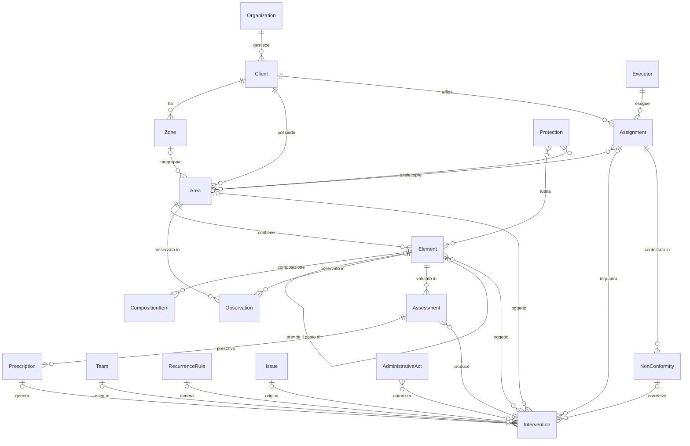
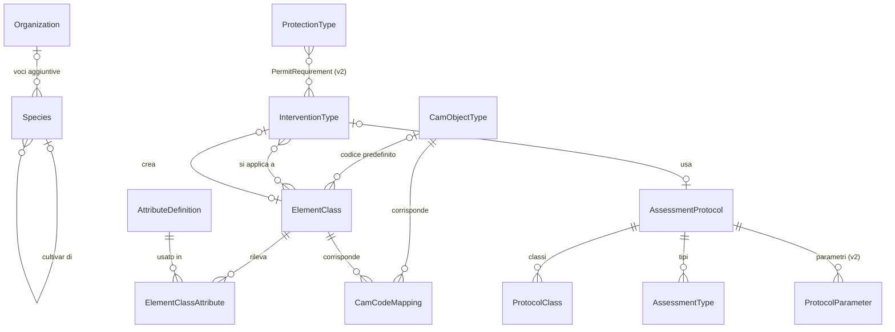
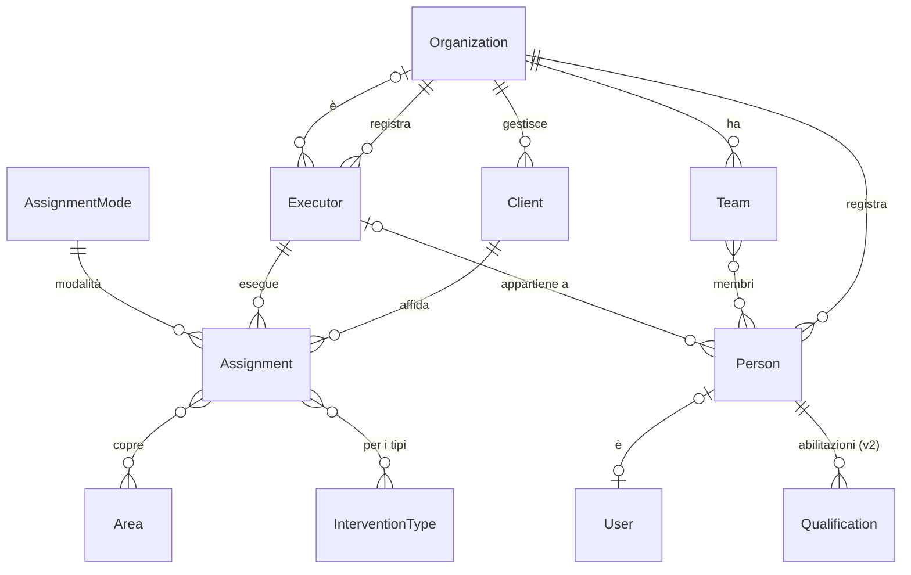
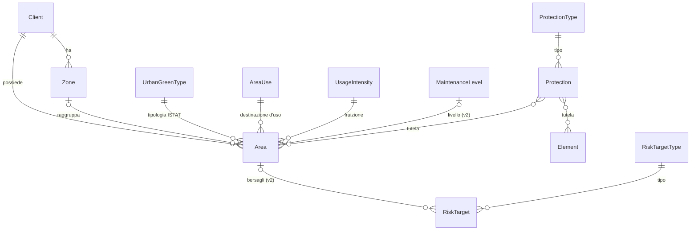
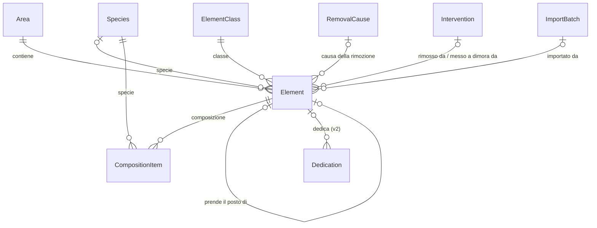
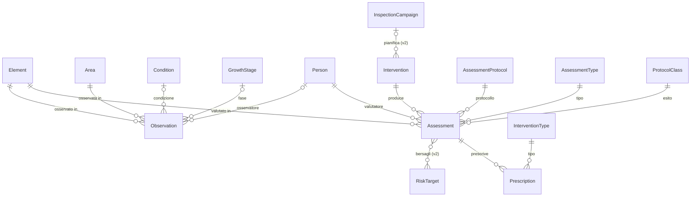
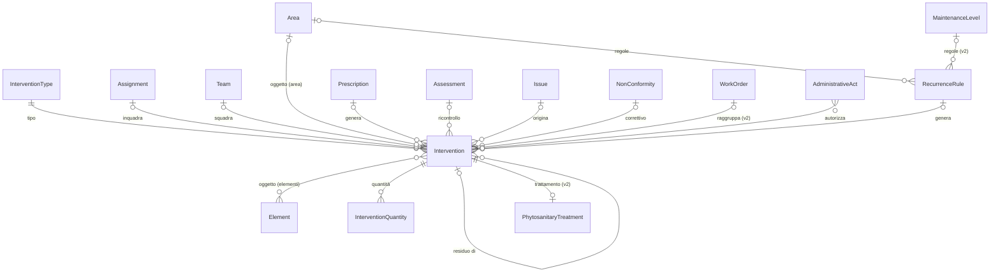
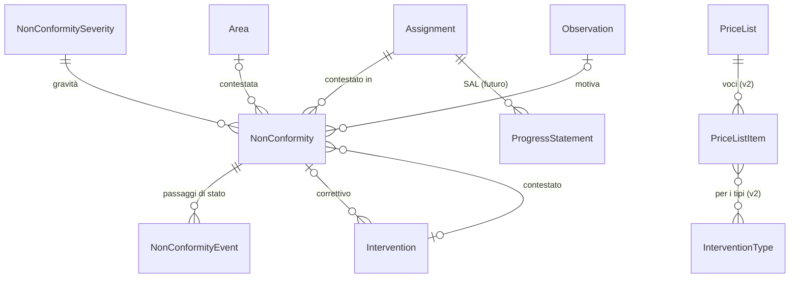
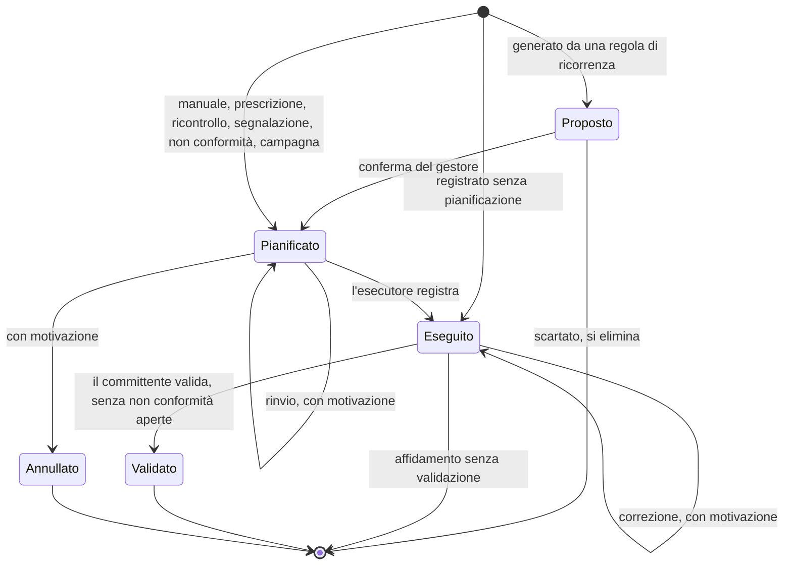
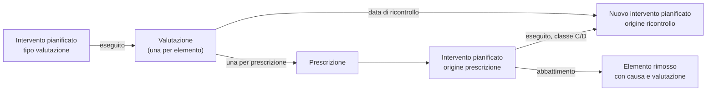

# 04 — Modello dati

> **Stato**: in revisione · **Passo**: 4 di 5 · Metodologia in [README.md](README.md)

- **Obiettivo**: definire il modello dati del dominio, pronto per essere tradotto in modelli Django.
- **Input**: [03-features.md](03-features.md), [glossario.md](glossario.md), [decisioni.md](decisioni.md).
- **Output atteso**: il diagramma ER, una scheda per ogni entità e le scelte di modellazione motivate.
- **Dallo Step 3**: il modello copre le feature MVP e v2 del catalogo (§3 di [03-features.md](03-features.md)); per le feature *futuro* basta non precluderle. Le regole emerse dagli scenari sono in §4 dello stesso documento.
- **Fonte aggiunta in questo passo**: il [*Modello dati per il censimento del verde urbano* v2.1](https://www.mase.gov.it/sites/default/files/archivio/allegati/GPP/2020/modello_dati_per_il_censimento_del_verde_urbano_2_1_con_allegati.pdf), letto per la corrispondenza con codici e attributi CAM (§4.8).

**Come leggere il documento.**
- §1 dà la panoramica, §2 i cataloghi, §3 le schede dei dati operativi. §4 motiva le scelte di modellazione e verifica le ipotesi; §5 dà le note per Django.
- Nomi di entità e campi in inglese (D-001), con la corrispondenza nel [glossario](glossario.md).
- I tipi sono concettuali, non tipi Django (§3.1).
- Priorità: un'entità o un campo senza indicazione serve all'MVP. *(v2)* e *(futuro)* indicano che serve a feature di quella priorità.

## 1. Panoramica

### 1.1 Principi

1. **Il committente è la radice del patrimonio.** Zone, aree, elementi, interventi e affidamenti appartengono a un committente. Il committente è gestito da un'organizzazione, la stessa che lo ha in carico o un'altra (D-032).
2. **L'elemento è l'unità di censimento** (D-002). Ha sempre una geometria e un'area. Un elemento lineare o areale può rappresentare un gruppo, con la sua composizione (D-018).
3. **Anagrafica e registri sono separati.**
   - L'anagrafica (aree, elementi, affidamenti) descrive cosa c'è: si modifica, e ogni modifica resta nello storico.
   - I registri (osservazioni, valutazioni, interventi eseguiti) descrivono cosa è successo: si aggiungono e non si cancellano.

   Lo stato corrente di un elemento si legge dall'ultimo record del registro. L'elemento ne tiene una copia per mappe e filtri.
4. **Cataloghi in tabella, comportamenti nel codice.** Le liste che gli utenti estendono sono cataloghi; le liste da cui dipende la logica dell'applicazione sono enumerazioni (D-027).
5. **Tutto è tracciato.** Identificativi UUID, autore e organizzazione di ogni modifica, storico delle modifiche, revisione per la sincronizzazione offline (D-014, D-034).
6. **I derivati si calcolano.** Superfici, lunghezze, scadenze e conteggi derivano da geometrie e date. Le copie tenute per le prestazioni sono indicate come *copia* nelle schede.

### 1.2 Gruppi di entità

| Gruppo | Entità | Feature dello Step 3 | § |
|---|---|---|---|
| Cataloghi | `Species`, `ElementClass`, `AttributeDefinition`, `CamObjectType`, `InterventionType`, `Condition`, `AssessmentProtocol` e voci collegate, cataloghi minori | CT-1–CT-8, EL-4, ST-10 | 2 |
| Soggetti e affidamenti | `Client`, `Executor`, `Person`, `Team`, `Qualification` (v2), `Assignment` | AF-1–AF-5 | 3.2 |
| Territorio | `Zone`, `Area`, `Protection`, `RiskTarget` (v2) | AR-1–AR-5, EL-12, EL-13, ST-11 | 3.3 |
| Elementi | `Element`, `CompositionItem`, `Dedication` (v2) | EL-1–EL-15 | 3.4 |
| Stato e valutazioni | `Observation`, `Assessment`, `Prescription`, `InspectionCampaign` (v2) | ST-1–ST-13 | 3.5 |
| Interventi | `Intervention`, `InterventionQuantity`, `RecurrenceRule`, `MaintenanceLevel` (v2), `WorkOrder` (v2), `AdministrativeAct`, `PhytosanitaryTreatment` (v2), `Issue` | IN-1–IN-17 | 3.6 |
| Rapporto tra committente ed esecutore | `NonConformity`, `NonConformityEvent`, `PriceList` e `PriceListItem` (v2), `ProgressStatement` (futuro) | CE-1–CE-7 | 3.7 |
| Trasversali | `Attachment`, `ChangeRecord`, `ImportBatch`, `ImportValueMapping`, `PublicMapSettings` | ST-3, TR-6, CE-4, RE-7, RE-8, PU-1–PU-4 | 3.8 |
| Entità di confine | `Organization`, `User` | — | 3.1 |

Report ed export (RE-1–RE-13) non hanno entità proprie: si calcolano dai dati operativi. Le regole di calcolo che toccano il modello sono in §4.3 (bilancio arboreo) e §4.8 (export CAM).

### 1.3 Diagramma d'insieme

Il diagramma mostra le entità principali e i loro legami. Cataloghi, entità trasversali ed entità v2 sono nei diagrammi delle sezioni 2 e 3.

## 2. Cataloghi

### 2.1 Cataloghi ed enumerazioni

Ogni lista di valori del dominio è un catalogo o un'enumerazione (D-027):
- **catalogo**: tabella con voci gestite nell'applicazione (D-005). Ci vanno le liste che gli utenti estendono o che cambiano senza rilasciare codice: specie, classi di elemento, tipi di intervento, condizioni, protocolli.
  - *Estendibile*: voci di sistema più voci dell'organizzazione (D-016).
  - *Fisso*: solo voci di sistema, perché viene da una fonte esterna (ISTAT, CAM).
- **enumerazione**: insieme chiuso di valori definito nel codice. Ci vanno le liste da cui dipende un comportamento dell'applicazione: stati, origini, tipi di geometria, unità di misura. Un valore nuovo richiede codice nuovo, quindi non avrebbe senso aggiungerlo da interfaccia.

Quando una voce di catalogo deve guidare un comportamento, ha un campo che punta a un'enumerazione. Per esempio il tipo di intervento ha un *effetto sul censimento* (rimozione, messa a dimora…), così le organizzazioni aggiungono tipi senza toccare la logica.

### 2.2 Voci di sistema e voci dell'organizzazione

Rappresentazione di D-016. I cataloghi estendibili hanno questi campi comuni:

| Campo | Tipo | Obbl. | Descrizione |
|---|---|---|---|
| `organization` | → Organization | | Vuoto per le voci di sistema; l'organizzazione proprietaria per le voci aggiuntive. Assente nei cataloghi fissi. |
| `code` | testo | sì | Codice stabile, usato da import, export e dati iniziali. Univoco tra le voci di sistema e, per ogni organizzazione, tra le sue voci. |
| `name` | testo | sì | Nome mostrato. |
| `description` | testo lungo | | |
| `sort_order` | intero | | Ordine di presentazione. |
| `source` | testo | | Fonte della voce (es. "ISTAT, questionario Verde 2024"). |
| `retired` | booleano | sì | Voce ritirata: non si sceglie più, ma resta valida sui dati che la usano (CT-2). |
| `hidden_by` | ↔ Organization | | Organizzazioni che nascondono la voce di sistema. Solo sulle voci di sistema. |

Regole:
- **Voci di sistema.** Le cura chi gestisce il sistema. Le organizzazioni non le modificano. Il codice non cambia mai; nome e descrizione si possono correggere.
- **Nessuna cancellazione di voci in uso.** Una voce usata dai dati si ritira (chi l'ha creata) o si nasconde (un'organizzazione, per una voce di sistema). Lo storico resta leggibile.
- **Voci disponibili.** Per un'organizzazione sono disponibili:
  - le voci di sistema non ritirate e non nascoste da lei;
  - le sue voci non ritirate.
- **Cataloghi tra organizzazioni** (domanda 2 dello Step 3). Sui dati di un committente valgono le voci disponibili per la sua **organizzazione di gestione** (D-032), anche quando lavora un esecutore o un valutatore di un'altra organizzazione.
  - Se all'esecutore manca una voce, la chiede al gestore. Nell'MVP non può aggiungere voci al catalogo del committente.
  - Una voce già registrata resta valida anche se poi viene nascosta o ritirata.
- **Voci dall'import.** In un import, un valore che non corrisponde a nessuna voce si associa a una voce esistente o diventa una voce dell'organizzazione (scenario 4.1). L'associazione si ricorda per gli import successivi (`ImportValueMapping`, §3.8).

### 2.3 Elenco dei cataloghi

| Catalogo | Entità | Tipo | Priorità | Feature |
|---|---|---|---|---|
| Specie | `Species` | estendibile | MVP | CT-2 |
| Classi di elemento | `ElementClass` | estendibile | MVP | CT-3 |
| Attributi | `AttributeDefinition`, `ElementClassAttribute` | estendibile | MVP; voci dell'organizzazione in v2 | EL-3, EL-4 |
| Codici del modello dati CAM | `CamObjectType`, `CamCodeMapping` | fisso | MVP | CT-3, RE-7 |
| Tipi di intervento | `InterventionType` | estendibile | MVP | CT-4 |
| Condizioni | `Condition` | estendibile | MVP | CT-6 |
| Protocolli di valutazione | `AssessmentProtocol`, `ProtocolClass`, `AssessmentType` | estendibile; voci dell'organizzazione in v2 | MVP | CT-7, ST-10 |
| Parametri dei protocolli | `ProtocolParameter` | estendibile | v2 | ST-10, ST-11 |
| Tipologie di verde urbano (ISTAT) | `UrbanGreenType` | fisso | MVP | CT-5 |
| Destinazioni d'uso | `AreaUse` | estendibile | MVP | CT-5 |
| Intensità di fruizione | `UsageIntensity` | estendibile | MVP | CT-5 |
| Fasi di sviluppo (CAM) | `GrowthStage` | fisso | MVP | CT-8 |
| Cause di rimozione | `RemovalCause` | estendibile | MVP | CT-8, IN-11 |
| Tipi di vincolo | `ProtectionType` | estendibile | MVP | CT-8, EL-12 |
| Modalità di affidamento | `AssignmentMode` | estendibile | MVP | CT-8 |
| Gravità delle non conformità | `NonConformitySeverity` | estendibile | MVP | CT-8 |
| Categorie di segnalazione | `IssueCategory` | estendibile | MVP | IN-12 |
| Tipi di abilitazione | `QualificationType` | estendibile | v2 | AF-5 |
| Tipi di bersaglio | `RiskTargetType` | estendibile | v2 | ST-11 |
| Frequenze d'uso | `UseFrequency` | estendibile | v2 | ST-11 |
| Atti richiesti per vincolo e intervento | `PermitRequirement` | estendibile | v2 | IN-14 |

### 2.4 Schede dei cataloghi principali

Nelle schede si omettono i campi comuni di §2.2.

#### Species — Specie

Voce del catalogo botanico, separata dalla classe di elemento (D-006). Comprende generi, specie, ibridi e cultivar, perché in campo non sempre si arriva alla specie (es. *Prunus* sp.).

| Campo | Tipo | Obbl. | Descrizione |
|---|---|---|---|
| `rank` | enum: genere, specie, ibrido, cultivar | sì | Livello tassonomico della voce. |
| `scientific_name` | testo | sì | Nome scientifico completo (es. *Platanus × hispanica* 'Vallis Clausa'). |
| `genus` | testo | sì | Genere. Campo `GENERE` del CAM. |
| `specific_epithet` | testo | | Epiteto specifico. Campo `SPECIE` del CAM. |
| `infraspecific` | testo | | Sottospecie, varietà o forma. |
| `cultivar` | testo | | Cultivar. Campo `VARIETA'` del CAM. |
| `family` | testo | | Famiglia. |
| `common_name` | testo | | Nome comune italiano. |
| `parent` | → Species | | Voce di livello superiore (la specie di una cultivar, il genere di una specie). |
| `synonyms` | lista di testo | | Sinonimi e nomi usati nei file da importare. |
| `external_ref` | testo | | Identificativo nella fonte di nomenclatura. |

Regole:
- il nome scientifico è univoco tra le voci disponibili a un'organizzazione;
- una voce ritirata (es. un sinonimo che confluisce in un nome accettato) resta sugli elementi esistenti; l'import usa `synonyms` per associare i nomi alla voce corrente.

#### ElementClass — Classe di elemento

Classificazione dell'elemento censito, erede dell'habitus Access (D-006). Determina geometria, unità di misura, specie e attributi da rilevare.

| Campo | Tipo | Obbl. | Descrizione |
|---|---|---|---|
| `category` | enum: vegetazione, arredo, gioco, impianto, altro | sì | Raggruppamento principale. Corrisponde ai tipi principali 1 e 2 del CAM. |
| `geometry_type` | enum: punto, linea, poligono | sì | Tipo di geometria degli elementi della classe. |
| `quantity_unit` | enum: numero, metro, metro quadro | sì | Unità con cui si conta la classe nei riepiloghi. Di norma segue la geometria. |
| `species_mode` | enum: nessuna, singola, composizione, singola o composizione | sì | Se l'elemento ha una specie, una composizione (D-018) o nessuna delle due (arredi). |
| `counts_as_tree` | booleano | sì | Gli elementi della classe contano come alberi nel catasto e nel bilancio arboreo. |
| `is_planting_site` | booleano | sì | La classe rappresenta un posto d'impianto: posto libero o ceppaia (D-029). |
| `cam_object_type` | → CamObjectType | | Codice CAM predefinito per l'export (D-030). Vuoto per le classi senza corrispondenza. |

Classi di sistema iniziali, ricavate dal catalogo oggetti CAM:
- albero, arbusto, rampicante;
- siepe, filare (solo per filari non censiti albero per albero, §3.4);
- prato, aiuola, macchia arbustiva, gruppo di alberi, bosco, vegetazione acquatica;
- arredi: panchina, cestino, fontanella, pavimentazione, recinzione…;
- gioco singolo e gioco complesso (D-017);
- elementi dell'impianto di irrigazione;
- *(v2)* posto libero e ceppaia (EL-15).

Le varianti CAM che dipendono da materiale o collocazione (es. "prato in scarpata", "pavimentazione in pietra") non sono classi: sono valori di un attributo, e la corrispondenza con il codice CAM la dà `CamCodeMapping`.

#### AttributeDefinition ed ElementClassAttribute — Attributi della classe

Gli attributi da rilevare dipendono dalla classe (EL-3), quindi sono a catalogo e non colonne fisse dell'elemento. Gli attributi definiti dall'organizzazione (EL-4) arrivano in v2 come voci aggiuntive.

`AttributeDefinition`:

| Campo | Tipo | Obbl. | Descrizione |
|---|---|---|---|
| `data_type` | enum: numero, testo, booleano, scelta, data | sì | Tipo del valore. |
| `unit` | testo | | Unità per i numeri (m, cm…). |
| `choices` | lista di testo | | Valori ammessi per il tipo *scelta* (es. tipo di prato: in erba, fiorito, in scarpata…). |
| `is_measure` | booleano | sì | *Misura*: varia nel tempo e si registra nelle osservazioni (D-028), come l'altezza di una siepe. Altrimenti è un attributo dell'elemento, come il materiale di una panchina. |

`ElementClassAttribute` lega una classe ai suoi attributi: `element_class`, `attribute`, `required` (booleano), `sort_order`.

Le misure degli alberi chieste dai CAM (diametri, altezza, chioma, fase di sviluppo) hanno campi propri nelle osservazioni (§3.5). Sono troppo centrali per report ed export per stare tra gli attributi generici.

#### CamObjectType e CamCodeMapping — Codici del modello dati CAM

`CamObjectType` è il catalogo fisso degli oggetti del modello dati CAM v2.1 (allegato 1), con i codici `TXYYZZZ`.

| Campo | Tipo | Obbl. | Descrizione |
|---|---|---|---|
| `code` | testo (7) | sì | Codice completo (es. `P103108`). |
| `geometry_type` | enum: punto, linea, poligono | sì | Primo carattere: P, L, S. |
| `main_type` | testo (1) | sì | Tipo principale: 1 vegetazione, 2 arredo urbano, 3 fruizione e gestione, 4 fattori ambientali. Campo `TP`. |
| `secondary_type` | testo (2) | sì | Tipo secondario (es. 03 pianta). Campo `TS`. |
| `attribute_code` | testo (3) | sì | Attributo (es. 108 albero). |
| `name` | testo | sì | Nome nel catalogo CAM (es. "albero", "prato in scarpata/fossetti"). |

`CamCodeMapping` collega un codice CAM a una classe e, se serve, ai valori di attributo che lo distinguono.

| Campo | Tipo | Obbl. | Descrizione |
|---|---|---|---|
| `cam_object_type` | → CamObjectType | sì | |
| `element_class` | → ElementClass | sì | |
| `attribute_preset` | JSON | | Valori degli attributi che identificano il codice (es. `{"tipo_prato": "in scarpata"}` per `S101051`). Vuoto per il codice predefinito della classe. |

Regole (D-030):
- **import**: il codice CAM dà la classe e i valori di attributo del preset;
- **export**: l'elemento prende il codice della corrispondenza più specifica che combacia con i suoi attributi, altrimenti il codice predefinito della classe;
- una classe senza codice CAM (es. posto libero, ceppaia: il modello CAM non li prevede) resta fuori dall'export CAM, e l'export lo segnala;
- i codici che nel modello CAM non sono elementi (aree di gestione, aree di quarantena, aree temporanee) hanno una corrispondenza propria, descritta in §4.8.

#### InterventionType — Tipo di intervento

Voce del catalogo degli interventi (CT-4). I campi che guidano la logica puntano a enumerazioni (§2.1).

| Campo | Tipo | Obbl. | Descrizione |
|---|---|---|---|
| `applies_to` | enum: elementi, area, entrambi | sì | Su cosa si esegue il tipo. |
| `element_classes` | ↔ ElementClass | | Classi a cui si applica; vuoto = tutte. |
| `quantity_unit` | enum: numero, metro, metro quadro, ora, chilogrammo, litro | sì | Unità della quantità eseguita principale. |
| `estimate_basis` | enum: superficie, lunghezza, numero, nessuna | sì | Come si stima la quantità dalla geometria dell'oggetto (scenario 4.3). |
| `census_effect` | enum: nessuno, rimozione, messa a dimora, sostituzione, valutazione | sì | Effetto dell'esecuzione sul censimento (IN-10, §4.3) o sul registro dello stato (§4.6). |
| `created_class` | → ElementClass | | Classe dell'elemento creato da una messa a dimora o da una sostituzione. |
| `default_removal_cause` | → RemovalCause | | Causa proposta quando il tipo rimuove l'elemento. |
| `protocol` | → AssessmentProtocol | | Protocollo usato dai tipi con effetto *valutazione*. |
| `default_assessment_type` | → AssessmentType | | Tipo di valutazione proposto. |
| `is_treatment` | booleano | | *(v2)* L'esecuzione richiede i dati del trattamento fitosanitario (IN-15). |
| `required_qualifications` | ↔ QualificationType | | *(v2)* Abilitazioni richieste agli operatori (AF-5). |
| `public_label` | testo | | Nome mostrato sulla mappa pubblica, se diverso. |

Regole:
- il tipo di sistema "valutazione" ha effetto *valutazione* e il protocollo SIA (D-025). In v2 i tipi "ispezione visiva", "ispezione funzionale" e "ispezione principale" dei giochi usano il protocollo UNI EN 1176-7 (D-017);
- un tipo con effetto *messa a dimora* o *sostituzione* richiede `created_class`.

#### Condition — Condizione

Valore della condizione nelle osservazioni (CT-6, D-007).

| Campo | Tipo | Obbl. | Descrizione |
|---|---|---|---|
| `applies_to` | enum: elemento, area, entrambi | sì | Le condizioni di un'area (es. "pulizia insufficiente") sono diverse da quelle di un albero. |
| `rank` | intero | sì | Posizione nella scala, dalla migliore alla peggiore. Serve a tematismi e filtri. |
| `cam_state_label` | testo (30) | | Valore del campo `STATO` nell'export CAM (es. "Pianta viva"). Vuoto = il nome della voce. |

#### AssessmentProtocol, ProtocolClass, AssessmentType, ProtocolParameter — Protocolli di valutazione

Il protocollo di valutazione è a catalogo (D-010). Nell'MVP c'è il protocollo SIA precaricato; il gestore aggiunge protocolli in v2 (ST-10).

`AssessmentProtocol`:

| Campo | Tipo | Obbl. | Descrizione |
|---|---|---|---|
| `kind` | enum: propensione al cedimento, rischio, ispezione giochi | sì | Famiglia del protocollo. |
| `version` | testo | | Versione o anno (es. SIA 2008/2015). |
| `recheck_basis` | enum: dalla classe, dal tipo | sì | Da dove viene l'intervallo di ricontrollo: dalla classe di esito (SIA) o dal tipo di valutazione (ispezioni dei giochi). |

`ProtocolClass`, le classi o gli esiti del protocollo:

| Campo | Tipo | Obbl. | Descrizione |
|---|---|---|---|
| `protocol` | → AssessmentProtocol | sì | |
| `code` | testo | sì | Es. A, B, C, C/D, D. |
| `rank` | intero | sì | Ordine di gravità. |
| `max_recheck_months` | intero | | Termine massimo del ricontrollo (SIA: A 60, B 36, C 24). Vuoto se non c'è un ricontrollo periodico. |
| `is_critical` | booleano | sì | Esito critico, da mettere in evidenza (ST-9). |
| `reassess_after_prescription` | booleano | sì | Dopo l'intervento prescritto si pianifica una nuova valutazione (classe C/D, ST-8). |

`AssessmentType`, i tipi di valutazione del protocollo: `protocol`, `code`, `name`, `depth_rank` (ordine di approfondimento) e `recheck_interval_months`. L'intervallo serve solo ai protocolli con ricontrollo dal tipo. Per il protocollo SIA i tipi iniziali sono quelli della linea guida 2025:
- visiva speditiva;
- visiva speditiva massiva;
- ordinaria;
- avanzata a terra;
- avanzata in quota;
- biomeccanica.

`ProtocolParameter` *(v2)*: i parametri strutturati della scheda. Campi: `protocol`, `code`, `label`, `group` (es. A–E delle linee guida CONAF), `data_type`, `choices`, `required`. Nell'MVP la scheda SIA ha classe, giudizio sintetico, prescrizioni e allegati; i parametri strutturati servono ai protocolli di rischio (ST-11).

### 2.5 Cataloghi minori

| Entità | Campi propri | Note |
|---|---|---|
| `UrbanGreenType` | — | Fisso. Le 14 tipologie del questionario ISTAT 2024 (Step 2, §2.4). |
| `GrowthStage` | `rank` | Fisso. Nuovo impianto, giovane, adulto, senescente (CAM). |
| `AreaUse` | — | Destinazione d'uso dell'area (D-009). |
| `UsageIntensity` | `rank` | Intensità di fruizione. Il rango permette regole come "8 sfalci nelle aree a fruizione alta" (scenario 4.3). |
| `RemovalCause` | `istat_cause` (enum: rischio di caduta, eventi atmosferici, altre cause) | Ogni causa si riconduce a una delle cause ISTAT di abbattimento (IN-11). |
| `ProtectionType` | `cam_object_type` (→ CamObjectType) | Monumentale, bene culturale, bene paesaggistico, area di quarantena, focolaio. Il codice CAM serve per esportare i vincoli con geometria propria (es. `S440558` area di quarantena). |
| `AssignmentMode` | `cam_object_type` (→ CamObjectType) | In economia, in appalto, in adozione, in sponsorizzazione (D-013). Il codice CAM è facoltativo (es. `S326551` area sponsor). |
| `NonConformitySeverity` | `rank`, `default_days` | Gravità e termine proposto per la correzione. |
| `IssueCategory` | `public` (booleano) | Es. ramo spezzato, albero inclinato, gioco danneggiato. In v2 le categorie pubbliche si scelgono dalla mappa pubblica. |
| `QualificationType` *(v2)* | — | Es. certificato per i prodotti fitosanitari, abilitazione alle piattaforme di lavoro elevabili. |
| `RiskTargetType` *(v2)* | — | Es. persone in sosta, traffico veicolare, traffico ciclopedonale, edifici (Step 2, §2.5). |
| `UseFrequency` *(v2)* | `rank` | Frequenza d'uso del bersaglio: costante, frequente, occasionale, rara. |
| `PermitRequirement` *(v2)* | `protection_type`, `intervention_type`, `requirement` (enum: comunicazione, autorizzazione) | Quali interventi su un oggetto vincolato richiedono un atto (IN-14). Voci di sistema dalla circolare 461/2020 per gli alberi monumentali. |

### 2.6 Enumerazioni

| Enumerazione | Valori | Usata in |
|---|---|---|
| Tipo di geometria | punto, linea, poligono | `ElementClass`, `CamObjectType` |
| Unità di misura | numero, metro, metro quadro, ora, chilogrammo, litro | `ElementClass`, `InterventionType`, `InterventionQuantity` |
| Stato dell'intervento | proposto, pianificato, eseguito, validato, annullato | `Intervention` (§4.5) |
| Origine dell'intervento | manuale, ricorrenza, prescrizione, ricontrollo, segnalazione, non conformità, campagna | `Intervention` (§4.5) |
| Priorità dell'intervento | bassa, normale, alta, urgente | `Intervention` |
| Priorità della prescrizione | ordinaria, urgente, indifferibile | `Prescription` |
| Effetto sul censimento | nessuno, rimozione, messa a dimora, sostituzione, valutazione | `InterventionType` |
| Stato della non conformità | aperta, risolta, chiusa | `NonConformity` |
| Tipo di non conformità | esecuzione non conforme, mancata esecuzione, stato dell'area | `NonConformity` |
| Stato della segnalazione | aperta, trasformata, archiviata | `Issue` |
| Origine della segnalazione | campo, cittadino, mappa pubblica (v2), altro | `Issue` |
| Stato della posizione | verificata, provvisoria | `Element` (D-026) |
| Origine della posizione | GPS, mappa, import, centro dell'area | `Element` |
| Stato di un record del registro | valido, annullato | `Observation`, `Assessment` |
| Modalità di inserimento della valutazione | scheda del gestore, dati da relazione | `Assessment` (D-022) |
| Tipo di committente | ente pubblico, azienda pubblica, condominio, azienda, privato, altro | `Client` (AF-1) |
| Tipo di esecutore | squadre interne, impresa, cooperativa, associazione, professionista o studio, altro | `Executor` |
| Ruolo nel dominio | operatore, rilevatore, valutatore | `Person` |
| Tipo di dedica | nuovo nato, minore adottato, celebrativa, commemorativa | `Dedication` (v2) |
| Tipo di atto | comunicazione, autorizzazione, parere, nulla osta, ordinanza | `AdministrativeAct` |
| Esito dell'atto | favorevole, favorevole con prescrizioni, contrario, non previsto | `AdministrativeAct` |
| Tipo di allegato | foto, relazione, referto, atto, documento | `Attachment` |
| Fase della foto | prima, durante, dopo | `Attachment` (IN-8) |
| Operazione e origine della modifica | creazione, modifica, annullamento · web, campo, import, sincronizzazione, sistema | `ChangeRecord` |
| Livello di censimento | 1, 2, 3 | `Area` |

### 2.7 Fonti dei cataloghi iniziali

Chiude la domanda 2 dello Step 2. Per i cataloghi che lo Step 2 aveva lasciato senza fonte si propone una fonte; la compilazione dei dati iniziali è un'attività dello sviluppo.

| Catalogo | Fonte | Stato |
|---|---|---|
| Tipologie di verde urbano | Questionario ISTAT Verde 2024 | trovata allo Step 2 |
| Fasi di sviluppo | CAM, livello 2 | trovata allo Step 2 |
| Codici CAM e classi di elemento | Allegato 1 del modello dati CAM v2.1 | verificata in questo passo (§4.8) |
| Cause di rimozione | Cause ISTAT di abbattimento | trovata allo Step 2 |
| Protocollo SIA, classi e tipi di valutazione | SIA 2008 e 2015; linea guida 2025 | trovata allo Step 2 |
| Tipi di vincolo; atti per vincolo e intervento | L. 10/2013, D.Lgs. 42/2004, circolare 461/2020; codici CAM `S440558`–`S440560` | trovata allo Step 2 |
| **Specie** | Elenco iniziale ricavato dai censimenti arborei pubblicati come open data da grandi comuni italiani, che riportano le specie davvero presenti in città. Nomi scientifici normalizzati su una nomenclatura di riferimento (es. *World Checklist of Vascular Plants* di Kew). Nomi comuni dagli stessi open data. | proposta; licenze da verificare |
| **Tipi di intervento** | Lavorazioni citate dai CAM (sfalcio, potatura, abbattimento, messa a dimora…), con le voci dei capitoli "opere a verde" dei prezzari regionali per nomi e unità di misura. Gli stessi prezzari sono la base del prezzario dell'affidamento (CE-6). | proposta |
| **Periodicità** | Non è più un catalogo: frequenze e finestre stanno nelle regole di ricorrenza (D-020). In v2 i livelli di manutenzione si possono precaricare come esempi di gestione differenziata. | chiusa |
| Condizioni | Scala a cinque livelli: buona, discreta, mediocre, scadente, morta. Per le aree: buona, sufficiente, insufficiente. | proposta |
| Destinazioni d'uso | Da costruire con i primi committenti; spunti dalle aree funzionali del modello CAM (tipo secondario 27: area gioco, area cani, orti…). | proposta |
| Intensità di fruizione, gravità | Tre livelli (alta, media, bassa). | proposta |

## 3. Dati operativi

### 3.1 Convenzioni delle schede

**Tipi.** testo, testo lungo, intero, decimale, data, data e ora, booleano, enum (§2.6), lista, JSON, file; punto, linea, poligono (§4.2); → Entità (riferimento a una entità); ↔ Entità (legame molti a molti).

**Campi comuni.** Ogni entità operativa ha questi campi, omessi nelle schede:

| Campo | Tipo | Descrizione |
|---|---|---|
| `id` | UUID | Identificativo, generabile anche dal dispositivo in campo (D-014). |
| `created_at`, `created_by` | data e ora, → User | Creazione. |
| `updated_at`, `updated_by` | data e ora, → User | Ultima modifica. |
| `revision` | intero | Numero di revisione, cresce a ogni modifica. Serve alla sincronizzazione offline in v2 (§4.1). |

L'organizzazione dell'autore e il dettaglio delle modifiche sono nello storico (`ChangeRecord`, §3.8).

**Entità di confine.** `Organization` (l'organizzazione che usa il sistema) e `User` (l'utente autenticato) le definiscono la multi-tenancy e l'autenticazione, fuori perimetro. Il modello vi fa solo riferimento (§5.4).

### 3.2 Soggetti e affidamenti

#### Client — Committente

Il soggetto a cui appartiene il verde, o che lo ha in carico (A1, D-013). È distinto dall'organizzazione che usa il sistema.

| Campo | Tipo | Obbl. | Descrizione |
|---|---|---|---|
| `name` | testo | sì | Denominazione. |
| `kind` | enum | sì | Tipo di committente (§2.6). |
| `istat_code` | testo | | Codice ISTAT del comune, per i committenti comunali. Valore predefinito del comune delle aree. |
| `tax_code` | testo | | Codice fiscale o partita IVA. |
| `managing_organization` | → Organization | sì | Organizzazione di gestione: quella del gestore, che organizza il patrimonio e affida i lavori (D-032). |
| `contacts` | testo lungo | | Recapiti: indirizzo, PEC, telefono. |
| `cam_export_srid` | enum: 6706, 7791, 7792, 7793, 7794 | | Sistema di riferimento RDN2008 per l'export CAM (§4.2). |
| `active` | booleano | sì | |
| `notes` | testo lungo | | |

Regole:
- il patrimonio di un committente è separato da quello degli altri (scenario 4.8): ogni dato operativo appartiene a un solo committente;
- nel caso base l'organizzazione di gestione è quella del committente. Nella variante di K2 il committente è il comune e l'organizzazione di gestione è l'azienda pubblica (§4.7).

#### Executor — Esecutore

Chi esegue gli interventi di un affidamento: squadre del committente, impresa, cooperativa, associazione, professionista (A5). È l'anagrafica degli esecutori tenuta dall'organizzazione di gestione.

| Campo | Tipo | Obbl. | Descrizione |
|---|---|---|---|
| `owner_organization` | → Organization | sì | Organizzazione che tiene l'anagrafica. |
| `name` | testo | sì | |
| `kind` | enum | sì | Tipo di esecutore (§2.6). |
| `tax_code` | testo | | |
| `linked_organization` | → Organization | | Organizzazione dell'esecutore, se usa il sistema. Nel caso K1 è la stessa organizzazione del committente. |
| `contacts` | testo lungo | | |
| `active` | booleano | sì | |

Regola: un esecutore senza `linked_organization` non usa il sistema. Il gestore registra per lui l'eseguito o la valutazione (D-022).

#### Person — Persona

Una persona che ha un ruolo nel dominio: operatore di una squadra, rilevatore, valutatore (D-031). Non coincide con l'utente: un rilevatore citato in un file importato o un agronomo che consegna solo la relazione non hanno un account.

| Campo | Tipo | Obbl. | Descrizione |
|---|---|---|---|
| `organization` | → Organization | sì | Organizzazione che registra la persona. |
| `first_name`, `last_name` | testo | sì | |
| `domain_roles` | lista di enum | | Ruoli nel dominio: operatore, rilevatore, valutatore. Servono a proporre le persone giuste, non sono permessi. |
| `professional_register` | testo | | Ordine o albo e numero di iscrizione, per i valutatori. |
| `executor` | → Executor | | Esecutore a cui appartiene, se è esterno (es. l'agronomo di uno studio incaricato). |
| `user` | → User | | Utente collegato, se la persona usa il sistema. |
| `active` | booleano | sì | |

#### Team — Squadra

Gruppo di operatori a cui si assegnano gli interventi (AF-3).

| Campo | Tipo | Obbl. | Descrizione |
|---|---|---|---|
| `organization` | → Organization | sì | Organizzazione dell'esecutore. Una ditta usa le stesse squadre per tutti i suoi committenti (scenario 4.8). |
| `name` | testo | sì | |
| `members` | ↔ Person | | Operatori. Le variazioni restano nello storico. |
| `active` | booleano | sì | |

Regola: la squadra di un intervento appartiene all'organizzazione dell'esecutore dell'affidamento.

#### Qualification — Abilitazione *(v2)*

Abilitazione di un operatore, con scadenza (AF-5). Campi:
- `person` (→ Person) e `qualification_type` (→ QualificationType), obbligatori;
- `number`, `issued_on`, `expires_on`;
- l'attestato come allegato.

Regola: quando si assegna un intervento di un tipo che richiede abilitazioni, almeno un operatore assegnato deve averle valide alla data prevista. Se non è così il sistema avvisa; per i trattamenti fitosanitari blocca (IN-15).

#### Assignment — Affidamento

Lega un committente a un esecutore per un insieme di aree, un periodo e, se serve, alcuni tipi di intervento (D-013). È anche il perimetro entro cui un esecutore o un valutatore di un'altra organizzazione lavora sul patrimonio (D-012).

| Campo | Tipo | Obbl. | Descrizione |
|---|---|---|---|
| `client` | → Client | sì | |
| `executor` | → Executor | sì | |
| `mode` | → AssignmentMode | sì | In economia, in appalto, in adozione, in sponsorizzazione. |
| `title` | testo | sì | Es. "Manutenzione del verde 2026–2028". |
| `start_date`, `end_date` | data | sì, no | Periodo. Senza fine per gli affidamenti in economia. |
| `all_areas` | booleano | sì | Vale per tutte le aree del committente, anche quelle aggiunte dopo. |
| `areas` | ↔ Area | | Aree coperte, se `all_areas` è falso. |
| `intervention_types` | ↔ InterventionType | | Tipi coperti; vuoto = tutti. |
| `contract_reference` | testo | | Estremi del contratto: numero, data, CIG. |
| `requires_validation` | booleano | sì | L'eseguito va validato dal committente (D-025). |
| `includes_census_update` | booleano | sì | L'esecutore aggiorna il censimento delle aree coperte (CE-4, N14). |
| `census_changes_require_approval` | booleano | | *(v2)* Le modifiche al censimento dell'esecutore richiedono l'approvazione del committente (CE-5). |
| `price_list` | → PriceList | | *(v2)* Prezzario dell'affidamento (CE-6). |
| `discount_percent` | decimale | | *(v2)* Ribasso sul prezzario. |
| `notes` | testo lungo | | |

Regole:
- l'esecutore deve essere nell'anagrafica dell'organizzazione di gestione del committente;
- sulla stessa area possono valere più affidamenti, per tipi di intervento diversi o periodi successivi. Lo storico resta: un affidamento usato da interventi non si cancella;
- un intervento rientra nell'affidamento se la sua area (o l'area dei suoi elementi), il suo tipo e la sua data sono coperti;
- l'incarico a un valutatore è un affidamento per il tipo "valutazione" (D-025);
- in K1 ogni committente ha un affidamento in economia alle proprie squadre, senza validazione.

### 3.3 Territorio

#### Zone — Zona

Raggruppamento facoltativo di aree: quartiere, circoscrizione, complesso di un cliente (D-019). Corrisponde al campo `ZONA` del modello dati CAM.

| Campo | Tipo | Obbl. | Descrizione |
|---|---|---|---|
| `client` | → Client | sì | |
| `code` | intero | sì | Codice numerico, univoco per committente. Il CAM vuole un numero. |
| `name` | testo | sì | |
| `geometry` | poligono | | Perimetro ufficiale, se esiste (es. un municipio). Altrimenti la zona è l'insieme delle sue aree. |

#### Area — Area

Porzione di territorio gestita, con il suo perimetro (AR-1). Corrisponde all'area di gestione del modello dati CAM (oggetti `S325xxx`).

| Campo | Tipo | Obbl. | Descrizione |
|---|---|---|---|
| `client` | → Client | sì | |
| `zone` | → Zone | | |
| `number`, `sub_number` | testo | sì, no | Numerazione e subalterno: insieme sono il codice dell'area, univoco per committente. |
| `name` | testo | sì | |
| `geometry` | poligono | sì | Perimetro, semplice (non multiparte) come chiede il CAM. Disegnato o importato (AR-2). |
| `surface_m2`, `perimeter_m` | decimale | — | *Calcolati* dalla geometria. |
| `is_fictitious` | booleano | sì | Area fittizia, esclusa dal calcolo delle superfici (AR-3). |
| `urban_green_type` | → UrbanGreenType | sì | Tipologia ISTAT (D-009). |
| `area_use` | → AreaUse | sì | Destinazione d'uso (D-009). |
| `usage_intensity` | → UsageIntensity | sì | Intensità di fruizione (D-009). |
| `management_start`, `management_end` | data | sì, no | Inizio e fine della gestione (CAM, livello 1). |
| `municipality_code` | testo | sì | Codice ISTAT del comune in cui si trova l'area. Per i committenti comunali è il loro codice; un consorzio o una ditta hanno aree in più comuni. |
| `street_code` | testo | | Codice del toponimo stradale (`CODE_VIA` del CAM). |
| `census_level` | enum: 1, 2, 3 | | Livello di censimento raggiunto (CAM). Dice se l'assenza di elementi significa che non ci sono o che non sono stati censiti. |
| `maintenance_level` | → MaintenanceLevel | | *(v2)* Livello di manutenzione (IN-4). |
| `surveyed_by` | → Person | | Rilevatore. |
| `surveyed_on` | data | | Data del rilievo. |
| `public_excluded` | booleano | | Esclusa dalla mappa pubblica anche se il committente pubblica le aree. |
| `notes` | testo lungo | | |

Regole:
- **sovrapposizioni** (AR-5): le aree dello stesso committente non si sovrappongono. Il sistema avvisa e non blocca; le aree sovrapposte restano in un elenco da correggere;
- **più parti**: un parco diviso da una strada è formato da due aree della stessa zona (D-019);
- **fine gestione**: un'area con `management_end` resta nello storico. Gli elementi che contiene vanno rimossi o spostati in un'altra area;
- un cambio di perimetro o di classificazione resta nello storico delle modifiche. Da lì si ricostruiscono le superfici a una data (§4.3).

#### Protection — Vincolo

Tutela che limita gli interventi su elementi o aree (EL-12): albero monumentale, bene culturale o paesaggistico, area di quarantena.

| Campo | Tipo | Obbl. | Descrizione |
|---|---|---|---|
| `client` | → Client | sì | |
| `protection_type` | → ProtectionType | sì | |
| `reference` | testo | sì | Codice nell'elenco nazionale degli alberi monumentali, estremi del provvedimento di vincolo o della delimitazione. |
| `authority` | testo | | Ente che ha posto il vincolo. |
| `established_on` | data | | |
| `valid_from`, `valid_to` | data | | Validità, ad esempio di una zona delimitata. |
| `elements` | ↔ Element | | Elementi tutelati, anche più insieme (un filare monumentale). |
| `areas` | ↔ Area | | Aree tutelate. |
| `geometry` | poligono | | *(v2)* Zona disegnata sulla mappa (EL-13). |
| `notes` | testo lungo | | |

Regole:
- un vincolo ha almeno un oggetto: elementi, aree o geometria;
- un elemento è **vincolato** se è tutelato direttamente, se la sua area è tutelata o, in v2, se sta dentro la geometria di un vincolo. È un dato *calcolato*, usato per gli avvisi sugli interventi (IN-13) e per il campo "protezione" del livello 2 dei CAM;
- l'atto di vincolo si allega (`Attachment`).

#### RiskTarget — Bersaglio *(v2)*

Bersaglio della valutazione del rischio, fissato dal gestore su un'area o su un tratto di strada (ST-11). Non sta sull'albero (Step 2, §2.5).

| Campo | Tipo | Obbl. | Descrizione |
|---|---|---|---|
| `client` | → Client | sì | |
| `target_type` | → RiskTargetType | sì | |
| `use_frequency` | → UseFrequency | sì | |
| `area` | → Area | | Area interessata, se il bersaglio vale per tutta l'area. |
| `geometry` | linea o poligono | | Tratto di strada o porzione di area. |
| `valid_from`, `valid_to` | data | | |
| `description` | testo lungo | | |

Regole: almeno uno tra `area` e `geometry`. La valutazione del rischio indica i bersagli considerati (`Assessment.targets`).

### 3.4 Elementi

#### Element — Elemento

Oggetto censito con la sua geometria (EL-1). È l'unità di censimento (D-002).

| Campo | Tipo | Obbl. | Descrizione |
|---|---|---|---|
| `client` | → Client | sì | Copia del committente dell'area: serve ai vincoli di unicità e alla multi-tenancy. |
| `area` | → Area | sì | Proposta dalla posizione, modificabile dal rilevatore (scenario 4.2). |
| `element_class` | → ElementClass | sì | |
| `geometry` | punto, linea o poligono | sì | Del tipo previsto dalla classe; semplice, non multiparte. |
| `location_status` | enum: verificata, provvisoria | sì | Posizione provvisoria (D-026, EL-10). |
| `location_source` | enum: GPS, mappa, import, centro dell'area | | Origine della posizione. |
| `location_accuracy_m` | decimale | | Precisione dichiarata dal GPS del dispositivo (TR-4). |
| `code` | testo | sì | Codice leggibile, univoco per committente e mai riusato (EL-8). Campo `PT` del CAM. |
| `tag_number` | testo | | Numero di cartellino, univoco tra gli elementi presenti del committente. |
| `species` | → Species | | Specie, per le classi con specie singola. |
| `attributes` | JSON | | Valori degli attributi della classe che non sono misure (es. tipo di prato, materiale). |
| `estimated_count` | intero | | Numero stimato di individui di un elemento di gruppo (bosco, gruppo di alberi). |
| `planted_on` | data | | Data di posa o di messa a dimora (EL-7). Campo `DATA_INI` del CAM. |
| `planted_on_estimated` | booleano | | La data è stimata o convenzionale (es. la data del primo censimento). |
| `planting_intervention` | → Intervention | | Intervento di messa a dimora che ha creato l'elemento (IN-10). |
| `replaces` | → Element | | Elemento di cui prende il posto: sostituzione, posto libero, ceppaia (D-029). |
| `removed_on` | data | | Data di rimozione (EL-7). Campo `DATA_FINE` del CAM. |
| `removal_cause` | → RemovalCause | | Causa della rimozione (IN-11). |
| `removal_intervention` | → Intervention | | Intervento che ha rimosso l'elemento. |
| `removal_assessment` | → Assessment | | Valutazione che ha motivato la rimozione (IN-11). |
| `surveyed_by`, `surveyed_on` | → Person, data | | Rilevatore e data dell'ultimo rilievo (CAM). Si aggiornano con la creazione, la verifica della posizione e ogni osservazione con misure. |
| `import_batch`, `source_id` | → ImportBatch, testo | | Import di provenienza e identificativo nel file d'origine (scenario 4.1). |
| `public_excluded` | booleano | | Escluso dalla mappa pubblica. |
| `notes` | testo lungo | | |

*Copie* dello stato corrente, aggiornate dai registri (§4.4):

| Campo | Tipo | Da dove viene |
|---|---|---|
| `current_condition`, `current_condition_on` | → Condition, data | Ultima osservazione valida con una condizione. |
| `stem_diameters_cm` | lista di decimali | Ultima osservazione valida con i diametri. |
| `height_m`, `crown_diameter_m` | decimale | Ultima osservazione valida con quella misura. |
| `growth_stage` | → GrowthStage | Ultima osservazione valida con la fase di sviluppo. |
| `measures` | JSON | Ultime misure della classe (es. altezza e larghezza della siepe). |
| `current_assessment` | → Assessment | Ultima valutazione valida. Serve al tematismo per classe di propensione al cedimento (TR-2). |

Regole:
- **geometria**: il tipo coincide con quello della classe. Un elemento fuori dalla propria area resta segnalato (AR-5). Il sistema avvisa se un albero nuovo è molto vicino a uno esistente (scenario 4.2);
- **specie**: obbligatoria per le classi con specie singola, salvo gli elementi importati con una specie da associare, che restano in un elenco da completare;
- **composizione**: solo per le classi che la prevedono (`species_mode`);
- **presenza a una data**: un elemento è presente alla data D se `planted_on` ≤ D e `removed_on` è vuoto o successivo a D (§4.3);
- **rimozione**: un elemento rimosso resta nello storico (EL-7). Non riceve più interventi pianificati, osservazioni o valutazioni; i suoi dati si possono solo correggere. Per le classi che contano come alberi la causa è obbligatoria;
- **filari**: un filare i cui alberi sono censiti uno per uno è rappresentato dai suoi alberi (punti). Interventi e vincoli sull'intero filare hanno come oggetto quegli alberi. L'elemento lineare di classe filare serve solo quando gli alberi non sono censiti uno per uno (D-018).

#### CompositionItem — Voce della composizione

Una specie di un elemento di gruppo, con la sua quantità o percentuale (D-018, EL-5).

| Campo | Tipo | Obbl. | Descrizione |
|---|---|---|---|
| `element` | → Element | sì | |
| `species` | → Species | sì | |
| `quantity` | intero | | Numero di individui. |
| `percentage` | decimale | | Percentuale sulla superficie o sulla lunghezza. |
| `planted_on`, `removed_on` | data | | *(v2)* Date di inserimento e di rimozione della specie, per esempio per le fioriture stagionali (EL-6). |

Regole: ogni voce ha la quantità o la percentuale. Le percentuali delle voci presenti in uno stesso elemento non superano 100.

#### Dedication — Dedica *(v2)*

Legame tra un albero e un nuovo nato, un minore adottato o una celebrazione (EL-14, D-023). Esiste prima dell'albero: la registrazione anagrafica fa partire i 6 mesi per la messa a dimora.

| Campo | Tipo | Obbl. | Descrizione |
|---|---|---|---|
| `client` | → Client | sì | |
| `dedication_type` | enum | sì | Nuovo nato, minore adottato, celebrativa, commemorativa. |
| `registration_on` | data | | Data della registrazione anagrafica, per nuovi nati e minori adottati. |
| `due_on` | data | — | *Calcolata*: registrazione più 6 mesi (L. 113/1992). |
| `deferred_due_on`, `deferral_reason` | data, testo | | Differimento per la stagione o per gravi motivi tecnici. |
| `registry_reference` | testo | | Riferimento fornito dall'ufficio anagrafe. Non contiene dati anagrafici. |
| `public_text` | testo | | Testo della dedica scelto dalla famiglia o dal donatore. |
| `publication_consent` | booleano | sì | La famiglia o il donatore hanno chiesto di pubblicare il testo (§4.9). |
| `donor_name`, `donor_kind` | testo, enum: persona, impresa, associazione | | Donatore degli alberi celebrativi. |
| `element` | → Element | | Albero, quando è stato messo a dimora. |
| `planting_intervention` | → Intervention | | Messa a dimora pianificata o eseguita. |

Regole:
- nessun dato anagrafico del bambino (D-023);
- lo scadenzario elenca le dediche senza albero, per data di scadenza;
- la scheda pubblica (PU-3) mostra specie, posizione e testo, se `publication_consent` è vero.

### 3.5 Stato e valutazioni

#### Observation — Osservazione

Rilievo datato dello stato di un elemento o di un'area (ST-1, ST-2; D-007, D-021). Contiene la condizione e, per gli elementi, le misure (D-028). Un'osservazione con misure è un **rilievo**.

| Campo | Tipo | Obbl. | Descrizione |
|---|---|---|---|
| `element` | → Element | | Elemento osservato. |
| `area` | → Area | | Area osservata. |
| `observed_at` | data e ora | sì | |
| `observer` | → Person | | Chi ha osservato. Per i dati importati, il rilevatore del file. |
| `source` | enum: campo, ufficio, import | sì | |
| `condition` | → Condition | | |
| `stem_diameters_cm` | lista di decimali | | Diametro a 1,30 m, uno per fusto se l'albero ha più fusti (EL-2). |
| `height_m` | decimale | | Altezza. |
| `crown_diameter_m` | decimale | | Diametro della chioma. |
| `growth_stage` | → GrowthStage | | Fase di sviluppo. |
| `measures` | JSON | | Altre misure previste dalla classe (`is_measure`). |
| `notes` | testo lungo | | |
| `status` | enum: valido, annullato | sì | |
| `void_reason` | testo | | Motivazione dell'annullamento. |

Regole:
- l'oggetto è un elemento o un'area, non entrambi;
- un'osservazione ha almeno una condizione, una misura, una nota o una foto;
- misure solo sugli elementi, e solo quelle previste dalla classe;
- **registro**: un'osservazione non si cancella. Si corregge, con la motivazione nello storico, o si annulla. Le copie sull'elemento ignorano le osservazioni annullate;
- la prima osservazione di un elemento censito in campo nasce con l'elemento (scenario 4.2). Per gli elementi importati, l'import crea un'osservazione con le misure e la data del file (scenario 4.1);
- il censimento non contiene giudizi sul rischio: quelli stanno nella valutazione (D-010).

#### Assessment — Valutazione

Valutazione di stabilità o di rischio di un albero, o in v2 ispezione di un gioco, secondo un protocollo (ST-4–ST-11; D-010, D-017). Appartiene al registro dello stato come l'osservazione, ma è un'entità distinta: ha valutatore, protocollo, esito e conseguenze (ricontrollo, prescrizioni), e riguarda solo gli elementi.

| Campo | Tipo | Obbl. | Descrizione |
|---|---|---|---|
| `element` | → Element | sì | |
| `intervention` | → Intervention | sì | Intervento di tipo valutazione che l'ha prodotta (D-025). Se la valutazione si registra senza pianificazione, il sistema crea l'intervento eseguito. |
| `protocol` | → AssessmentProtocol | sì | |
| `assessment_type` | → AssessmentType | sì | |
| `assessor` | → Person | sì | Valutatore (A4). |
| `assessed_on` | data | sì | |
| `entry_mode` | enum: scheda del gestore, dati da relazione | sì | Chi ha inserito la valutazione (D-022). |
| `outcome_class` | → ProtocolClass | sì | Classe o esito, del protocollo indicato. |
| `summary` | testo lungo | | Giudizio sintetico. |
| `parameters` | JSON | | *(v2)* Parametri della scheda, secondo `ProtocolParameter`. |
| `targets` | ↔ RiskTarget | | *(v2)* Bersagli considerati, per i protocolli di rischio. |
| `recheck_due_on` | data | | Data del ricontrollo fissata dal valutatore. |
| `acknowledged_at`, `acknowledged_by` | data e ora, → User | | Presa visione del gestore, per gli esiti critici (ST-9). |
| `status` | enum: valido, annullato | sì | |
| `void_reason` | testo | | |

Allegati: relazione firmata, referti delle analisi strumentali, foto (`Attachment`).

Regole:
- **contenuto minimo** (D-022): protocollo, tipo, valutatore, data, esito, ricontrollo, prescrizioni. Vale in entrambe le modalità di inserimento; con *dati da relazione* la relazione allegata è obbligatoria;
- **ricontrollo** (ST-6): `recheck_due_on` non supera il massimo della classe (o del tipo, secondo il protocollo). Se manca, vale il massimo. Ogni valutazione con ricontrollo pianifica un intervento di tipo valutazione con origine *ricontrollo* (§4.6);
- **critica** (ST-9): è *calcolata*, vera se la classe è critica o se c'è una prescrizione urgente o indifferibile. Resta in evidenza finché il gestore non ne prende visione;
- **non si modifica** (§3.5 dello Step 3): il valutatore può correggere un errore, con la motivazione nello storico. Il gestore non la modifica: decide sulle prescrizioni negli interventi che ne derivano. Una valutazione non si cancella;
- l'elemento deve essere tra gli oggetti dell'intervento.

#### Prescription — Prescrizione

Intervento indicato dal valutatore, con un termine (ST-7).

| Campo | Tipo | Obbl. | Descrizione |
|---|---|---|---|
| `assessment` | → Assessment | sì | |
| `intervention_type` | → InterventionType | sì | |
| `description` | testo lungo | | |
| `due_on` | data | sì | Termine. |
| `priority` | enum: ordinaria, urgente, indifferibile | sì | |

Regole:
- ogni prescrizione genera un intervento pianificato con origine *prescrizione*, scadenza `due_on` e oggetto l'elemento valutato;
- la prescrizione non cambia. Se il gestore cambia termine o tipo, lo fa sull'intervento e ne registra la motivazione (`Intervention.deviation_reason`). Se decide di non eseguirla, annulla l'intervento con la motivazione;
- se la classe della valutazione richiede una nuova valutazione dopo l'intervento prescritto (C/D), l'esecuzione dell'intervento pianifica il ricontrollo (ST-8).

#### InspectionCampaign — Campagna di controllo *(v2)*

Controllo speditivo degli alberi di una zona dopo un evento meteo straordinario (ST-12).

| Campo | Tipo | Obbl. | Descrizione |
|---|---|---|---|
| `client` | → Client | sì | |
| `name` | testo | sì | |
| `event_on`, `event_description` | data, testo | | Evento che motiva la campagna. |
| `geometry` | poligono | sì | Zona colpita, disegnata sulla mappa. |
| `assessment_type` | → AssessmentType | sì | Di norma la visiva speditiva massiva. |
| `assignment` | → Assignment | | Affidamento dei controlli. |
| `opened_on`, `closed_on` | data | sì, no | |

Regole: all'apertura il sistema pianifica un intervento di tipo valutazione per ogni albero presente nella zona, con origine *campagna*. L'avanzamento è il rapporto tra interventi eseguiti e pianificati.

### 3.6 Interventi

#### Intervention — Intervento

Azione su un oggetto (uno o più elementi, o un'area), con il suo ciclo (D-008, D-025, §4.5).

| Campo | Tipo | Obbl. | Descrizione |
|---|---|---|---|
| `client` | → Client | sì | |
| `intervention_type` | → InterventionType | sì | |
| `status` | enum | sì | Proposto, pianificato, eseguito, validato, annullato (§4.5). |
| `origin` | enum | sì | Manuale, ricorrenza, prescrizione, ricontrollo, segnalazione, non conformità, campagna. |
| `recurrence_rule`, `recurrence_period` | → RecurrenceRule, intero | | Regola e anno di riferimento, per l'origine *ricorrenza*. |
| `prescription` | → Prescription | | Per l'origine *prescrizione*. |
| `source_assessment` | → Assessment | | Valutazione da cui nasce il ricontrollo. |
| `issue` | → Issue | | Per l'origine *segnalazione*. |
| `non_conformity` | → NonConformity | | Per l'origine *non conformità* (intervento correttivo). |
| `campaign` | → InspectionCampaign | | *(v2)* Per l'origine *campagna*. |
| `split_from` | → Intervention | | Intervento da cui è stata separata la parte non eseguita (§4.5). |
| `area` | → Area | | Oggetto, se l'intervento è su un'area intera. |
| `elements` | ↔ Element | | Oggetto, se l'intervento è su elementi. |
| `description` | testo lungo | | |
| `planned_from`, `planned_to` | data | | Data o finestra prevista. |
| `due_on` | data | | Scadenza. |
| `priority` | enum | sì | Bassa, normale, alta, urgente. |
| `assignment` | → Assignment | | Affidamento. Obbligatorio dall'esecuzione. |
| `team` | → Team | | Squadra. |
| `operators` | ↔ Person | | *(v2)* Operatori, per il controllo delle abilitazioni (AF-5). |
| `work_order` | → WorkOrder | | *(v2)* Ordine di lavoro. |
| `deviation_reason` | testo | | Motivazione del gestore quando cambia tipo o termine di una prescrizione. |
| `confirmed_at`, `confirmed_by` | data e ora, → User | | Conferma del piano (D-020). |
| `executed_on` | data | | Data di esecuzione. |
| `execution_notes` | testo lungo | | |
| `requires_validation` | booleano | | Copiato dall'affidamento al momento dell'esecuzione. |
| `validated_at`, `validated_by`, `validation_notes` | data e ora, → User, testo | | Validazione (CE-1). |
| `cancelled_at`, `cancelled_by`, `cancellation_reason` | data e ora, → User, testo | | Annullamento (IN-9). |

Regole:
- **oggetto**: un'area oppure uno o più elementi, dello stesso committente. Gli elementi devono essere presenti e di classi a cui il tipo si applica. L'area di un intervento su elementi si ricava dagli elementi;
- **origine**: il riferimento corrispondente all'origine è obbligatorio; gli altri sono vuoti. Un intervento residuo (`split_from`) eredita l'origine;
- **affidamento**: l'intervento deve rientrare nell'affidamento (aree, tipo, periodo). La squadra appartiene all'organizzazione dell'esecutore;
- **campi per stato**:
  - *pianificato*: almeno una data prevista o una scadenza;
  - *eseguito*: data di esecuzione, affidamento e quantità principale;
  - *annullato*: motivazione;
- **scadenza superata**: un intervento pianificato con `due_on` passata è *scaduto*. È un dato calcolato, non uno stato, e può ricevere una non conformità per mancata esecuzione;
- **vincoli**: se l'oggetto è vincolato, il sistema avvisa e chiede gli estremi dell'atto (IN-13). In v2 l'eseguito non si registra senza l'atto richiesto da `PermitRequirement` (IN-14);
- **storico**: un intervento eseguito o validato non si cancella. Le altre regole del ciclo sono in §4.5.

#### InterventionQuantity — Quantità dell'intervento

Quantità stimate ed eseguite di un intervento (IN-6, IN-17). Sono righe e non un campo unico, perché in v2 si aggiungono ore di manodopera e mezzi.

| Campo | Tipo | Obbl. | Descrizione |
|---|---|---|---|
| `intervention` | → Intervention | sì | |
| `kind` | enum: principale, manodopera, mezzi, materiale | sì | La quantità principale ha l'unità del tipo di intervento. Le altre sono *(v2)*. |
| `unit` | enum | sì | Unità di misura (§2.6). |
| `estimated_value` | decimale | | Stima dalla geometria al momento della pianificazione (scenario 4.3). |
| `executed_value` | decimale | | Quantità dichiarata dall'esecutore (scenario 4.4). |
| `description` | testo | | Es. il mezzo o il materiale. |
| `price_list_item` | → PriceListItem | | *(v2)* Voce del prezzario. |
| `unit_price`, `amount` | decimale | | *(v2)* Prezzo unitario al momento della registrazione, importo *calcolato*. |

Regole: un intervento eseguito ha una sola quantità principale. La stima resta come riferimento accanto al valore dichiarato.

#### RecurrenceRule — Regola di ricorrenza

Regola che genera gli interventi proposti del piano (IN-3, D-020).

| Campo | Tipo | Obbl. | Descrizione |
|---|---|---|---|
| `client` | → Client | sì | |
| `intervention_type` | → InterventionType | sì | |
| `area` | → Area | | Area a cui si applica. |
| `maintenance_level` | → MaintenanceLevel | | *(v2)* Livello di manutenzione: la regola vale per tutte le aree con quel livello. |
| `element_classes` | ↔ ElementClass | | Classi degli elementi interessati; vuoto = l'area intera. |
| `assignment` | → Assignment | | Affidamento proposto agli interventi generati. |
| `mode` | enum: volte all'anno, ogni n anni | sì | |
| `times_per_year` | intero | | Numero di interventi all'anno nella finestra. |
| `every_n_years` | intero | | Intervallo in anni. |
| `window_start`, `window_end` | mese e giorno | | Finestra stagionale (es. 1 aprile–31 ottobre). |
| `valid_from`, `valid_to` | data | sì, no | |
| `active` | booleano | sì | |
| `notes` | testo lungo | | |

Regole: la regola ha un'area oppure un livello di manutenzione. Gli altri campi richiesti dipendono dalla modalità. La generazione è descritta in §4.5.

#### MaintenanceLevel — Livello di manutenzione *(v2)*

Modello di regole da applicare a più aree: è la gestione differenziata dei CAM (IN-4). Campi: `client`, `code`, `name`, `description`. Le regole hanno `maintenance_level` al posto di `area`; le aree indicano il loro livello (`Area.maintenance_level`). Generando il piano, una regola di livello vale per ogni area con quel livello.

#### WorkOrder — Ordine di lavoro *(v2)*

Incarico numerato che raggruppa più interventi pianificati, emesso dal gestore all'esecutore (IN-16).

| Campo | Tipo | Obbl. | Descrizione |
|---|---|---|---|
| `assignment` | → Assignment | sì | |
| `number` | testo | sì | Progressivo per affidamento. |
| `issued_on`, `issued_by` | data, → User | sì | |
| `due_on` | data | | |
| `description` | testo lungo | | |
| `status` | enum: emesso, preso in carico, chiuso | sì | |
| `acknowledged_at`, `acknowledged_by` | data e ora, → User | | Presa visione dell'esecutore. |

Regola: gli interventi dell'ordine appartengono al suo affidamento e sono pianificati quando l'ordine viene emesso.

#### AdministrativeAct — Atto

Comunicazione o autorizzazione che permette interventi su oggetti vincolati. Se ne registrano gli estremi, non il procedimento (D-024, IN-13).

| Campo | Tipo | Obbl. | Descrizione |
|---|---|---|---|
| `client` | → Client | sì | |
| `act_type` | enum | sì | Comunicazione, autorizzazione, parere, nulla osta, ordinanza. |
| `authority` | testo | sì | Ente: comune, ministero, Soprintendenza, Servizio fitosanitario. |
| `number` | testo | | |
| `act_date` | data | sì | |
| `outcome` | enum | | Favorevole, favorevole con prescrizioni, contrario, non previsto (per le comunicazioni). |
| `valid_until` | data | | Es. fine di un piano di gestione pluriennale approvato. |
| `protection` | → Protection | | Vincolo a cui l'atto si riferisce. |
| `interventions` | ↔ Intervention | | Interventi autorizzati. |
| `notes` | testo lungo | | |

Regole:
- un atto vale per più interventi. Un intervento può richiederne più d'uno: per il cedro dello scenario 4.7 servono quello del comune e quello della Soprintendenza;
- il documento si allega, ma non si pubblica (D-015).

#### PhytosanitaryTreatment — Trattamento fitosanitario *(v2)*

Dati di un intervento di trattamento (IN-15), uno per intervento.

| Campo | Tipo | Obbl. | Descrizione |
|---|---|---|---|
| `intervention` | → Intervention | sì | Intervento di un tipo con `is_treatment`. |
| `product_name` | testo | sì | |
| `registration_number` | testo | | Numero di registrazione del prodotto. |
| `active_substance` | testo | | |
| `dose`, `dose_unit` | decimale, testo | sì | |
| `treated_surface_m2` | decimale | | |
| `target_organism` | testo | | |
| `operator` | → Person | sì | Operatore abilitato. |
| `public_notice_from`, `public_notice_to`, `public_notice_text` | data, data, testo | | Avviso alla popolazione, mostrato anche sulla mappa pubblica. |

Regola: l'operatore deve avere un'abilitazione valida alla data di esecuzione.

#### Issue — Segnalazione

Problema rilevato in campo o da un cittadino (IN-12).

| Campo | Tipo | Obbl. | Descrizione |
|---|---|---|---|
| `client` | → Client | sì | |
| `reported_at` | data e ora | sì | |
| `source` | enum | sì | Campo, cittadino, mappa pubblica (v2), altro. |
| `category` | → IssueCategory | | |
| `description` | testo lungo | sì | |
| `position` | punto | sì | |
| `area` | → Area | | Ricavata dalla posizione, modificabile. |
| `element` | → Element | | Elemento interessato, se c'è. |
| `reporter` | → Person | | Chi segnala, se interno. |
| `citizen_contact` | testo | | Recapito del cittadino, facoltativo, per la risposta. Non si pubblica (§4.9). |
| `status` | enum | sì | Aperta, trasformata, archiviata. |
| `archive_reason` | testo | | Obbligatoria per l'archiviazione. |
| `handled_at`, `handled_by` | data e ora, → User | | |

Regole: trasformare la segnalazione crea uno o più interventi con origine *segnalazione*, e la segnalazione passa a *trasformata*. In v2 le segnalazioni dalla mappa pubblica (PU-4) entrano come *aperte* con origine *mappa pubblica*.

### 3.7 Rapporto tra committente ed esecutore

La validazione dell'eseguito (CE-1) non ha un'entità propria: sono i campi `validated_*` dell'intervento (§3.6). La validazione in blocco è un'operazione su più interventi. Il rapportino (CE-2) è un export.

#### NonConformity — Non conformità

Contestazione del committente su un intervento o su un'area dell'affidamento (CE-3, D-025).

| Campo | Tipo | Obbl. | Descrizione |
|---|---|---|---|
| `client` | → Client | sì | |
| `assignment` | → Assignment | sì | |
| `kind` | enum | sì | Esecuzione non conforme, mancata esecuzione, stato dell'area. |
| `intervention` | → Intervention | | Intervento contestato. |
| `area` | → Area | | Area contestata. |
| `observation` | → Observation | | Osservazione dell'area che motiva la contestazione (D-021). |
| `severity` | → NonConformitySeverity | sì | |
| `description` | testo lungo | sì | |
| `opened_at` | data e ora | sì | |
| `due_on` | data | sì | Termine per la correzione; proposto dalla gravità. |
| `status` | enum | sì | Aperta, risolta, chiusa. |

Regole:
- **oggetto per tipo**:
  - *esecuzione non conforme*: un intervento eseguito;
  - *mancata esecuzione*: un intervento pianificato e scaduto;
  - *stato dell'area*: un'area coperta dall'affidamento;
- **risoluzione**: passa a *risolta* solo con un intervento eseguito collegato, cioè il correttivo o, per la mancata esecuzione, l'intervento contestato;
- **validazione**: un intervento con una non conformità aperta o risolta non si valida. Si valida quando la non conformità è chiusa (scenario 4.5).

#### NonConformityEvent — Passaggio di stato

Ogni passaggio di stato della non conformità: apertura, risoluzione, chiusura, riapertura. Lo storico serve ai rapporti e, dopo la v2, al SAL. Campi:
- `non_conformity`, `from_status`, `to_status`, `at` e `by` (→ User), obbligatori;
- `notes`;
- foto e documenti come allegati.

#### PriceList e PriceListItem — Prezzario *(v2)*

Prezzario dell'affidamento (CE-6).
- `PriceList`: `client`, `name`, `source` (es. "Prezzario regionale 2026, capitolo opere a verde"), `valid_from`, `valid_to`.
- `PriceListItem`: `price_list`, `code`, `description`, `unit`, `unit_price`, `intervention_types` (↔ InterventionType).

Regole:
- il costo dell'eseguito è la somma degli importi delle quantità, con il ribasso dell'affidamento;
- il computo del pianificato usa le quantità stimate;
- il prezzo unitario si copia sulla quantità, perché un prezzario aggiornato non cambi gli importi già registrati.

#### ProgressStatement — SAL *(futuro)*

Non specificato. Per non precluderlo bastano:
- gli interventi validati con le date di validazione;
- le quantità con prezzo e importo;
- un'entità futura con `assignment`, numero, periodo, interventi inclusi, importo e dati del pagamento (CE-7).

### 3.8 Entità trasversali

#### Attachment — Allegato

File collegato a un record: foto, relazioni, referti, atti (ST-3, IN-8).

| Campo | Tipo | Obbl. | Descrizione |
|---|---|---|---|
| `kind` | enum | sì | Foto, relazione, referto, atto, documento. |
| `file` | file | sì | |
| `mime_type` | testo | sì | |
| `taken_at` | data e ora | | Per le foto: data dello scatto. |
| `position` | punto | | Per le foto: posizione dello scatto. |
| `phase` | enum: prima, durante, dopo | | Per le foto degli interventi (IN-8). |
| `caption` | testo | | |
| `observation`, `assessment`, `intervention`, `issue`, `non_conformity_event`, `administrative_act`, `protection`, `dedication`, `assignment`, `qualification` | → entità | | Record a cui appartiene. |

Regole:
- un allegato appartiene a un solo record;
- la galleria di un elemento o di un'area si *calcola* raccogliendo gli allegati dei suoi record;
- gli allegati non si pubblicano (D-015);
- gli allegati di una valutazione o di un intervento validato non si tolgono.

#### ChangeRecord — Storico delle modifiche

Registro di ogni modifica ai dati operativi (TR-6, CE-4; D-034).

| Campo | Tipo | Obbl. | Descrizione |
|---|---|---|---|
| `entity`, `record_id` | testo, UUID | sì | Record modificato. |
| `client` | → Client | | Committente del record, per la consultazione delle modifiche di un periodo (CE-4). |
| `operation` | enum: creazione, modifica, annullamento | sì | |
| `changes` | JSON | sì | Campi modificati, con valore precedente e nuovo. |
| `reason` | testo | | Motivazione. Obbligatoria nei casi di §4.1. |
| `author` | → User | sì | |
| `organization` | → Organization | sì | Organizzazione per cui l'autore lavorava (CE-4). |
| `recorded_at` | data e ora | sì | Ora del server. |
| `device_at` | data e ora | | *(v2)* Ora sul dispositivo, per le modifiche fatte offline. |
| `source` | enum | sì | Web, campo, import, sincronizzazione, sistema. |
| `review_status` | enum: da approvare, approvata, respinta | | *(v2)* Approvazione del committente per le modifiche al censimento dell'esecutore (CE-5). |

Regola: lo storico non si modifica né si cancella.

#### ImportBatch e ImportValueMapping — Import

`ImportBatch` è un import di dati di un committente (RE-7, RE-8; scenario 4.1).

| Campo | Tipo | Obbl. | Descrizione |
|---|---|---|---|
| `client` | → Client | sì | |
| `format` | enum: CAM, shapefile, GeoJSON, CSV | sì | |
| `source_srid` | intero | | Sistema di riferimento del file. |
| `file` | file | sì | |
| `field_mapping` | JSON | | Corrispondenza tra i campi del file e i campi del modello. |
| `started_at`, `completed_at` | data e ora | sì, no | |
| `report` | JSON | | Esito: record creati, doppioni, voci non trovate, elementi fuori area, aree sovrapposte. |

`ImportValueMapping` ricorda le associazioni tra valori dei file e voci di catalogo, per l'organizzazione e per la fonte. Campi:
- `organization`;
- `source` (es. "CAM", "censimento 2015 del comune");
- `catalog`, `source_value`, `entry_id`.

Regole (scenario 4.1):
- l'import non sovrascrive in silenzio: un record con lo stesso `source_id` o molto vicino a un elemento esistente è segnalato come doppione;
- un elemento importato conserva rilevatore e data del rilievo del file. Se mancano, valgono l'utente e la data dell'import.

#### PublicMapSettings — Impostazioni della mappa pubblica

Cosa il committente pubblica sulla mappa pubblica (PU-1, PU-2; D-015). Una per committente.

| Campo | Tipo | Obbl. | Descrizione |
|---|---|---|---|
| `client` | → Client | sì | |
| `enabled` | booleano | sì | |
| `slug`, `title`, `intro_text` | testo | | Indirizzo e presentazione. |
| `publish_areas` | booleano | sì | |
| `publish_elements` | booleano | sì | |
| `published_element_classes` | ↔ ElementClass | | Classi pubblicate; vuoto = tutte. |
| `published_element_fields` | lista di testo | | Dati pubblicati: specie, dimensioni, fase di sviluppo, data di messa a dimora. |
| `publish_interventions` | booleano | sì | Interventi pianificati e in corso. |
| `intervention_horizon_days` | intero | | Quanti giorni avanti si pubblicano gli interventi pianificati. |
| `citizen_issues_enabled` | booleano | | *(v2)* Segnalazioni dei cittadini (PU-4). |
| `dedications_enabled` | booleano | | *(v2)* Schede pubbliche delle dediche (PU-3). |

Regola: valutazioni, non conformità, dati economici, allegati e dati personali non si pubblicano in nessun caso (D-015). Non c'è un'impostazione per pubblicarli.

## 4. Scelte di modellazione

### 4.1 Identificativi, tracciabilità e offline

**Identificativi.** Ogni entità operativa ha un UUID come chiave, generabile dal dispositivo prima della sincronizzazione (D-014). I codici leggibili (codice dell'area, dell'elemento, numero dell'ordine di lavoro) sono campi distinti, univoci per committente e mai riusati.

**Storico delle modifiche** (D-034). Ogni creazione, modifica o annullamento produce un `ChangeRecord`, con autore, organizzazione, campi cambiati e motivazione. Risponde a TR-6 e CE-4 e ricostruisce i dati a una data passata (§4.3). La motivazione è obbligatoria per:
- la correzione di un intervento eseguito, di una valutazione o di un'osservazione;
- il rinvio di un intervento confermato;
- l'annullamento di un intervento, di un'osservazione o di una valutazione;
- la modifica di tipo o termine rispetto a una prescrizione;
- l'archiviazione di una segnalazione.

**Cosa non si cancella.**

| Record | Regola |
|---|---|
| Osservazioni, valutazioni | Si correggono con motivazione o si annullano; mai cancellate. |
| Interventi eseguiti e validati | Prima della validazione l'esecutore corregge, con motivazione. Dopo la validazione l'intervento non si modifica (D-025). |
| Interventi pianificati | Si annullano con motivazione. |
| Interventi proposti | Si eliminano: non sono mai arrivati all'esecutore (§4.5). |
| Elementi | Si rimuovono con data e causa, restano nello storico. Si cancella solo un elemento inserito per errore e senza registri collegati. |
| Aree | Si chiudono con la data di fine gestione. |
| Voci di catalogo in uso | Si ritirano o si nascondono (§2.2). |
| Storico, passaggi di stato delle non conformità | Mai modificati. |

**Offline in v2.** Il modello ha già quello che serve:
- UUID generati dal dispositivo;
- `revision` su ogni record;
- `device_at` e origine *sincronizzazione* nello storico.

La regola di sincronizzazione proposta:
- i record dei registri (osservazioni, valutazioni, eseguiti, segnalazioni, foto) si aggiungono e non vanno in conflitto;
- le modifiche all'anagrafica (elementi, aree) si fondono campo per campo. Se due modifiche toccano lo stesso campo dalla stessa revisione, vale la prima arrivata al server; l'altra resta nello storico come respinta ed è segnalata all'autore.

La progettazione di dettaglio spetta alla v2.

### 4.2 Geometrie e sistema di riferimento

| Oggetto | Geometria | Note |
|---|---|---|
| Elemento | punto, linea o poligono, secondo la classe | Semplice, non multiparte (CAM). Un solo campo geometria con il tipo controllato dalla classe. |
| Area | poligono | Semplice; può avere buchi. Le parti separate sono aree distinte. |
| Zona | poligono, anche multiparte | Facoltativo. |
| Vincolo *(v2)*, campagna *(v2)* | poligono | Zona disegnata sulla mappa. |
| Bersaglio *(v2)* | linea o poligono | Tratto di strada o porzione di area. |
| Segnalazione, foto | punto | |

**Sistema di riferimento** (D-035). Le geometrie si memorizzano in coordinate geografiche WGS84 (EPSG:4326):
- sono le coordinate del GPS del browser e delle mappe web;
- le librerie trattano di norma come nulla la trasformazione tra WGS84 e RDN2008, con una precisione dichiarata di circa un metro. Le coordinate RDN2008 di un rilievo di precisione passano quindi senza modifiche numeriche, in import e in export;
- superfici e lunghezze si calcolano sull'ellissoide, quindi in metri reali in tutta Italia.

L'export CAM usa il sistema RDN2008 scelto per il committente (`cam_export_srid`: 6706 geografico, oppure 7791–7794 proiettato). L'import accetta i sistemi RDN2008 e i più comuni (WGS84, UTM) e converte.

**Precisione.** Il CAM chiede ±10 cm in scala 1:500 (per gli alberi, una tolleranza pari al diametro). Il GPS di uno smartphone dà qualche metro. Il modello conserva la precisione dichiarata (`location_accuracy_m`) e l'origine della posizione. Così i rilievi da smartphone restano distinguibili da quelli strumentali, senza bloccarli.

**Controlli topologici** (AR-5). Sono controlli che avvisano e non bloccano, calcolati con interrogazioni spaziali:
- aree dello stesso committente sovrapposte;
- elementi fuori dalla propria area;
- alberi troppo vicini (possibili doppioni).

Il controllo CAM di livello 3 (poligoni di vegetazione e arredo che coprono l'area senza buchi né sovrapposizioni) è un controllo dell'export CAM, non un vincolo del modello.

### 4.3 Ciclo di vita dell'elemento, posto d'impianto e patrimonio a una data

**Ciclo di vita** (EL-7, IN-10). L'elemento nasce con la posa o la messa a dimora e finisce con la rimozione. Le date sono sull'elemento. L'intervento che lo crea o lo rimuove è collegato.

| Effetto del tipo di intervento | All'esecuzione |
|---|---|
| Rimozione (abbattimento, estirpazione) | Ogni elemento dell'oggetto riceve `removed_on`, `removal_cause` (proposta dal tipo), `removal_intervention` e, se l'intervento nasce da una prescrizione, `removal_assessment`. |
| Messa a dimora | L'esecutore posiziona i nuovi elementi della classe `created_class`. Ricevono `planted_on` e `planting_intervention`. |
| Sostituzione | Rimozione più messa a dimora. Il nuovo elemento ha `replaces` = elemento rimosso. |
| Valutazione | Ogni elemento dell'oggetto riceve una valutazione (§4.6). |

**Posto d'impianto** (domanda 5 dello Step 2, D-029). Il posto d'impianto non è un'entità.
- *(v2)* Posti liberi e ceppaie sono elementi di classi dedicate (`is_planting_site`), che non contano come alberi.
- Quando un albero viene abbattuto, l'esecutore sceglie se al suo posto resta nulla, una ceppaia o un posto libero. Il nuovo elemento ha `replaces` = albero rimosso.
- La messa a dimora su un posto libero lo rimuove e crea l'albero, con `replaces` = posto libero.
- Lo storico di una posizione è la catena di `replaces`: ippocastano → posto libero → tiglio (scenario 4.6).

Alternativa scartata: un'entità posto d'impianto con stato proprio, a cui ogni albero rimanda, come in Esri.
- Raddoppia geometria e identità di ogni albero.
- Creerebbe due modi di censire, con e senza posto.
- Servirebbe solo a una feature v2 (EL-15), mentre il legame di sostituzione serve già all'MVP.
- Il modello dati CAM non prevede né posti liberi né ceppaie.

**Patrimonio a una data** (N3, RE-9, RE-11).
- **Elementi**: presenti alla data D secondo `planted_on` e `removed_on`. Un elemento con la data di posa stimata conta come presente dall'inizio della gestione della sua area.
- **Aree**: gestite alla data D secondo `management_start` e `management_end`. Perimetro e classificazione alla data D si ricostruiscono dallo storico delle modifiche. In v2 si possono salvare istantanee annuali per i dati ISTAT, se il calcolo dallo storico risulta lento.

**Bilancio arboreo** (RE-9) di un periodo:
- alberi all'inizio e alla fine: elementi di classi con `counts_as_tree`, presenti alle due date;
- piantati: alberi con `planted_on` nel periodo;
- abbattuti per causa: alberi con `removed_on` nel periodo, raggruppati per `removal_cause` e per la causa ISTAT corrispondente;
- gli individui stimati degli elementi di gruppo (`estimated_count` dei gruppi di alberi e dei boschi) si riportano a parte: non sono alberi censiti uno per uno;
- i posti liberi e le ceppaie non contano.

### 4.4 Misure nel tempo

Chiude la domanda 1 dello Step 3 (D-028).

Diametri, altezza, chioma e fase di sviluppo si registrano nelle **osservazioni**, non come attributi dell'elemento. L'elemento ne tiene una *copia* con l'ultimo valore valido.

Motivi:
- **coerenza con D-007**: le misure descrivono lo stato fisico in un momento, come la condizione. I CAM chiedono di collegare all'albero le informazioni sullo stato nel tempo;
- **evoluzione e correzione restano distinte**. Il diametro che cresce è una nuova osservazione; un diametro scritto male è una correzione dell'osservazione, con la motivazione nello storico. Con le misure sull'elemento le due cose si confonderebbero nello storico delle modifiche;
- **gli usi futuri hanno bisogno della serie**: copertura arborea (RE-12), crescita e benefici ecosistemici (RE-15) usano i valori nel tempo;
- **l'offline in v2**: un'osservazione si aggiunge e non va in conflitto. Due modifiche dello stesso attributo sì.

Conseguenze:
- censire un albero in campo crea l'elemento e una prima osservazione con le misure (scenario 4.2);
- *rilievo* è il nome di un'osservazione con misure. Rilevatore e data dell'ultimo rilievo si copiano sull'elemento, per i campi del livello 2 dei CAM;
- gli attributi che non cambiano nel tempo (specie, materiale, tipo di prato) restano sull'elemento. Un loro cambio è una correzione;
- le copie sull'elemento si aggiornano nella stessa transazione dell'osservazione (§5.3).

Alternativa scartata: misure come attributi dell'elemento, con lo storico delle modifiche. È più semplice, ma mescola evoluzione e correzioni e rende la serie storica una ricostruzione.

### 4.5 Ciclo dell'intervento, piano e ricorrenze

Il ciclo di D-025, con lo stato *proposto* per il piano (D-033):

Il ciclo della non conformità resta quello di §5.2 dello Step 3. I passaggi di stato si registrano in `NonConformityEvent`.

**Proposto.** Un intervento generato da una regola nasce *proposto*. È visibile al gestore e non all'esecutore. La conferma lo rende *pianificato* e registra `confirmed_at`. Una proposta scartata si elimina, perché non è mai arrivata a nessuno. Gli interventi con le altre origini nascono *pianificati*: ricontrolli e prescrizioni non passano dal piano (D-020).

**Il piano non è un'entità.** Il piano di manutenzione di un periodo è l'insieme degli interventi con origine *ricorrenza* di quel periodo, proposti e confermati. Si filtra, si rivede, si esporta (IN-5). Un'entità piano duplicherebbe gli interventi senza aggiungere informazioni.

**Generazione** (D-020, scenario 4.3). Per un periodo e per ogni regola attiva:
1. il sistema calcola quante occorrenze servono nel periodo: `times_per_year` nella finestra, oppure una ogni `every_n_years`;
2. conta gli interventi della regola già confermati in quel periodo (`recurrence_rule`, `recurrence_period`), anche se eseguiti o annullati;
3. propone solo le occorrenze mancanti, distribuite nella parte della finestra non ancora trascorsa, con la quantità stimata dalla geometria e l'affidamento della regola;
4. rigenerando, le proposte non confermate della regola si eliminano e si ricalcolano. Una regola modificata vale quindi solo per gli interventi non confermati.

**Oggetto degli interventi generati.**
- Regola sull'area intera: un intervento sull'area.
- Regola su classi di elementi: un intervento sugli elementi di quelle classi presenti nell'area alla generazione.

**Esecuzione parziale** (scenario 4.4). Quando l'esecutore registra come eseguiti solo alcuni elementi:
- l'intervento originale resta con gli elementi eseguiti e passa a *eseguito*;
- gli altri passano a un nuovo intervento *pianificato*, con `split_from` = intervento originale e la stessa origine.

**Validazione** (D-025).
- Serve solo se `requires_validation` è vero: il valore si copia dall'affidamento all'esecuzione, così un cambio dell'affidamento non tocca gli interventi già eseguiti.
- È esplicita e non si dà con una non conformità aperta o risolta.
- Dopo la validazione l'intervento non si modifica.

**Origini aggiunte** rispetto a D-025:
- *ricontrollo*: la valutazione pianifica il controllo successivo (§4.6);
- *campagna*: *(v2)*, ST-12.

### 4.6 Valutazioni, ricontrolli e prescrizioni

- **La valutazione nasce da un intervento** (D-025). Un intervento di tipo valutazione su uno o più alberi si esegue registrando una valutazione per ogni albero. Una valutazione registrata direttamente crea l'intervento eseguito, così ogni valutazione ha un esecutore e un affidamento.
- **Ricontrollo.** Alla registrazione della valutazione il sistema pianifica il ricontrollo:
  - è un intervento di tipo valutazione, con origine *ricontrollo* e `source_assessment`;
  - la scadenza è `recheck_due_on`;
  - l'affidamento è quello del valutatore, se copre ancora quella data.

  Se una valutazione successiva arriva prima, il ricontrollo pianificato si chiude come eseguito da quella valutazione.
- **Prescrizioni**: generano interventi con scadenza (§3.5). Con le classi che lo prevedono (C/D), l'esecuzione dell'intervento prescritto pianifica una nuova valutazione (ST-8).
- **Esiti critici** (ST-9): restano in evidenza finché il gestore non ne prende visione. Le prescrizioni urgenti restano in evidenza finché l'intervento non è eseguito.
- **Ispezioni dei giochi** *(v2)*: stesso meccanismo. Il ricontrollo viene dal tipo di ispezione (`recheck_basis` = dal tipo), perché UNI EN 1176-7 fissa la frequenza per tipo e non per esito.

### 4.7 Committente, organizzazione di gestione e affidamento

Verifica di D-013 (D-032).

**Il proprietario non serve come entità.** La variante di K2 (un'azienda pubblica gestisce il verde del comune e affida i lavori a ditte) si rappresenta così:
- il **committente** è il comune: il patrimonio è suo, e suoi sono gli obblighi (catasto, bilancio arboreo, ISTAT);
- l'**organizzazione di gestione** è l'azienda pubblica: organizza il patrimonio, affida i lavori, valida;
- l'**affidamento** lega il patrimonio del comune alla ditta. Lo emette l'organizzazione di gestione: per la ditta è l'azienda la controparte.

La distinzione tra proprietario e gestore che D-013 voleva verificare è quindi quella tra `Client` e `Client.managing_organization`. Nel caso base coincidono.

| Configurazione | Committente | Organizzazione di gestione | Esecutore dell'affidamento |
|---|---|---|---|
| K1 ente in economia | Comune | Comune | Squadre interne, collegate al comune |
| K2 ente con appalto | Comune | Comune | Ditta, collegata alla sua organizzazione se usa il sistema |
| Variante di K2 | Comune | Azienda pubblica | Ditta |
| K3 ditta per più clienti | Condominio, azienda, ente | Ditta | Squadre interne della ditta |
| K4 privato | Villa, complesso | Proprietario, o il suo curatore | Giardinieri interni o ditta |

Per un consorzio o una ditta con aree in più comuni, il comune di ogni area è `Area.municipality_code`. Dà il campo `CODE_ISTAT` del CAM e permette i riepiloghi per comune.

### 4.8 Corrispondenza con il modello dati CAM

Chiude la domanda 10 dello Step 2 (D-030): i codici CAM restano una **corrispondenza**, non diventano il catalogo delle classi di elemento.

Motivi, verificati sul modello v2.1:
- il catalogo oggetti CAM mette nel codice anche materiale e collocazione: 16 codici di prato (es. `S101051` prato in scarpata/fossetti), una trentina di pavimentazioni per materiale. Per noi sono classi più attributi;
- molti oggetti CAM non sono elementi del nostro modello: le aree di gestione (`S325xxx`) sono `Area`, le aree di quarantena (`S440xxx`) sono vincoli, i vertici geodetici (`P399xxx`) non servono;
- alcune nostre classi non hanno un codice CAM: posto libero, ceppaia (D-029);
- una corrispondenza regge un aggiornamento del modello CAM: il MASE ha in programma i nuovi CAM (Step 2, §2.3).

**Campi del modello CAM e loro origine.**

| Shapefile CAM | Campo | Da dove viene |
|---|---|---|
| tutti | `CODE_ISTAT` | `Area.municipality_code` |
| tutti | `ZONA` | `Zone.code`; per le aree senza zona, un codice predefinito del committente |
| tutti | `AREA` | Codice dell'area (`number` e `sub_number`) |
| tutti | `OBJ_ID` | Progressivo generato all'export |
| tutti | `TP`, `TS`, `CODICE` | `CamObjectType`, dalla corrispondenza (§2.4) |
| tutti | `DATA_INI`, `DATA_FINE` | `planted_on`, `removed_on` dell'elemento; per le aree, inizio e fine gestione |
| tutti | `DATA_AGG`, `MODIF_DA` | Ultima modifica nello storico |
| tutti | `NOTE`, `FOTO` | `notes`; nome del file dell'ultima foto |
| P1, L1, S1 (vegetazione) | `PT` | `Element.code` |
| P1, L1, S1 | `GENERE`, `SPECIE`, `VARIETA'` | `Species`: genere, epiteto, cultivar. Per un elemento con composizione, la specie prevalente |
| P1, L1 | `H_m` | Copia dell'altezza |
| P1 | `DIAM_TRONC`, `DIAM_CHIOM` | Copie del diametro (cm) e della chioma (m). Per gli alberi con più fusti vedi le domande aperte |
| L1 | `LARG_m` | Misura "larghezza" della classe siepe |
| P1, L1, S1 | `STATO` | `cam_state_label` della condizione corrente |
| L1, L2, L3 | `LUNG_m`, `LUNGH_m` | Calcolata dalla geometria |
| S1, S2, S3, S4 | `AREA_mq`, `PERIM_m` | Calcolate dalla geometria |
| S3 (aree di gestione) | `CODICE` | `S325000` se l'area è fittizia, altrimenti `S325500` |
| S3 | `NOME_AREA`, `CODE_VIA`, `DATA_RIL` | `name`, `street_code`, `surveyed_on` dell'area |
| S3 | `GESTORE` | Nome dell'organizzazione di gestione del committente |
| S3 | aree temporanee (`S326xxx`) | Facoltativo: aree degli affidamenti in sponsorizzazione o concessione (`AssignmentMode.cam_object_type`) |
| S4 (fattori ambientali) | aree di quarantena e focolai | *(v2)* Vincoli con geometria propria (`ProtectionType.cam_object_type`) |

Fase di sviluppo e protezione, chieste dal livello 2 dei CAM, non sono campi del modello v2.1. Si esportano come campi aggiuntivi dello shapefile P1.

**Import CAM.**
- Le aree di gestione (`S325xxx`) diventano aree.
- Gli oggetti di vegetazione e arredo diventano elementi: il codice dà classe e attributi (`CamCodeMapping`).
- Aree funzionali e temporanee (`S326xxx`, `S327xxx`) e fattori ambientali restano fuori dall'MVP, e il report dell'import le elenca. Le aree funzionali sono AR-6, *futuro*: potranno sovrapporsi alle aree di gestione, come prevede il CAM, quindi saranno un'entità distinta da `Area`.

### 4.9 Dati personali

È la verifica chiesta da D-023. Il modello contiene questi dati personali:

| Dato | Entità | Chi riguarda | Pubblicato | Misura |
|---|---|---|---|---|
| Nome, cognome, iscrizione all'albo | `Person` | Operatori, rilevatori, valutatori | no | Solo i dati necessari al ruolo; nessun recapito personale. |
| Autore, data, posizione delle foto e delle modifiche | `ChangeRecord`, `Attachment` | Utenti, operatori | no | Vedi sotto. |
| Recapito del cittadino | `Issue.citizen_contact` | Cittadini | no | Facoltativo; serve solo alla risposta. |
| Riferimento dell'anagrafe | `Dedication.registry_reference` | Minori | no | Un riferimento, non un dato anagrafico. Il legame con la persona resta all'anagrafe (D-023). |
| Testo della dedica | `Dedication.public_text` | Minori, famiglie | solo con `publication_consent` | Può contenere un nome scelto dalla famiglia: si pubblica solo su sua richiesta, registrata. |
| Nome del donatore | `Dedication.donor_name` | Donatori | solo con `publication_consent` | |

D-023 è confermata: il modello non contiene dati anagrafici del bambino.

Due punti richiedono una verifica legale prima del rilascio (domanda aperta 2):
- **consenso alla pubblicazione** del testo della dedica, che può contenere il nome di un minore;
- **dati sull'attività degli operatori**: data, ora e posizione delle foto e delle registrazioni in campo descrivono dove e quando ha lavorato una persona. Servono alla prova dell'esecuzione (scenario 4.4), ma possono ricadere nelle regole sul controllo a distanza dei lavoratori. Il modello non registra tracciati di posizione, solo la posizione delle foto e degli eventi registrati.

### 4.10 Verifica delle ipotesi

| Decisione | Esito | Dove si vede nel modello |
|---|---|---|
| D-006 Specie separata dalla classe | **confermata** | `Species` ed `ElementClass` distinte; `species_mode` dice se la classe ha specie, composizione o nessuna delle due. |
| D-007 Stato come osservazione datata | **confermata**, con D-028 | `Observation`; copie sull'elemento. Anche le misure sono osservazioni. |
| D-009 Classificazione delle aree | **confermata** | Tre riferimenti obbligatori su `Area`; `UrbanGreenType` fisso, gli altri estendibili. |
| D-010 Valutazioni con protocolli a catalogo | **confermata**, con una precisazione | Protocolli, classi e tipi a catalogo. La valutazione è un'entità distinta dall'osservazione: condivide le regole del registro dello stato ma ha struttura e conseguenze proprie, e nasce sempre da un intervento di tipo valutazione. |
| D-011 Compatibilità con il modello dati CAM | **confermata**, con D-030 | Corrispondenza tra codici e classi; tabella dei campi in §4.8. |
| D-013 Committente e affidamento | **confermata**, con D-032 | `Client`, `Assignment`. Il proprietario non serve come entità. |
| D-018 Elementi di gruppo | **confermata** | `CompositionItem`, `estimated_count`; regola sui filari (§3.4). |
| D-019 Zone e aree | **confermata** | `Zone` con codice numerico, come chiede il CAM; aree non sovrapposte controllate con un avviso. |
| D-020 Regole di ricorrenza | **confermata**, con D-033 | `RecurrenceRule`; stato *proposto*; piano come vista. |
| D-021 Osservazioni sulle aree | **confermata** | `Observation.area`; condizioni con `applies_to`. |
| D-022 Valutatore esterno | **confermata** | `entry_mode`; `assessor` come `Person`, anche senza account; relazione obbligatoria con i dati da relazione. |
| D-023 Alberi dedicati senza dati anagrafici | **confermata** | `Dedication` senza dati anagrafici; consenso alla pubblicazione (§4.9). |
| D-024 Estremi dell'atto | **confermata**, con una precisazione | L'atto è un'entità (`AdministrativeAct`) e non un gruppo di campi dell'intervento: un atto copre più interventi (es. un piano pluriennale approvato) e un intervento può richiedere più atti. |
| D-025 Ciclo dell'intervento e della non conformità | **confermata**, con D-033 | Stato *proposto*; origini *ricontrollo* e *campagna*; esecuzione parziale con `split_from`; passaggi di stato delle non conformità in `NonConformityEvent`. |
| D-026 Nessun import Access; posizione provvisoria | **confermata** | `location_status`; `ImportBatch` con report dei doppioni. |

## 5. Note di mappatura su Django

Indicazioni per lo sviluppo, senza codice.

### 5.1 App

| App | Entità |
|---|---|
| `core` | Modelli astratti (UUID, tracciamento, revisione), `ChangeRecord`, `Attachment` |
| `catalogs` | Tutti i cataloghi di §2, compresi `CamObjectType` e `CamCodeMapping` |
| `parties` | `Client`, `Executor`, `Person`, `Team`, `Qualification` |
| `territory` | `Zone`, `Area`, `Protection`, `RiskTarget` |
| `inventory` | `Element`, `CompositionItem`, `Dedication` |
| `monitoring` | `Observation`, `Assessment`, `Prescription`, `InspectionCampaign` |
| `works` | `Intervention`, `InterventionQuantity`, `RecurrenceRule`, `MaintenanceLevel`, `WorkOrder`, `AdministrativeAct`, `PhytosanitaryTreatment`, `Issue` |
| `contracts` | `Assignment`, `NonConformity`, `NonConformityEvent`, `PriceList`, `PriceListItem`, in futuro il SAL |
| `exchange` | `ImportBatch`, `ImportValueMapping`; servizi di import ed export (CAM, GIS, tabellari) |
| `publicmap` | `PublicMapSettings`; interfaccia pubblica in sola lettura |

Le dipendenze vanno in una sola direzione: `catalogs` ← `parties` ← `territory` ← `inventory` ← `monitoring` ↔ `works` ← `contracts`. Tra `monitoring` e `works` il legame è doppio (la valutazione nasce da un intervento, la prescrizione genera interventi): i riferimenti tra le due app si dichiarano per nome.

### 5.2 Estensioni

- `django.contrib.gis` con PostGIS: campi geometria, indici spaziali GiST, funzioni per superfici e lunghezze sull'ellissoide, trasformazione dei sistemi di riferimento in import ed export.
- `django.contrib.postgres`: campi lista (diametri dei fusti, sinonimi) e indici sui campi JSON.
- Storico delle modifiche: si può scrivere nel livello dei servizi oppure con una libreria di storicizzazione (es. django-simple-history, django-pghistory), estesa con motivazione, organizzazione e stato di approvazione. La scelta spetta allo sviluppo; il contenuto richiesto è quello di `ChangeRecord`.
- Import ed export GIS: GDAL, già richiesto da GeoDjango, per shapefile e GeoJSON.

### 5.3 Convenzioni

- **Chiavi**: campo UUID come chiave primaria, con valore predefinito generato. In v2 il dispositivo può fornirlo.
- **Modelli astratti**:
  - uno per i campi comuni (§3.1);
  - uno per i cataloghi estendibili, con i campi di §2.2 e un gestore che restituisce le voci disponibili a un'organizzazione;
  - uno per i cataloghi fissi.
- **Enumerazioni**: scelte testuali nel codice (§2.6), salvate con valori stabili in inglese.
- **Vincoli nel database**, dove possibile:
  - *esattamente uno tra*: oggetto dell'osservazione, oggetto dell'intervento, proprietario dell'allegato, area o livello della regola;
  - tipo di geometria coerente con la classe;
  - ordine delle date (posa prima della rimozione, inizio prima della fine);
  - unicità condizionata: codice dell'elemento per committente; cartellino tra gli elementi presenti; codice delle voci per organizzazione.
- **Copie e derivati**: le copie sull'elemento (§3.4) si aggiornano nei servizi di dominio, nella stessa transazione del record che le cambia, non con i segnali. Così l'aggiornamento è esplicito, testabile e sincronizzato anche in v2. Superfici e lunghezze si salvano all'aggiornamento della geometria, per ordinamenti e totali veloci.
- **Attributi JSON**: i valori di `Element.attributes` e `Observation.measures` si validano rispetto alle definizioni della classe.
- **Indici**: oltre a quelli spaziali, su committente più stato e date degli interventi (calendario, scadenzario), su committente più classe e specie degli elementi (inventario), su `record_id` e committente più data dello storico.

### 5.4 Agganci per la multi-tenancy

La multi-tenancy è fuori perimetro. Il modello le offre questi agganci:

| Entità | Aggancio |
|---|---|
| `Client` | `managing_organization`: chi gestisce il patrimonio |
| Dati del patrimonio (zone, aree, elementi, osservazioni, valutazioni, interventi, regole, vincoli, segnalazioni, atti, dediche, import, mappa pubblica) | `client`, quindi l'organizzazione di gestione |
| `Assignment` | Perimetro dell'esecutore: `executor.linked_organization`, aree, tipi di intervento, periodo, `includes_census_update` |
| `Executor` | `owner_organization` (chi lo registra), `linked_organization` (chi è) |
| `Person`, `Team` | `organization` |
| Cataloghi estendibili | `organization` (vuota per le voci di sistema), `hidden_by` |
| `ChangeRecord` | `organization` dell'autore |

I vincoli che la multi-tenancy deve rispettare, emersi in questo e nei passi precedenti:
1. chi lavora per l'organizzazione di gestione accede a tutto il patrimonio del committente;
2. un esecutore di un'altra organizzazione accede agli interventi dei suoi affidamenti e agli elementi delle aree coperte. Li modifica solo se l'affidamento prevede l'aggiornamento del censimento (D-012);
3. un valutatore esterno accede agli alberi degli interventi di valutazione che gli sono affidati (D-022);
4. chi agisce per il committente (es. l'amministratore di condominio in K3) consulta il patrimonio e valida l'eseguito (AF-4, CE-1);
5. la mappa pubblica legge solo ciò che `PublicMapSettings` permette (D-015).

## 6. Esito del passo

Le decisioni e i termini seguenti sono registrati in [decisioni.md](decisioni.md) e nel [glossario](glossario.md).

### 6.1 Decisioni

| ID | Decisione | Stato |
|---|---|---|
| D-027 | Cataloghi estendibili con voci di sistema (senza organizzazione), voci dell'organizzazione, voci ritirate e nascoste; enumerazioni nel codice per i valori che guidano la logica. Sui dati di un committente valgono le voci della sua organizzazione di gestione (§2.1, §2.2) | ipotesi, da confermare alla revisione dello Step 4 |
| D-028 | Misure nelle osservazioni, con una copia dell'ultimo valore sull'elemento (§4.4) | ipotesi, da confermare alla revisione dello Step 4 |
| D-029 | Posto d'impianto: nessuna entità; classi posto libero e ceppaia e legame di sostituzione tra elementi (§4.3) | ipotesi, da confermare alla revisione dello Step 4 |
| D-030 | Codici CAM come corrispondenza: catalogo fisso dei codici, codice predefinito per classe, corrispondenze per valore di attributo (§2.4, §4.8) | ipotesi, da confermare alla revisione dello Step 4 |
| D-031 | Persone del dominio distinte dagli utenti; esecutori come anagrafica dell'organizzazione di gestione, collegabili all'organizzazione dell'esecutore; squadre dell'organizzazione dell'esecutore (§3.2) | ipotesi, da confermare alla revisione dello Step 4 |
| D-032 | Committente come titolare del patrimonio, con un'organizzazione di gestione; nessuna entità proprietario; comune dell'area sull'area (§4.7) | ipotesi, da confermare alla revisione dello Step 4 |
| D-033 | Interventi generati nello stato *proposto*; piano come vista sugli interventi; origini *ricontrollo* e *campagna*; esecuzione parziale con intervento residuo (§4.5) | ipotesi, da confermare alla revisione dello Step 4 |
| D-034 | Storico delle modifiche come entità del dominio; registri non cancellabili, correzioni con motivazione; revisione per la sincronizzazione (§4.1) | ipotesi, da confermare alla revisione dello Step 4 |
| D-035 | Geometrie semplici in WGS84 (EPSG:4326), misure sull'ellissoide, export CAM in RDN2008 (§4.2) | ipotesi, da confermare alla revisione dello Step 4 |

Cambiano stato le ipotesi verificate in §4.10: D-006, D-007, D-009, D-010, D-011, D-013, D-018–D-026 sono confermate allo Step 4, alcune con le precisazioni indicate.

### 6.2 Glossario

- **Nomi nel modello definiti**: Committente (`Client`), Esecutore (`Executor`), Squadra (`Team`), Composizione (`CompositionItem`), Dedica (`Dedication`), Atto (`AdministrativeAct`), Codice dell'oggetto CAM (`CamObjectType`), Periodicità (`RecurrenceRule`), Quantità eseguita (`InterventionQuantity`). Rilevatore e valutatore sono `Person`; la validazione è un gruppo di campi di `Intervention`.
- **Senza entità**: Gestore (ruolo di chi lavora per l'organizzazione di gestione); Piano di manutenzione (vista sugli interventi); Posto d'impianto (classi e legame di sostituzione, D-029).
- **Aggiunti**: Organizzazione di gestione, Persona, Operatore, Rilievo, Voce di sistema, Voce ritirata, Voce nascosta, Enumerazione, Storico delle modifiche, Allegato, Import, Intervento proposto, Intervento residuo, Intervento scaduto, Posto libero, Ceppaia, Abilitazione, Campagna di controllo, Trattamento fitosanitario, Tipo di valutazione, Classe del protocollo, Causa di rimozione, Attributo della classe, Misura.

## Domande aperte

Le domande ereditate sono tutte chiuse. Quelle emerse in questo passo sono da chiudere alla revisione o rinviate allo Step 5.

Ereditate dallo [Step 2](02-benchmark.md#domande-aperte), con il numero originale:
- **Fonti dei cataloghi** (2): da quali fonti si costruiscono i cataloghi iniziali? → **chiusa** (§2.7). Per specie e tipi di intervento si propone una fonte: open data dei censimenti comunali normalizzati su una nomenclatura di riferimento, e prezzari regionali. La periodicità non è più un catalogo. La compilazione dei dati iniziali è un'attività dello sviluppo.
- **Posto d'impianto** (5): il posto d'impianto va modellato come entità distinta dall'albero? → **chiusa** da D-029: no. Posti liberi e ceppaie sono elementi di classi dedicate, legati da `replaces` (§4.3).
- **Modello dati CAM** (10): i codici CAM diventano il catalogo delle classi o restano una corrispondenza? → **chiusa** da D-030: restano una corrispondenza (§4.8).

Ereditate dallo [Step 3](03-features.md#domande-aperte), con il numero originale:
- **Misure nel tempo** (1): attributi dell'elemento o misure in un'osservazione datata? → **chiusa** da D-028: misure nelle osservazioni, con una copia dell'ultimo valore sull'elemento (§4.4).
- **Cataloghi tra organizzazioni** (2): quali voci aggiuntive valgono quando due organizzazioni lavorano sullo stesso patrimonio? → **chiusa** da D-027: quelle dell'organizzazione di gestione del committente (§2.2).

Emerse in questo passo:
1. **Dettagli dell'export CAM.** Il modello v2.1 lascia aperti tre punti che vanno verificati su file CAM reali, ricevuti da un ente:
   - *alberi con più fusti*: `DIAM_TRONC` accetta un solo valore. Proposta: il diametro equivalente, cioè la radice quadrata della somma dei quadrati dei diametri;
   - *codice ISTAT*: il modello lo dà di 5 caratteri, ma i codici dei comuni sono di 6 cifre;
   - *valori di `STATO`*: è testo libero (es. "Pianta viva"); conviene allinearlo all'uso degli enti.

   → da chiudere alla revisione per la proposta sul diametro; il resto è rinviato allo Step 5
2. **Verifica legale sui dati personali** (§4.9): consenso alla pubblicazione del testo delle dediche; dati di data, ora e posizione dell'attività degli operatori. → rinviata allo Step 5, da riportare nella specifica come verifica prima del rilascio
