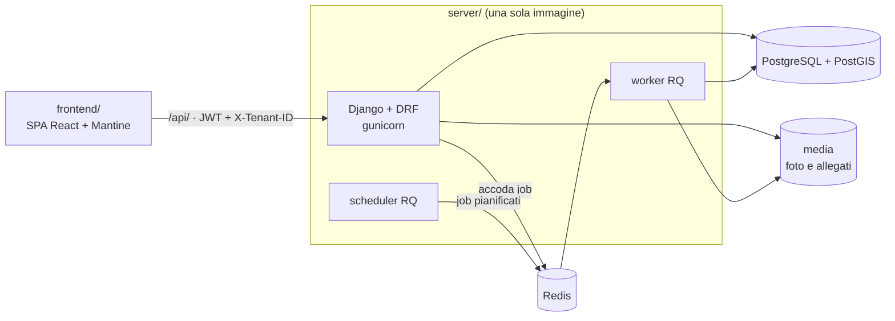

# Architettura tecnica

> **Stato**: in revisione · **Passo**: T1 del binario tecnico · Metodologia in [README.md](../README.md)

- **Obiettivo**: fissare tecnologie e struttura di backend e frontend prima di scrivere codice, riusando lo scaffold dei progetti INMAGIK recenti.
- **Input**: i progetti di riferimento (§2), il vincolo di stack di [AGENTS.md](../../AGENTS.md), le note Django di §5 di [04-modello-dati.md](../04-modello-dati.md).
- **Output atteso**: le regole per copiare lo scaffold (passo T4) e i pattern da seguire nelle app e nei moduli di dominio.

**Documenti del binario tecnico.**

| Documento | Contenuto |
|---|---|
| questo file | componenti, progetti di riferimento, cosa si copia e cosa si scarta |
| [backend.md](backend.md) | progetto Django: struttura, settings, app core, pattern delle app di dominio, ambiente, versioni |
| [frontend.md](frontend.md) | SPA React: struttura, provider, moduli, data fetching, pattern UI di base, versioni |

I pattern dell'interfaccia per sezione (T2) e la corrispondenza tra entità del dominio e app (T3) arrivano nei passi successivi.

## 1. Componenti

| Componente | Cartella | Tecnologia | Ruolo |
|---|---|---|---|
| Server | `server/` | Python 3.14, Django 6.1, Django REST Framework, GeoDjango | modello dati, API REST, logica di dominio, admin di Django |
| Worker e scheduler | `server/`, stessa immagine | django-rq, rq-scheduler | import ed export, generazione del piano, job pianificati (D-039) |
| Database | — | PostgreSQL 18 con PostGIS 3.6 | dati e geometrie |
| Code | — | Redis 8 | code dei job |
| Frontend | `frontend/` | React 19, Vite, TypeScript, Mantine 9 | interfaccia per gli utenti autenticati, servita da nginx (D-038) |

- Il frontend parla solo con le API REST sotto `/api/`. In sviluppo Vite inoltra `/api` al server su `localhost:8000`; in produzione lo fa il reverse proxy.
- Ogni richiesta autenticata porta il token JWT e l'header `X-Tenant-ID` dell'organizzazione scelta dall'utente (D-037).
- La mappa pubblica in sola lettura (D-015) è un'interfaccia del frontend; se sta nella stessa SPA o in un'app separata si decide in T2.
- Deploy e topologia di produzione sono fuori perimetro.

## 2. Progetti di riferimento

| Progetto | Commit letto in T1 | Da cui si prende |
|---|---|---|
| [inmagik/data-lab](https://github.com/inmagik/data-lab) | `8fc4b5d10a` (2026-10-05) | struttura di server e frontend, app core, settings, convenzioni, pattern di modelli e API (app `datasets`), componenti e pattern UI |
| [inmagik/bottaro-pesatura](https://github.com/inmagik/bottaro-pesatura) | `3d4b313f00` (2026-10-06) | versioni delle dipendenze, di Python e delle immagini; `inmagik_utils/pagination.py` |

Regole (D-036):
- data-lab dice *cosa* si copia e *come* si scrive; bottaro-pesatura dice *quale versione*. Le librerie che bottaro-pesatura non usa prendono la versione di data-lab.
- Le convenzioni proprie di bottaro-pesatura non valgono qui:
  - identificatori in italiano: qui sono in inglese (D-001);
  - codice single-tenant, un'istanza per cliente: qui il sistema è multi-tenant (D-037);
  - compatibilità con SQLite: qui PostGIS è obbligatorio (D-002).
- I due repository sono privati: per leggerli servono i permessi dell'organizzazione INMAGIK su GitHub.
- Dalle app di dominio di data-lab non si copia codice: si copiano i pattern, descritti in §4 di [backend.md](backend.md) e §5 di [frontend.md](frontend.md).

## 3. Cosa si copia

Esiti: *si copia* (con la sola rinomina del progetto), *si adatta* (con le modifiche indicate nei documenti di componente), *si scarta*.

### 3.1 Server

Origine: `server/` di data-lab.

| Elemento | Esito | Note |
|---|---|---|
| package di progetto `datalab/` (`settings.py`, `urls.py`, `schema.py`, `wsgi.py`, `asgi.py`) | si adatta | diventa `greenmanager/`; vedi §2 di [backend.md](backend.md) |
| `auth_core` | si copia | utenti, ruoli, permessi |
| `tenants` | si copia | organizzazioni (D-037) |
| `jobs_core` | si adatta | senza i job di esempio |
| `inmagik_utils` | si adatta | riceve paginazione e validazione da `datasets/commons.py` |
| `datasets` | si scarta | resta il modello dei pattern delle app di dominio |
| `docs_core` | si scarta | editor di documenti, non serve |
| `simulations`, `simulation_*` | si scarta | dominio di data-lab |
| `requirements.txt`, `requirements_prod.txt` | si adatta | versioni di §7 di [backend.md](backend.md) |
| `docker-compose.yml`, `Dockerfile`, `.devcontainer/`, `scripts/`, `build_image.sh`, `.gitignore`, `.dockerignore` | si adatta | senza Docker-out-of-Docker; GDAL anche nel devcontainer |
| `run_local.sh`, `build_image_local.sh`, `docker-compose-run-local-runner.yml`, `example_data/` | si scarta | servono ai simulatori |
| migrazioni delle app copiate | si scarta | si rigenerano da zero |

Dalla radice di data-lab si scartano anche `simulators/` e `translations/`.

### 3.2 Frontend

Origine: `admin/` di data-lab. In GreenManager la cartella si chiama `frontend/`, come in bottaro-pesatura.

| Elemento | Esito | Note |
|---|---|---|
| `package.json` | si adatta | versioni di §8 di [frontend.md](frontend.md) |
| `vite.config.ts`, `plugins/`, `tsconfig.*`, `eslint.config.js`, `.prettierrc`, `postcss.config.cjs`, `index.html`, `Dockerfile`, `nginx.conf`, `build_image.sh` | si copia | |
| `src/main.tsx`, `src/App.tsx`, `src/Navigation.tsx`, `src/declarations.d.ts`, `src/mantine_customization.css` | si adatta | senza gli stili dei pacchetti non usati |
| `src/auth/`, `src/general/`, `src/context/`, `src/utils.tsx`, `src/utils/` | si copia | |
| `src/hooks/`: `useHasPermission`, `useTenant`, `useUrlParams` | si copia | |
| `src/hooks/`: `useSimulations`, `useSimulationListFilters`; `src/types/simulations.ts` | si scarta | |
| `src/components/`: `AlertError`, `AsyncSelect`, `BlockNavigation`, `CheckPermission`, `CheckStaff`, `DoubleNavbar`, `FormFooter`, `Header`, `InputAccessors`, `LanguageSelector`, `Page`, `Redirect`, `ScreenWidthGuard`, `Table`, `TenantSelector`, `utils/` | si copia | |
| `src/components/`: `DocumentEditor`, `LexicalEditor`, `ViewFrame`, `PhoneFrame`, `Simulations`, `SimulatorIcons`, `ChartExportModal`; `src/all-blocks.ts` | si scarta | editor di documenti e simulazioni |
| `src/components/Allegati` | da valutare in T3 | per `Attachment` |
| `src/pages/`: accesso, recupero e reset della password, verifica email, benvenuto, profilo, home | si copia | la home si riscrive |
| `src/i18n/` | si adatta | solo le parti comuni (`auth`, `common`, `tenants`, `users`); italiano come lingua di riferimento |
| `src/modules/users`, `src/modules/tenants` | si copia | |
| `src/modules/datasets` | si scarta | resta il modello dei pattern dei moduli di dominio |
| `src/modules/spedi`, `toxflam`, `fire_plume_rise` | si scarta | |
| `src/constants.ts` | si adatta | solo `API_URL` e `IMAGE_URL` |

## 4. Perimetro

- Con lo scaffold, autenticazione, multi-tenancy, ruoli e permessi e ambiente di sviluppo hanno un'implementazione di riferimento. La specifica del dominio continua a non descriverli: ne dà solo gli agganci (§5.4 di [04-modello-dati.md](../04-modello-dati.md)).
- Le regole di accesso proprie di GreenManager (esecutori di un'altra organizzazione, valutatori esterni, committente che valida) si innestano sullo scaffold in T3.
- Restano fuori: deploy e infrastruttura di produzione, design visivo dell'interfaccia.

## Domande aperte

1. **Commit di partenza per T4.** Lo scaffold parte dai commit letti in T1 o dai più recenti al momento della copia? Proposta: dai più recenti, verificando che le tabelle di §3 valgano ancora e aggiornando le versioni di [backend.md](backend.md) e [frontend.md](frontend.md). → da chiudere alla revisione di T1
2. Le domande specifiche dei componenti sono in fondo a [backend.md](backend.md#domande-aperte) e [frontend.md](frontend.md#domande-aperte).
